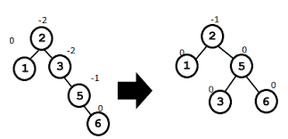

<div align="right">

</div>

# TDA ABB

## Alumno: Joaquin Ezequiel Mendez Archerrizo - 111767 - jmendeza@fi.uba.ar.

- Para compilar:

```bash
make pruebas_alumno
make tp-abb
```

- Para ejecutar:

```bash
./pruebas_alumno 
./tp_abb ejemplos/pokedex.csv
```

- Para ejecutar con valgrind:
```bash
make valgrind-alumno
make valgrind-tp-abb
```

- Para compilación y ejeccución con valgrind (version rapida):
```bash
make correr-pruebas
make correr-tp
```
---

##  Funcionamiento

Explicación de cómo funcionan las estructuras desarrolladas en el TP y el funcionamiento general del mismo.

Aclarar en esta parte todas las decisiones que se tomaron al realizar el TP, cosas que no se aclaren en el enunciado, fragmentos de código que necesiten explicación extra, etc.

Incluír **EN TODOS LOS TPS** los diagramas relevantes al problema (mayormente diagramas de memoria para explicar las estructuras, pero se pueden utilizar otros diagramas si es necesario).

### Por ejemplo:

El programa funciona abriendo el archivo pasado como parámetro y leyendolo línea por línea. Por cada línea crea un registro e intenta agregarlo al vector. La función de lectura intenta leer todo el archivo o hasta encontrar el primer error. Devuelve un vector con todos los registros creados.

<div align="center">

</div>

En el archivo `sarasa.c` la función `funcion1` utiliza `realloc` para agrandar la zona de memoria utilizada para conquistar el mundo. El resultado de `realloc` lo guardo en una variable auxiliar para no perder el puntero original en caso de error:

```c
int *vector = realloc(vector_original, (n+1)*sizeof(int));

if(vector == NULL)
    return -1;
vector_original = vector;
```


<div align="center">

</div>

---

## Respuestas a las preguntas teóricas
Explique teóricamente (y utilizando gráficos) qué es una árbol, árbol binario y árbol binario de búsqueda. Explique cómo funcionan, cuáles son sus operaciones básicas (incluyendo el análisis de complejidad de cada una de ellas) y por qué es importante la distinción de cada uno de estos diferentes tipos de árboles. Ayúdese con diagramas para explicar.

Para empezar, podemos definir que seria un Arbol, el mismo es un TDA que busca "simular" la estrcutura de un arbol, es decir existe una raiz, de donde salen el resto de elementos. A diferencia de los arboles "naturales", donde la raiz esta en el suelo y el arbol crece hacia arriba, nuestro arbol (el TDA) empezaria con la raiz arriba de todo y va creciendo o se agregan eleemntos debajo de la raiz, lo podemos ver en este dibujo que encontre en google:

<div align="center">

</div>

Primero que tod, tenes la raiz que es el elemento central o el primero en haberse agregado, y vas agregando elementos, dependiendo del arbol que uno quiera, a derecha, izquierda u otro lado. CAbe hacer el destacamiento de los elementos hoja que serian esos elementos que no tienene nada por debajo, estando en el ultimo nivel del arbol(si se lo quiere ver asi), y las ramas que como dije antes pueden ser 0,1,2 o mas (dependiendo del arbol) de posibles lugares donde pueden parar los elementos.Y TAmbien estan los padres que son estos elementos que conectan con otros elementos .

Los primeros arboles serian los N-arios ya que estos, como todos los arboles tiene una raiz, poseen varios hijos, pueden tener 1,2 3,4, etc. O sea, no esta limitada la cantidad de hijos que puede teer un nodo, lo cual lo termina haciendo mas costosas las operaciones basicas (especialmente la busqueda). Ademas no tiene un criterio de orden, lo que hace que si sumamos a que hay distintas cantidades de hijos, aumente las complejidades. Ademas ni hablar de que, como apreciacion, un arbol N-ario es mas factible de quedar desbalanceado que un arbol binario, ya que al no tener un control de cantidad de hijos que pueden haber en el arbol, es muy facil que te queden muchos mas de un lado que del otro. Ademas de que si quisieramos meter alguna forma/norma para balancear el arbol, seria mas dificil, de nuevo a mi consideracion, porque en un arbol binario son dos elementos y vas haciendo swap segun el caso, aca son N-nodos y ya seria mas engorroso el hecho de tener que hacer swap entre los elementos.

Ahora vamos con los Arboles binarios, ya que acabamos de habalr sobre ramas podemos conectar que los Arboles binarios son arboles que solo pueden tener 0, 1 o 2 ramas, es decir es una restrinccion a los arboles N-arios que bien podian tener las ramas que uno qusiera, pero los binarios no solo tienen como mucho dos ramas (como el arbol de la imagen).

<div align="center">

</div>
Esto mejora los problemas que mencione para el balanceo si uno quisiera implementarlo, ademas de que la inserccion de hace un poc mas odenada. EL Gran pero es que lo que no ganas en cantidad de ramas lo ganas en niveles, al estar limitado a 1 o 2 caminos, tenderiamos a tener un arbol con mas niveles que el N-ario. Auqnue todo esto depende de como insertemos en el N-ario.

Por ultimo tenemos el Arbol Binario de Busqueda, que este agrega otra restrinccion al Arbol binario, ya que este impone un cierto orden al agregar un elemento, descartyando al inserccion inicila que seria la raiz. En nuestro caso de TDA, los elementos menores a la raiz van a la izquierda y los mayores a la derecha. Y manejamos los casos especiales como querer insertar un elemento repetido o eliminar un nodo con 2 hijos metiendolos o agarando (en caso de la eliminacion) a los predecesores inorden. Obviamente este criterio no es estricto, sino que se podria hacer al revez, pero la idea es mantener un cierto orden asi hacemos que la mayoria, no todas, las funciones basicas sean O(log(n)), ya que por ejemplo al buscar, estariamos haciendo una busqueda binaria ya que si el elemento que bsuco es mayor a la raiz, buscariamos en el lado derecho (si estan los mayores a la raiz ahi) o en caso contrario me voy a la izquierda hasta que llegue al final del arbol o encuentre el elemento que busco. Aunque esto seria si el arbol esta balanceado o sea, no tenemos por ejemplo muchos elementos de un lado, no tenemos todo loe elementos de un lado, etc.

Bueno, una vez explicado cada arbol, pasemos a estudiar las funciones y la complejidad computacional de cada funcion principal, es decir, insertar, eliminar y buscar y recorrer inorden.
Para los arboles N-arios, suponeidno que la inserccion es metiendo el nuevo elemento al espacio mas a la izquerda (porque honestamente no se me ocurriria una inserccion mas "estandar"),es decir  buscamos si algun hijo izquierdo esta libre y vamos insertando el nuevo elemento a al izuqierda de alguna de las ramas (como una piramide si lo queres ver). Seria O(n) en el peor caso (o el mejor es que insertemos la raiz o algun hijo de la raiz seria O(1)), ya que deberiamos recorrer todas las ramas hasta encontrar que izqierdo no sea NULL. Obvio que puede haber otro tipo de insercciones, y la que propuse para analizar es bastante mala porque seria ultra propensa a desbalancearse (y seria muy caotico querer balancearlo), pero podemos asumir que no queremos que este balanceado (porque sino eligiriamos otro arbol) y que nos bancamos la complejidad que tenga buscar. 
Ya que estabamos hablando de buscar, este en el peor caso es tambien O(n), porque supongamos que el elemento que busco esta hasta el fondo de alguna rama y tendria que recorrer hasta el final de esa rama y podria haber 1, 5 100 elementos asi que termina siendo un problema de N tamaño. Lo malo de todo esto, es que supongamos que tuvieramos 5 ramas con 10 elementos y diera la casualidad que el elemento esta en la raiz 5 en la posicion 10, es muy costoso tener que recorrer cada rama hasta encontrarlo, tuviste que hacer 50 verificaciones, lo cual demuestra lo "deficiente" que es este tipo de arbol ya que otros arboles hacen esto mucho mas eficiente (obvio que suponiendo que estan balanceados). Ya que viemos un poco de busqueda, el recorrido tambien es O(n) porque dependemos de un tamaño variable N, que seria la cantidad de elementos a recorrer en el arbol. 
Por ultimo eliminar,independientemente de como insertemos, primero que todo tenes que recorrer el arbol hasta encontrar el elemnto a eliminar y luego eliminas segun el criterio, si ponemos siempre a la izuqierda del padre, seria reacomodar punteros y eliminarlo. Pero ya el hecho de tener que recorrer es O(n) porque dependemos de cuantos elementos hay en el arbol.

Bien, ahora vamos con los arboles binarios, empezando por la inserccion, suponeidno que llenamos por niveles o sea si tenemos una raiz y no hay hijos, llenamos primero el izquierdo y derecho y de ahi vas agregando del padre mas a la izuqierda, el nuevo elemento va a la izquierda del mismo luego otro a ala derecha del pardre y luego agregamos a la izuqierda del padre derecho y luego a la derecha del mismo y asi llenamos por niveles (entre nos vamos llenando de izquierda a derecha hasta completar el nivel). De todas formas, creo que independientemente de si esta o no balanceado, la inserccion siempre seria O(n), proque debemos recorrer el arbol e ir insertando. MIremoslo asi, el primer nivel (o el cero) esta la rama tiene un elemento, recorre ese elemento, bajemos un nivel tenemos 2 eleemntos, peor caso recorrer 3 elementos (si debo insertar a la derecha) y asi va incrementando la cantidad del recorrido a medida que bajamos en niveles, entonces dependemos de un problema que depende de N elementos a recorrer para poder insertar.  

Para recorrer es lo mismo que insertar, debemos ir recorriendo primero el nodo actual, luego a la izquierda y luego a la derecha, entonces tambien dependemos de un problema de tamaño N que vendria a ser la cantidad de elemntos que hay en el arbol. Para la busqueda pasa lo mismo, hariamos una "busqueda lineal" en el arbol pero debemos recorrer todo el arbol hatsa encontrar el elemento que necesitamos entonces terminaria siendo O(n), capaz es menos costoso que iterar, pero sigue siendo O(n).
Y paar eliminar, pasa medio que lo mismo ya que debemos recorrer hasta econtarr el nodo a eliminar y de ahi acomodas segun tu criterio o caso y lo eliminas. Pensandolo un pco mas friamente, podriamos deducir que si el peor caso, eliminar cuando hay dos hijos de por medio, y queremos reemplzar ese elemento con el predecesor inorden, primero recorres como mencionamos antes, pero luego deberias recorrer del subarbol izquierod y encontarr el que este mas a la derecha. Asi que tendrias dos iteraciones que dependen de la cantidadd de elemntos que haya en el arbol, etnces seria O(2n) o si preferis, O(n) . Igual seria muy rebuscado (y caro) querer reemplazar ese nodo a eliminar con el predecesor (o sucesor) inorden, porque aca no te importa mantener un cierto orden como en el ABB, pero se me hizo curiso quere explicarlo. Aunque de nuevo, pensandolo en frio, si tenes que buscar algun nodo sin hijos y da la casualidad que del eleemnto a eliminar tenes los dos hisjo con hijo derecho e hijo izquierdo, tendrias que recorrer ahsta encontrar algun elemento sin hijos, entonces terminaria siendo O(2n) porque primero recorres buscao el elemento y luego recorrerias hatsa encontrar un "candidato" apto para hacer swap. Es psoible que este mal, mas que nada me da cierta duda, que sea al cuadrado porque basico seria que sea O(n) pero tenes que buscar algun candidato apto para eliminarlo sin perder referencia alguna. Cabe aclarar que, creo que, no nos afectaria en cuanto a complejidades si esta o no baloanceado el arbol (auqneu para el que sigue si lo sera).


Por ultimo tenemos el Arbol Binario de Busqueda (ABB para acortr), que como dijimos antes, es una rbol binario pero con un criterio de inserccion, en nuestro caso (y tomando lo quei se hizo para el tp), se ponen a la izquierda los elementos menores a la raiz y los mayores a la derecha. SIguiendo este criterio, tenemos dos casos, el caso donde esta balanceado mi ABB y el caso donde no lo esta, ¿Por que? porque si por ejemplo tenemos el clasico arbol binario todo aomodado, algo asi:
<div align="center">

</div>
LAs alturas son logaritmicas en cuanto a cuantos elementos hay en el nivel, en cambio si es un ABB no balanceado como este:
<div align="center">

</div>
La cantidad de elementos en cada nivel no es proporcional y si ele elemnto que bsuco fuera el 5, terimina mas siendo una busqueda lineal mas que una busqueda binaria. 

YA hecha la distincion de casos, me voy a parar mas en el caso de que el ABB no esta balanceado, porque es lo que teniamos que hacer. Pero alcanza con decir que si el arbol esta balanceado, todas las operaciones, excepto una, serian O(log(N)). ASi que vamos con la inserccion, de nuevo es recorrer pero tomando en cuenta que ahora los menores estan a la izquierda y los mayores a la derecha sucesivamente entonces comparas si ele elemnto a insertar es mayor o menor y te vas moviendo, si estuviera balanceado es O(log(N)) porque no necesitas recorrer todo el arbol sino que solo recorres la parte que te interesa. Pero al no estar balanceado puede ocurrir el peor caso que te quede casi todos los elementos de un lado entonces ya termina siendo una busqueda lineal para insertra el nuevo elemento, por lo que cae en O(n) porque termina siendo un problema que depende de la canitdad de elementos que hay que recorrer.
PAra buscar ocurre exctamente lo mismo, ya que si esta balanceado vas separando si es mayor o menor que el elemnto que buscas y vas "difurcando" segun el resultado de la comparacion (una busqueda binaria) pero si el arbol quedo estilo vector o casi todos los elementos de un aldo termian siendo O(n) porque termianr recorriendo todo el arbol hasta encontrar el elemento que buscas. 
La iteracion inorden, es la unica funcion que comparten ambos casos, ya que independientemente de que este o no balanceado, vas a tener que recorrer todo el arbol, entonces termina siendo un recorrido que depende de n elementos entonces termianria seindo O(n). Digo que es independiente porque si tenes eslitlo vector el arbol lo recorrerias de igua manera que si el arbol esta acomodado porque inevitablemente tenes que ir elemento a elemento.
Para eliminar, seria O(n) para arboles desbalanceados porque buscas primero el elemnto a eleiminar, luego buscas el predecesor inorden, luego los intercambias de lugar y eliminas, entonces caes en la complejidad de O(n) porque dependemos de la longitud n de elementos en ela rbol . En el caso de los balanceados, las busqueda  (del predecesor y del elemento) se harian de form binaria y por eso termian cayendo en O(log(n)) como complejidad computacional. 


Por ultimo, podemos hacer una conclusion sobre esto 3 tipos de arboles, para mi, adquiere un gran valor el hacer las cosas de forma ordenada en cuanto a los arboles, podemos ver que si no habia limitaciones con el Arbol N-ario, terminaba siendo un descontrol para las operaciones, en cambio el arbol binario al plantear una restrinccion, llega a ordenar las cosas pero no lo suficiente como para que veamos un cambio notable en cuanto a las complejidades computacionales. Y ya con el ABB, si vemos una mejora con la posibilidad de que sean O(log(n)) que es termina siendo un gran cambio ekl pasar de O(n) a O(log(n)) auqnue lo "malo" seria que debe estar balanceado para mantener esa complejidad. Pero,a lgo que no mencione antes, es que el recorrido inorden te permite una felxibildad "unica" y es que de entrada como primero va todo a la izquierda, luego se queda con ele elemnto en cuestion y luego a la derecha, hace que te queden ordenados de menor a mayor, y si jugamos un pcoo con el comparador de forma que te queden los mayroes a la izquierda y los menores a la izquierda y llamamos al recorrido inorden, te quedan de mayores a menores, lo cual con el arbol binario seria muy dificil y ni hablar del arbol N-ario que seria inviable practicamente. 
