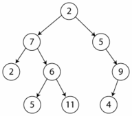

<div align="right">

</div>

# TDA ABB

## Alumno: Joaquin Ezequiel Mendez Archerrizo - 111767 - jmendeza@fi.uba.ar.

- Para compilar:

```bash
make pruebas_alumno
make tp-abb
```

- Para ejecutar:

```bash
./pruebas_alumno 
./tp_abb ejemplos/pokedex.csv
```

- Para ejecutar con valgrind:
```bash
make valgrind-alumno
make valgrind-tp-abb
```

- Para compilación y ejeccución con valgrind (version rapida):
```bash
make correr-pruebas
make correr-tp
```
---

##  Funcionamiento

Explicación de cómo funcionan las estructuras desarrolladas en el TP y el funcionamiento general del mismo.

Aclarar en esta parte todas las decisiones que se tomaron al realizar el TP, cosas que no se aclaren en el enunciado, fragmentos de código que necesiten explicación extra, etc.

Incluír **EN TODOS LOS TPS** los diagramas relevantes al problema (mayormente diagramas de memoria para explicar las estructuras, pero se pueden utilizar otros diagramas si es necesario).

### Por ejemplo:

El programa funciona abriendo el archivo pasado como parámetro y leyendolo línea por línea. Por cada línea crea un registro e intenta agregarlo al vector. La función de lectura intenta leer todo el archivo o hasta encontrar el primer error. Devuelve un vector con todos los registros creados.

<div align="center">

</div>

En el archivo `sarasa.c` la función `funcion1` utiliza `realloc` para agrandar la zona de memoria utilizada para conquistar el mundo. El resultado de `realloc` lo guardo en una variable auxiliar para no perder el puntero original en caso de error:

```c
int *vector = realloc(vector_original, (n+1)*sizeof(int));

if(vector == NULL)
    return -1;
vector_original = vector;
```


<div align="center">

</div>

---

## Respuestas a las preguntas teóricas
Explique teóricamente (y utilizando gráficos) qué es una árbol, árbol binario y árbol binario de búsqueda. Explique cómo funcionan, cuáles son sus operaciones básicas (incluyendo el análisis de complejidad de cada una de ellas) y por qué es importante la distinción de cada uno de estos diferentes tipos de árboles. Ayúdese con diagramas para explicar.

Para empezar, podemos definir que seria un Arbol, el mismo es un TDA que busca "simular" la estrcutura de un arbol, es decir existe una raiz, de donde salen el resto de elementos. A diferencia de los arboles "naturales", donde la raiz esta en el suelo y el arbol crece hacia arriba, nuestro arbol (el TDA) empezaria con la raiz arriba de todo y va creciendo o se agregan eleemntos debajo de la raiz, lo podemos ver en este dibujo que encontre en google:

<div align="center">

</div>

O sea, tenes la raiz que es el elemento central o el primero en haberse agregado, y vas agregando elementos, dependiendo del arbol que uno quiera, a derecha, izquierda u otro lado. CAbe hacer el destacamiento de los elementos hoja que serian esos elementos que no tienene nada por debajo, estando en el ultimo nivel del arbol, y las ramas que como dije antes pueden ser 0,1,2 o mas (dependiendo del arbol) de posibles lugares donde pueden parar los elementos.

Ahora vamos con lso Arboles binarios, ya que acabamos de habalr sobre ramas podemos conectar que los Arboles binarios son arboles que solo pueden tener 0, 1 o 2 ramas, es decir es una restrinccion a los arboles que bien podiran tener las ramas que uno qusiera, pero lso binarios no solo tienen como mucho dos ramas (como el arbol de la imagen).

<div align="center">

</div>

Por ultimo tenemos el Arbol Binario de Busqueda, que este agrega otra restrinccion al Arbol binario, ya que este impone un cierto orden al agregar un elemento, descartyando al inserccion inicila que seria la raiz. En nuestro caso de TDA, los elementos menores a la raiz van a la izquierda y los mayores a la derecha. Y manejamos los casos especiales como querer insertar un elemento repetido o eliminar un nodo con 2 hijos metiendolos o agarando (en caso de la eliminacion) a los predecesores inorden. Obviamente este criterio no es estricto, sino que se podria hacer al revez, pero la idea es mantener un cierto orden asi hacemos que la mayoria, no todas, las funciones basicas sean O(log(n)), ya que por ejemplo al buscar, estariamos haciendo una busqueda binaria ya que si el elemento que bsuco es mayor a la raiz, buscariamos en el lado derecho (si estan los mayores a la raiz ahi) o en caso contrario me voy a la izquierda hasta que llegue al final del arbol o encuentre el elemento que busco. Aunque esto seria si el arbol esta balanceado o sea, no tenemos por ejemplo muchos elementos de un lado, no tenemos todo loe elementos de un lado, etc.

<div align="center">

</div>

Bueno, una vez explicado cada arbol, pasemos a estudiar las funciones y la complejidad computacional de cada funcion.  


