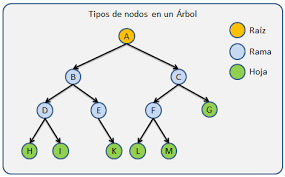
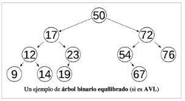

<div align="right">

</div>

# TDA ABB

## Alumno: Joaquin Ezequiel Mendez Archerrizo - 111767 - jmendeza@fi.uba.ar.

- Para compilar:

```bash
make pruebas_alumno
make tp-abb
```

- Para ejecutar:

```bash
./pruebas_alumno 
./tp_abb ejemplos/pokedex.csv
```

- Para ejecutar con valgrind:
```bash
make valgrind-alumno
make valgrind-tp-abb
```

- Para compilación y ejeccución con valgrind (version rapida):
```bash
make correr-pruebas
make correr-tp
```
---

##  Funcionamiento

El TP consta en hacer algo similar a lo que se hizo para el TP de Listas, pero aca usamos el TDA de Arboles binarios de busqueda, en vez de usar vectores dinamicos o listas enlazadas. Lo que se pide hacer, es basicamente, leer un archivo csv, linea por linea, separar los elementos separados por el ";" o "," (depende del separador que le pasemos), irlo casteando/parseando esos datos e irlos guardando en el ABB. Y debemos darle la opcion al usuario de listar los pokemones que se leyeron de ese .csv (netamente lo hecho en el tp1 y el de lista) o darle la opcion de buscar X pokemon y que aparezca por pantalla el nombre, el tipo y las estadisticas, si se lo encuentra claro. Y se imprimiria estas dos opciones:

<div align="center">

</div>

<div align="center">

</div>

<div align="center">

</div>


Para hacerlo mas ameno, voy a explicar las funciones basicas como insertar, eliminar, buscar, recorrer y vectorizar (inorden) algunas mas faciles las explico por arriba y la que se me hizo mas complicada la explico mas al detalle (como eliminar). Y por ultimo hablar sobre las dificultades que fui teniendo.

Para empezar, vamos con insertar, se nos presentaban dos casos, uno que es insertar la raiz, es decir el arbol esta vacio y tenes que insertar el primer eleemnto, entonces eso termina siendo bastante facil porque es solo setear el campo raiz con el nodo a agregar y seteas pro las dudas que izquierda y derecha sean NULL ( y se aumenta la canitdad de nodos, obvio). El otro caso, es que el ABB ya tuviera raiz y tuvieramos que agregar un elemento nuevo, aqui el codigo y lo desglosamos un poco:

```c
nodo_t *insertar_abb_no_vacio(nodo_t *raiz, nodo_t *nuevo_nodo,
			      int (*comparador)(void *, void *))
{
	if (raiz == NULL) {
		return nuevo_nodo;
	}
	int resultado_comparacion =
		comparador(nuevo_nodo->elemento, raiz->elemento);
	if (resultado_comparacion <= 0) {
		raiz->izq = insertar_abb_no_vacio(raiz->izq, nuevo_nodo,
						  comparador);
	} else {
		raiz->der = insertar_abb_no_vacio(raiz->der, nuevo_nodo,
						  comparador);
	}
	return raiz;
}
```
Basicamente lo que hacemos como condicion de corte, es que si el nodo raiz es null, devolvemos el nuevo nodo pero actualizado segun lo que dio la comparacion. Luego calculamos ,usando el comparador que nos pasen, si la comparacion diera mayor, debemos recorrer a la derecha y volver a comparar y en caso contrario de que diera menot o igual a 0, vamos a recorrer del lado izquierdo y volver a comparar hasta que podamos insertarlo. En todo este proceso recursivo, vamos seteando el campo derecho o izquierdo segun nos de la comparacion, y finalmente devolvemos el nodo raiz que le pasamos actualizada. Y bueno en la funcion de abb_insertar si la raiz es NULL (no tiene nodo aun) seteamos la raiz, y caso contrario es otro elemento cualquiera.

Para buscar es algo similar a insertar en caso de que la raiz no sea NULL. Veamos el codigo:

```c
void *abb_obtener_elemento_recursivo(nodo_t *nodo, void *elemento,
				     int (*comparador)(void *, void *))
{
	if (nodo == NULL) {
		return NULL;
	}
	int resultado_comparacion = comparador(elemento, nodo->elemento);
	if (resultado_comparacion == 0) {
		return nodo->elemento;
	}
	if (resultado_comparacion > 0) {
		return abb_obtener_elemento_recursivo(nodo->der, elemento,
						      comparador);
	}
	return abb_obtener_elemento_recursivo(nodo->izq, elemento, comparador);
}

void *abb_obtener(abb_t *abb, void *elemento)
{
	if (abb == NULL || abb->nodos == 0) {
		return NULL;
	}
	return abb_obtener_elemento_recursivo(abb->raiz, elemento,
					      abb->comparador);
}
```
Como vemos buscar es como insertar en caso de Raiz no NULL, ya que aca vamos haciendo una busqueda binaria, si el comparador me dio igual a 0, quiere decir que ele elemento buscado y el encontrado son iguales, entonces retorno ese nodo. Si el resultado da mayor, me deveria mover a la derecha del arbol ya que ahi se encuentran los elementos mayores a la raiz del ABB, y caso contrario me muevo a la izquierda y vuelvo a preguntar lo mismo, esto todo recursivo ya que volvemos a llamar a la funcion hasta que se cumpla que nodo es == NULL (que seria que llego al finla de alguna de las dos ramas) y en ese caso retornamos NULL ya que no lo encontro. Y en abb obtener si el abb es null o si la cantidad de elementos en el abb es 0, retorno NULL porque no encontraria nada si el abb esta vacio o si es null. Y luego retornamos lo que devuelva la funcion recursiva de buscar.

Ahora vamos con iterar_inorden que me trajo problemas por un pequeño detalle, pero vamos con el codigo:
```c
size_t contar_iteraciones_inorder(nodo_t *nodo, bool (*f)(void *, void *),
				  void *ctx, bool *continua_iteracion)
{
	if (nodo == NULL || !(*continua_iteracion)) {
		return 0;
	}
	size_t cantidad = 0;
	cantidad += contar_iteraciones_inorder(nodo->izq, f, ctx,
					       continua_iteracion);

	if (*continua_iteracion) {
		if (!f(nodo->elemento, ctx)) {
			*continua_iteracion = false;
		}
		cantidad++;
	}
	cantidad += contar_iteraciones_inorder(nodo->der, f, ctx,
					       continua_iteracion);
	return cantidad;
}

size_t abb_iterar_inorden(abb_t *abb, bool (*f)(void *, void *), void *ctx)
{
	if (abb == NULL || f == NULL) {
		return 0;
	}
	bool continuar_iteracion = true;
	return contar_iteraciones_inorder(abb->raiz, f, ctx,
					  &continuar_iteracion);
}
```

Para empezar, podemos aclarar que el bool* es mas que nada para frenar la iteracion, ya que la condicion de corte para el recorrido seria preguntar si el nodo es NULL o si se corto la iteracion, lo primero sera basicamente preguntar si llego al final del arbol o que lo recorrio todo, y la segunda seria que si se corto la iteracion (porque la funcion f devolvio false).
Entonces como hacemos recorrido inorden, recordamos que primero recorremos el subarbol izquierdo, luego el elemento en cuestion (si no tiene algun hijo izquierdo) y luego vamos y recorremos el subarbol derecho. Por eso hacemos suma directa de la cantidad e elementos que de hacer el llamado a la funcion del nodo a la izqueirda del que estemos parados. Y vamos comparando siempre que si sigue la iteracion y F retorna True, aumentamos en 1 la cantidad de iteraciones. Y entonces llega el momento donde f da false. Yo lo que hice en un rpincipio era agregar pokemones en un ABB y una funcion que corte prematuramente la iteracion si el nombre de un pokemon era X nombre, y ahi cortar la iteracion, entonces llegaba, preguntaba, si se seguia la iteracion (si porque aun no devolvimos false), F devuelve false, el bool* ahora es false (asi no ejecutamos ese bloque) y aumentamos la cantidad en 1 porque debemos contar a ese pokemon.
El gran problema que tenia era literalembnte una linea ya que antes haciamos esto:
```c
size_t contar_iteraciones_inorder(nodo_t *nodo, bool (*f)(void *, void *),
				  void *ctx, bool *continua_iteracion)
{
	if (nodo == NULL || !(*continua_iteracion)) {
		return 0;
	}
	size_t cantidad = 0;
	cantidad += contar_iteraciones_inorder(nodo->izq, f, ctx,
					       continua_iteracion);

	if (*continua_iteracion) {
		if (!f(nodo->elemento, ctx)) {
			*continua_iteracion = false;
            //Aca el problema
            return cantidad;
		}
		cantidad++;
	}
	cantidad += contar_iteraciones_inorder(nodo->der, f, ctx,
					       continua_iteracion);
	return cantidad;
}
```
Entonces al cortar el bloque con return cantidad, no aumentabamos en 1 entonces las pruebas me daban mal las pruebas porque tomaba con que no cortaba bien la funcion entonces, tambien fallaban en vectorizar si cortabamos prematuramente la iteracion. Mas alla de ese problema tonto, depsues repetimos con el arbol derecho (si no cortamos la iteracion antes) y retornamos la cantidad una vez terminada la iteracion. Si queremos hacer lso otros recorridos, es intercambiar el orden de los recorridos o la verificacion de la funcion F. 

Luego tenemos la funcion de vectorizar, que no tuvimos problemas (mas alla de los cortes prematuros) pero capz toem una mala deficion o una polemica, mas que nada al no querer reutilizar la funcion de iterar. MAs que anda, lo decidi asi por vagancia, ya que son muy siumilares pero hacen cosas distintas, yo lo pense de otra forma pero es total mente valido usar la funcion de iterar y luego vas vectorizando, pero bueno, analizemos el codigo y la "funcion principal" de vectorizar:

```c
void agregar_elemento_al_vector(void *elemento, size_t *i, void **vector)
{
	vector[*i] = elemento;
	(*i)++;
}

void rellenar_vector_inorden_recu(nodo_t *nodo, void **vector, size_t tamaño,
				  size_t *i)
{
	if (*i == tamaño || nodo == NULL) {
		return;
	}
	if (nodo->izq != NULL) {
		rellenar_vector_inorden_recu(nodo->izq, vector, tamaño, i);
	}
	if (*i < tamaño) {
		agregar_elemento_al_vector(nodo->elemento, i, vector);
	}
	if (nodo->der != NULL) {
		rellenar_vector_inorden_recu(nodo->der, vector, tamaño, i);
	}
}

size_t abb_vectorizar_inorden(abb_t *abb, void **vector, size_t tamaño)
{
	if (abb == NULL || vector == NULL) {
		return 0;
	}
	size_t i = 0;
	rellenar_vector_inorden_recu(abb->raiz, vector, tamaño, &i);
	return i;
}
```
LO que mas "destaca" es que i lo pasamos por referencia, esto es mas que nada porque necesitamos que I se vaya aunmentanmdo a medida que vamos metiendo elementos en el vector y  ya que lo vamos a modificar y necesitamos que se mantenga el inidce, lo pasamos por referencia. Entonces, vamos recorriendo y en vez de preguntar si una funcion f es true, llamamos a la funcionde agregar al vector, y asi susecibamente hasta que i sea igual al tamaño que me pasaron o se llego al final del arbol y no hay nada mas que recorrer. Como vemos es un caclco de la iteracion pero cambiando el hecho de vamos llenando el vector en vez de verificar si cortamos la iteracion. 

Ahora vamos con la funcion mas problematica (para variar), eliminar. 

```c
nodo_t *buscar_predecesor_inorden(nodo_t *nodo)
{
	if (nodo == NULL) {
		return NULL;
	}
	nodo_t *nodo_actual = nodo->izq;
	while (nodo_actual->der != NULL) {
		nodo_actual = nodo_actual->der;
	}
	return nodo_actual;
}

nodo_t *eliminar_nodo(nodo_t *nodo, void *buscado, void **encontrado,
		      int (*comparador)(void *, void *),
		      bool *se_encontro_elemento)
{
	if (nodo == NULL) {
		return NULL;
	}
	int resultado_comparacion = comparador(buscado, nodo->elemento);
	if (resultado_comparacion == 0) {
		if (*encontrado == NULL) {
			*encontrado = nodo->elemento;
			*se_encontro_elemento = true;
		}
		if (nodo->der != NULL && nodo->izq != NULL) {
			nodo_t *nodo_inorden = buscar_predecesor_inorden(nodo);
			nodo->elemento = nodo_inorden->elemento;
			nodo->izq = eliminar_nodo(nodo->izq,
						  nodo_inorden->elemento,
						  encontrado, comparador,
						  se_encontro_elemento);
			return nodo;
		}
		nodo_t *hijo_no_null = (nodo->der != NULL) ? nodo->der :
							     nodo->izq;
		free(nodo);
		return hijo_no_null;
	} else if (resultado_comparacion > 0) {
		nodo->der = eliminar_nodo(nodo->der, buscado, encontrado,
					  comparador, se_encontro_elemento);
	} else {
		nodo->izq = eliminar_nodo(nodo->izq, buscado, encontrado,
					  comparador, se_encontro_elemento);
	}
	return nodo;
}

bool abb_quitar(abb_t *abb, void *buscado, void **encontrado)
{
	if (abb == NULL || encontrado == NULL) {
		return false;
	}
	*encontrado = NULL;
	bool se_encontro_elemento = false;
	abb->raiz = eliminar_nodo(abb->raiz, buscado, encontrado,
				  abb->comparador, &se_encontro_elemento);
	if (*encontrado != NULL ||
	    (se_encontro_elemento && *encontrado == NULL)) {
		(abb->nodos)--;
		return true;
	}
	return false;
}
```
Vamos por lo facil primero, el caso donde tenemos uno o dos hijos,  


Incluír **EN TODOS LOS TPS** los diagramas relevantes al problema (mayormente diagramas de memoria para explicar las estructuras, pero se pueden utilizar otros diagramas si es necesario).

### Por ejemplo:

El programa funciona abriendo el archivo pasado como parámetro y leyendolo línea por línea. Por cada línea crea un registro e intenta agregarlo al vector. La función de lectura intenta leer todo el archivo o hasta encontrar el primer error. Devuelve un vector con todos los registros creados.

<div align="center">

</div>

En el archivo `sarasa.c` la función `funcion1` utiliza `realloc` para agrandar la zona de memoria utilizada para conquistar el mundo. El resultado de `realloc` lo guardo en una variable auxiliar para no perder el puntero original en caso de error:

```c
int *vector = realloc(vector_original, (n+1)*sizeof(int));

if(vector == NULL)
    return -1;
vector_original = vector;
```


<div align="center">

</div>

---

## Respuestas a las preguntas teóricas
Explique teóricamente (y utilizando gráficos) qué es una árbol, árbol binario y árbol binario de búsqueda. Explique cómo funcionan, cuáles son sus operaciones básicas (incluyendo el análisis de complejidad de cada una de ellas) y por qué es importante la distinción de cada uno de estos diferentes tipos de árboles. Ayúdese con diagramas para explicar.

Para empezar, podemos definir que sería un Árbol, el mismo es un TDA que busca "simular" la estructura de un árbol, es decir existe una raíz, de donde salen el resto de elementos. A diferencia de los árboles "naturales", donde la raíz está en el suelo y el árbol crece hacia arriba, nuestro árbol (el TDA) empezaría con la raíz arriba de todo y va creciendo o se agregan elementos debajo de la raíz, lo podemos ver en este dibujo que encontré en Google:

<div align="center">

</div>

Primero que todo, Tenes la raíz que es el elemento central o el primero en haberse agregado, y vas agregando elementos, dependiendo del árbol que uno quiera, a derecha, izquierda u otro lado. Cabe hacer el destacamento de los elementos hoja que serían esos elementos que no tienen nada por debajo, estando en el último nivel del árbol(si se lo quiere ver así), y las ramas que como dije antes pueden ser 0,1,2 o más (dependiendo del árbol) de posibles lugares donde pueden parar los elementos. Y También están los padres que son estos elementos que conectan con otros elementos .

Los primeros arboles serían los N-arios ya que estos, como todos los árboles tiene una raíz, poseen varios hijos, pueden tener 1,2 3,4, etc. O sea, no está limitada la cantidad de hijos que puede tener un nodo, lo cual lo termina haciendo más costosas las operaciones básicas (especialmente la búsqueda). Además no tiene un criterio de orden, lo que hace que si sumamos a que hay distintas cantidades de hijos, aumente las complejidades. Además ni hablar de que, como apreciación, un árbol N-ario es más factible de quedar desbalanceado que un árbol binario, ya que al no tener un control de cantidad de hijos que puede haber en el árbol, es muy fácil que te queden muchos más de un lado que del otro. Además de que si quisiéramos meter alguna forma/norma para balancear el árbol, sería más difícil, de nuevo a mi consideración, porque en un árbol binario son dos elementos y vas haciendo swap según el caso, acá son N-nodos y ya sería más engorroso el hecho de tener que hacer swap entre los elementos.

Ahora vamos con los Árboles binarios, ya que acabamos de hablar sobre ramas podemos conectar que los Árboles binarios son árboles que solo pueden tener 0, 1 o 2 ramas, es decir es una restricción a los árboles N-arios que bien podían tener las ramas que uno quisiera, pero los binarios no solo tienen como mucho dos ramas (como el árbol de la imagen).

<div align="center">

</div>
Esto mejora los problemas que mencione para el balanceo si uno quisiera implementarlo, además de que la inserción de hace un poco más ordenada. EL Gran pero es que lo que no ganas en cantidad de ramas lo ganas en niveles, al estar limitado a 1 o 2 caminos, tenderíamos a tener un árbol con más niveles que el N-ario. Aunque todo esto depende de cómo insertemos en el N-ario.

Por ultimo tenemos el Árbol Binario de Búsqueda, que este agrega otra restricción al Árbol binario, ya que este impone un cierto orden al agregar un elemento, descartando a la inserción inicial que sería la raíz. En nuestro caso de TDA, los elementos menores a la raíz van a la izquierda y los mayores a la derecha. Y manejamos los casos especiales como querer insertar un elemento repetido o eliminar un nodo con 2 hijos metiéndolos o agarrando (en caso de la eliminación) a los predecesores inorden. Obviamente este criterio no es estricto, sino que se podría hacer al revés, pero la idea es mantener un cierto orden así hacemos que la mayoría, no todas, las funciones básicas sean O(log(n)), ya que por ejemplo al buscar, estaríamos haciendo una búsqueda binaria ya que si el elemento que busco es mayor a la raíz, buscaríamos en el lado derecho (si están los mayores a la raíz ahí) o en caso contrario me voy a la izquierda hasta que llegue al final del árbol o encuentre el elemento que busco. Aunque esto sería si el árbol esta balanceado o sea, no tenemos por ejemplo muchos elementos de un lado, no tenemos todo loe elementos de un lado, etc.

Bueno, una vez explicado cada árbol, pasemos a estudiar las funciones y la complejidad computacional de cada función principal, es decir, insertar, eliminar y buscar y recorrer inorden.
Para los árboles N-arios, suponiendo que la inserción es metiendo el nuevo elemento al espacio más a la izquierda (porque honestamente no se me ocurriría una inserción más "estándar"),es decir buscamos si algún hijo izquierdo esta libre y vamos insertando el nuevo elemento a la izquierda de alguna de las ramas (como una pirámide si lo quieres ver). Seria O(n) en el peor caso (o el mejor es que insertemos la raíz o algún hijo de la raíz seria O(1)), ya que deberíamos recorrer todas las ramas hasta encontrar que izquierdo no sea NULL. Obvio que puede haber otro tipo de inserciones, y la que propuse para analizar es bastante mala porque sería ultra propensa a desbalancearse (y sería muy caótico querer balancearlo), pero podemos asumir que no queremos que este balanceado (porque si no elegiríamos otro árbol) y que nos bancamos la complejidad que tenga buscar. 
Ya que estábamos hablando de buscar, este en el peor caso es también O(n), porque supongamos que el elemento que busco esta hasta el fondo de alguna rama y tendría que recorrer hasta el final de esa rama y podría haber 1, 5 100 elementos así que termina siendo un problema de N tamaño. Lo malo de todo esto, es que supongamos que tuviéramos 5 ramas con 10 elementos y diera la casualidad que el elemento está en la raíz 5 en la posición 10, es muy costoso tener que recorrer cada rama hasta encontrarlo, tuviste que hacer 50 verificaciones, lo cual demuestra lo "deficiente" que es este tipo de árbol ya que otros arboles hacen esto mucho más eficiente (obvio que suponiendo que están balanceados). Ya que vemos un poco de búsqueda, el recorrido también es O(n) porque dependemos de un tamaño variable N, que sería la cantidad de elementos a recorrer en el árbol. 
Por ultimo eliminar, independientemente de cómo insertemos, primero que todo Tenes que recorrer el árbol hasta encontrar el elemento a eliminar y luego eliminas según el criterio, si ponemos siempre a la izquierda del padre, seria reacomodar punteros y eliminarlo. Pero ya el hecho de tener que recorrer es O(n) porque dependemos de cuantos elementos hay en el árbol.

Bien, ahora vamos con los árboles binarios, empezando por la inserción, suponiendo que llenamos por niveles o sea si tenemos una raíz y no hay hijos, llenamos primero el izquierdo y derecho y de ahí vas agregando del padre más a la izquierda, el nuevo elemento va a la izquierda del mismo luego otro a ala derecha del padre y luego agregamos a la izquierda del padre derecho y luego a la derecha del mismo y así llenamos por niveles (entre nos vamos llenando de izquierda a derecha hasta completar el nivel). De todas formas, creo que independientemente de si está o no balanceado, la inserción siempre seria O(n), porque debemos recorrer el árbol e ir insertando. Mirémoslo así, el primer nivel (o el cero) está la rama tiene un elemento, recorre ese elemento, bajemos un nivel tenemos 2 elementos, peor caso recorrer 3 elementos (si debo insertar a la derecha) y así va incrementando la cantidad del recorrido a medida que bajamos en niveles, entonces dependemos de un problema que depende de N elementos a recorrer para poder insertar.  

Para recorrer es lo mismo que insertar, debemos ir recorriendo primero el nodo actual, luego a la izquierda y luego a la derecha, entonces también dependemos de un problema de tamaño N que vendría a ser la cantidad de elementos que hay en el árbol. Para la búsqueda pasa lo mismo, haríamos una "búsqueda lineal" en el árbol pero debemos recorrer todo el árbol hasta encontrar el elemento que necesitamos entonces terminaría siendo O(n), capaz es menos costoso que iterar, pero sigue siendo O(n).
Y para eliminar, pasa medio que lo mismo ya que debemos recorrer hasta encontrar el nodo a eliminar y de ahí acomodas según tu criterio o caso y lo eliminas. Pensándolo un poco más fríamente, podríamos deducir que si el peor caso, eliminar cuando hay dos hijos de por medio, y queremos reemplazar ese elemento con el predecesor inorden, primero recorres como mencionamos antes, pero luego deberías recorrer del subárbol izquierdo y encontrar el que este más a la derecha. Así que tendrías dos iteraciones que dependen de la cantidad de elementos que haya en el árbol, entonces seria O(2n) o si preferís, O(n) . Igual sería muy rebuscado (y caro) querer reemplazar ese nodo a eliminar con el predecesor (o sucesor) inorden, porque acá no te importa mantener un cierto orden como en el ABB, pero se me hizo curso quiere explicarlo. Aunque de nuevo, pensándolo en frio, si Tenes que buscar algún nodo sin hijos y da la casualidad que del elemento a eliminar Tenes los dos hijos con hijo derecho e hijo izquierdo, tendrías que recorrer hasta encontrar algún elemento sin hijos, entonces terminaría siendo O(2n) porque primero recorres busca el elemento y luego recorrerías hasta encontrar un "candidato" apto para hacer swap. Es posible que este mal, más que nada me da cierta duda, que sea al cuadrado porque básico seria que sea O(n) pero Tenes que buscar algún candidato apto para eliminarlo sin perder referencia alguna. Cabe aclarar que, creo que, no nos afectaría en cuanto a complejidades si está o no balanceado el árbol (aunque para el que sigue si lo será).

Por ultimo tenemos el Árbol Binario de Búsqueda (ABB para acortar), que como dijimos antes, es una árbol binario pero con un criterio de inserción, en nuestro caso (y tomando lo que se hizo para el tú), se ponen a la izquierda los elementos menores a la raíz y los mayores a la derecha. Siguiendo este criterio, tenemos dos casos, el caso donde esta balanceado mi ABB y el caso donde no lo está, ¿Por qué? porque si por ejemplo tenemos el clásico árbol binario todo acomodado, algo así:
<div align="center">

</div>
Las alturas son logarítmicas en cuanto a cuantos elementos hay en el nivel, en cambio sí es un ABB no balanceado como este:
<div align="center">

</div>
La cantidad de elementos en cada nivel no es proporcional y si ele elemento que busco fuera el 5, termina más siendo una búsqueda lineal más que una búsqueda binaria. 

YA hecha la distinción de casos, me voy a parar más en el caso de que el ABB no está balanceado, porque es lo que teníamos que hacer. Pero alcanza con decir que si el árbol esta balanceado, todas las operaciones, excepto una, serian O(log(N)). Así que vamos con la inserción, de nuevo es recorrer pero tomando en cuenta que ahora los menores están a la izquierda y los mayores a la derecha sucesivamente entonces comparas si ele elemento a insertar es mayor o menor y te vas moviendo, si estuviera balanceado es O(log(N)) porque no necesitas recorrer todo el árbol sino que solo recorres la parte que te interesa. Pero al no estar balanceado puede ocurrir el peor caso que te quede casi todos los elementos de un lado entonces ya termina siendo una búsqueda lineal para insertar el nuevo elemento, por lo que cae en O(n) porque termina siendo un problema que depende de la cantidad de elementos que hay que recorrer.
Para buscar ocurre exactamente lo mismo, ya que si esta balanceado vas separando si es mayor o menor que el elemento que buscas y vas "bifurcando" según el resultado de la comparación (una búsqueda binaria) pero si el árbol quedo estilo vector o casi todos los elementos de un Aldo termina siendo O(n) porque terminar recorriendo todo el árbol hasta encontrar el elemento que buscas. 
La iteración inorden, es la única función que comparten ambos casos, ya que independientemente de que este o no balanceado, vas a tener que recorrer todo el árbol, entonces termina siendo un recorrido que depende de n elementos entonces terminaría siendo O(n). Digo que es independiente porque si Tenes sellito vector el árbol lo recorrerías de igual manera que si el árbol este acomodado porque inevitablemente Tenes que ir elemento a elemento.
Para eliminar, seria O(n) para arboles desbalanceados porque buscas primero el elemento a eliminar, luego buscas el predecesor inorden, luego los intercambias de lugar y eliminas, entonces caes en la complejidad de O(n) porque dependemos de la longitud n de elementos en el árbol . En el caso de los balanceados, la búsqueda  (del predecesor y del elemento) se harían de forma binaria y por eso termina cayendo en O(log(n)) como complejidad computacional. 

Por último, podemos hacer una conclusión sobre esto 3 tipos de árboles, para mí, adquiere un gran valor el hacer las cosas de forma ordenada en cuanto a los árboles, podemos ver que si no había limitaciones con el Árbol N-ario, terminaba siendo un descontrol para las operaciones, en cambio el árbol binario al plantear una restricción, llega a ordenar las cosas pero no lo suficiente como para que veamos un cambio notable en cuanto a las complejidades computacionales. Y ya con el ABB, si vemos una mejora con la posibilidad de que sean O(log(n)) que es termina siendo un gran cambio el pasar de O(n) a O(log(n)) aunque lo "malo" seria que debe estar balanceado para mantener esa complejidad. Pero, algo que no mencione antes, es que el recorrido inorden te permite una flexibilidad "única" y es que de entrada como primero va todo a la izquierda, luego se queda con ele elemento en cuestión y luego a la derecha, hace que te queden ordenados de menor a mayor, y si jugamos un poco con el comparador de forma que te queden los mayeros a la izquierda y los menores a la izquierda y llamamos al recorrido inorden, te quedan de mayores a menores, lo cual con el árbol binario sería muy difícil y ni hablar del árbol N-ario que sería inviable prácticamente. 