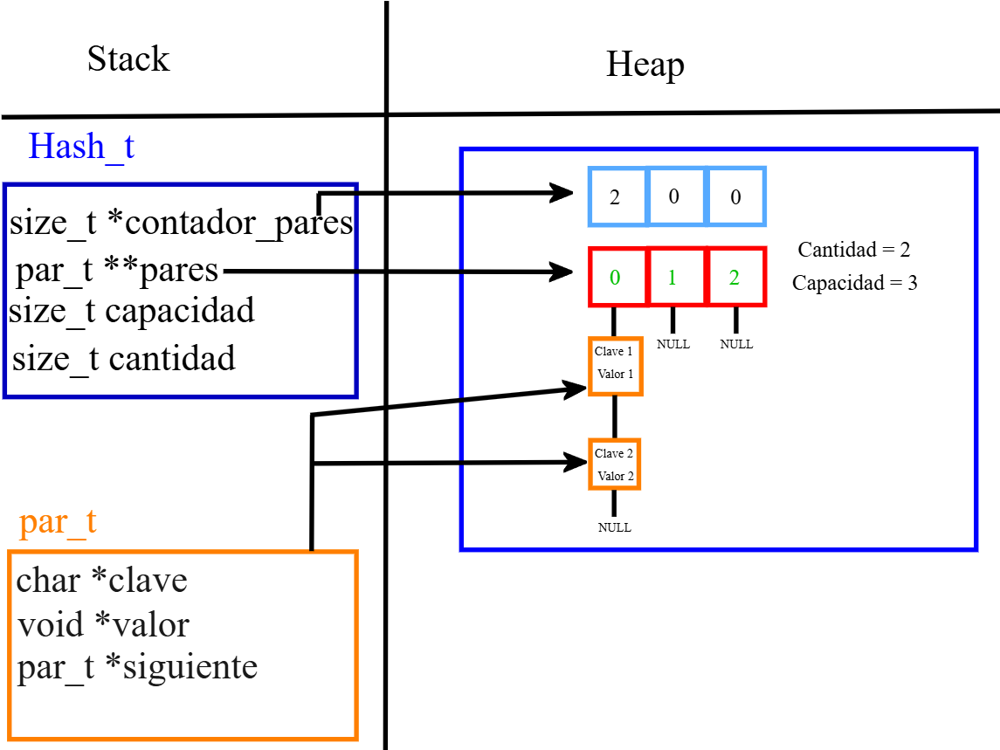

<div align="right">

</div>

# TDA HASH

## Alumno: Joaquin Ezequiel Mendez Archerrizo - 111767 - jmendeza@fi.uba.ar.

- Para compilar:

```bash
make pruebas_alumno
make tp-hash
```

- Para ejecutar:

```bash
./pruebas_alumno 
./tp_hash ejemplos/pokedex.csv
```

- Para ejecutar con valgrind:
```bash
make valgrind-alumno
make valgrind-tp-hash
```

- Para compilación y ejeccución con valgrind (version rapida):
```bash
make correr-pruebas
make correr-tp
```

---
##  Funcionamiento


El TP consta en hacer algo similar a lo que se hizo para el TP de Listas y de ABB, pero acá usamos el TDA Hash, usando nodos simplemente enlazados. Lo que se pide hacer, es básicamente, leer un archivo caso, línea por línea, separar los elementos separados por el ";" o "," (depende del separador que le pasemos), irlo casteando/parseando esos datos e irlos guardando en el ABB. Y debemos darle la opción al usuario de listar los pokemones que se leyeron de ese .csv (netamente lo hecho en el tp1 y el de lista) o darle la opción de buscar X Pokémon y que aparezca por pantalla el nombre, el tipo y las estadísticas, si se lo encuentra claro. Y se imprimiría estas dos opciones:

Bueno, para estructurar un poco esta parte, podemos empezar con un diagrama de como quedan las estructuras, y luego ir comentando en general la implementacion del hash, halar de funciones concretas (como la de insertar, la funcion hash y el rehash). Empezemos entonces por como definimos nuestras estructuras y luego vamos al diagrama:

```c
struct par {
	char *clave;
	void *valor;
	par_t *siguiente;
};

struct hash {
	par_t **pares;
	size_t *contador_pares;     //Podria ser opcional
	size_t capacidad;
	size_t cantidad;
};
```
Entonces el Hash vendria a ser la estructura prinicpal, que tiene un vector de punteros par_t (que es donde vamos a ir guardando laos pares clave-valor), una cantidad para medir cuantos pares hay en el hash, una capacidad que nos sirve a la hora de medir cuando hay que hacer rehash para el vector de pares. Y por ultimo el contador_pares, este ultimo es "opcional" y mas abajo explicare bien porque lo usamos, pero a priori digamos que nos sirve para medir cuantos pares hay en una posicion del vector que usamos para ir guardando segun lo que nos devuelva la funcion de hash. Yo lo veo mas como que la cantidad y la capacidad nos sirve como "verificador horizontal" y el vector de contador_pares es mas un "verificador vertical", supongo que con el diagrama se va a entender mejor esta idea. 
Despues tenemos la estructura de par que vendria a ser un nodo donde guardamos el par clave-valor (de ahi los campos que tenemos) y un puntero a un siguiente par, entrenos es un nodo que almacena una clave en vez de solo el valor. Bien, ahora vamos con el diagrama:

<div align="center">

</div>

Bien, capaz ahora si se entende esto de verificar con el contador_pares (array en celeste) que va aumentando el contador en esa posicion (que es la misma que el vector rojo que seria lo que nos devuelve la funcion  hash). Entonces el vector celeste seria el que verifica que no haya determinada cantidad de pares en X posicion, porque por ejemplo supongamos que nuestro hash tiene 100 elementos en la posicion 0 y el resto quedo vacia (un poco improbable), sin el contador de pares en esa posicion, buscar ya seria O(n) porque puede haber N elementos en esa posicion, pero con los contadores, podria ser una operacion O(n) pero acotada a un cierto N; en mi implementacion le puse un tope de 10 pares por posicion, entonces el pero caso seria recorrer esos 10 elementos, por lo tanto ya no es un problema de tamaño variable sino de fijo, recorrer 10 elementos como mucho (en esa posicion claro). Auqnue claro, en mi caso seria 10, vos prodias poner 20 y otra persona 50 como topes para la cantidad de pares,  entonces bie podria ser O(n) pero es amortizado a una constante que seria ese N que elijas. A lo que quiero llegar, es que si bien es un O(n) porque vos podes elegir cuantos pares aceptas por el primer vector de pares (el rojo o el que representa lo devuelto por la funcio hash), tiene un limite que es constante, entonces en el peor caso deberias recorrer un rpoblema que, a priori no sabes que tan largo sera, pero al estar limitado a un tope, sabes que no vas a recorrer mas alla de ese tope.


Bueno, una vez explicada la estructura, podemos darle una ojeada a lo que hicimos en la implementacion, particularmente me interesa hablar de insertar, la operacion del rehash y este tema de meterle un contador a la cantidad de pares que hay por posicion hash, mas que nada las ventajas y desventajas que veo con hacer esto. 

Vamos con la funcion que mas usamos que es la de buscar, que depende de la funcion de dict_buscar_par;
```c
par_t *dict_buscar_par(hash_t *hash, char *clave)
{
	size_t indice = funcion_hash(clave, hash->capacidad);
	par_t *par_actual = hash->pares[indice];
	bool clave_encontrada = false;
	void *par_buscado = NULL;
	while (par_actual != NULL && !clave_encontrada) {
		if (strcmp(clave, par_actual->clave) == 0) {
			par_buscado = par_actual;
			clave_encontrada = true;
		}
		par_actual = par_actual->siguiente;
	}
	return par_buscado;
}

```

Basicamente lo que hace es, primero se para en la psocion del hash que me de de hacer la clave que busco, luego itero "hacia abajo" (o itero los nodos que esten en esa posicion del hash) hasta que la clave del par_actual (o par en i si lo queres ver asi) y la clave que bsuco sean iguales, cortamos la iteracion y retornamos su par


### Por ejemplo:

El programa funciona abriendo el archivo pasado como parámetro y leyendolo línea por línea. Por cada línea crea un registro e intenta agregarlo al vector. La función de lectura intenta leer todo el archivo o hasta encontrar el primer error. Devuelve un vector con todos los registros creados.

<div align="center">

</div>

En el archivo `sarasa.c` la función `funcion1` utiliza `realloc` para agrandar la zona de memoria utilizada para conquistar el mundo. El resultado de `realloc` lo guardo en una variable auxiliar para no perder el puntero original en caso de error:

```c
int *vector = realloc(vector_original, (n+1)*sizeof(int));

if(vector == NULL)
    return -1;
vector_original = vector;
```


<div align="center">

</div>

---

## Respuestas a las preguntas teóricas
Incluír acá las respuestas a las preguntas del enunciado (si aplica).
