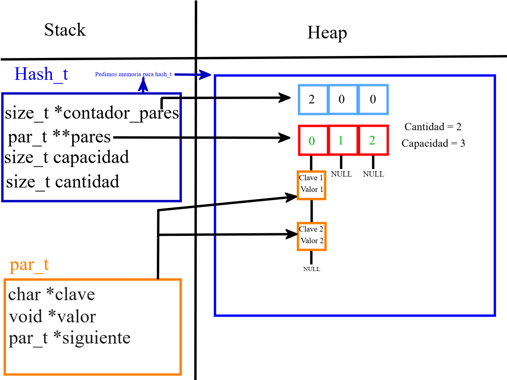
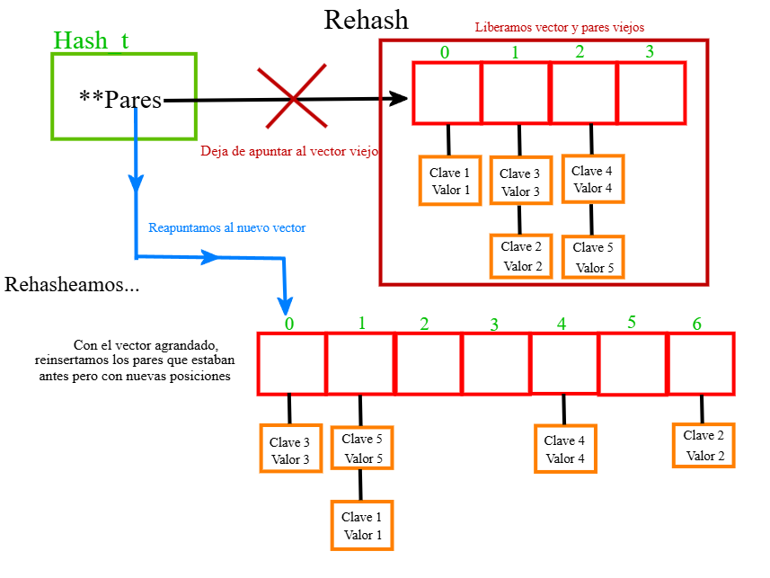
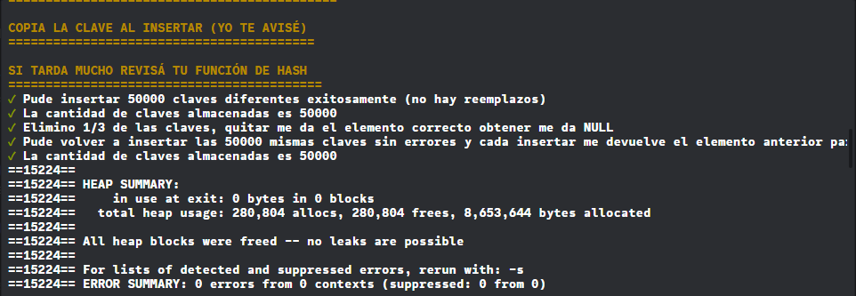
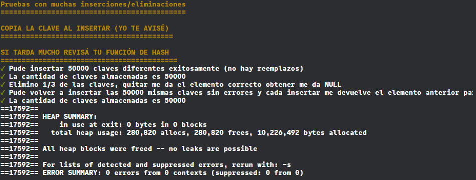
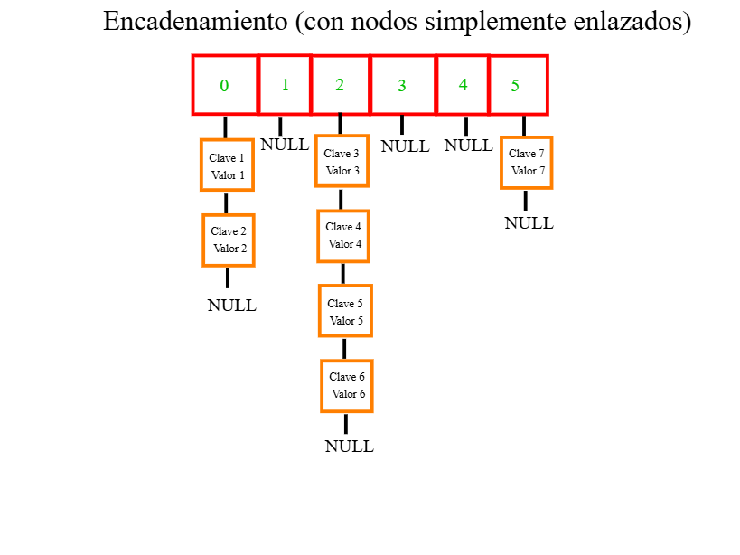
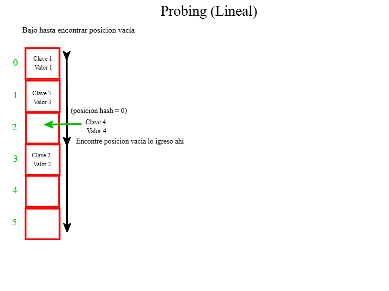
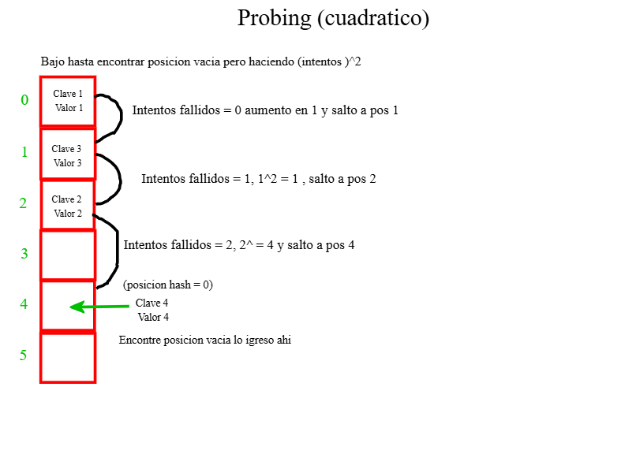
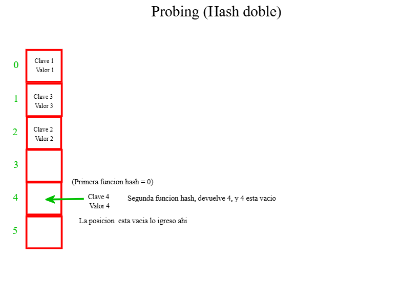

<div align="right">

</div>

# TDA HASH

## Alumno: Joaquin Ezequiel Mendez Archerrizo - 111767 - jmendeza@fi.uba.ar.

- Para compilar:

```bash
make pruebas_alumno
make tp-hash
```

- Para ejecutar:

```bash
./pruebas_alumno 
./tp_hash ejemplos/pokedex.csv
```

- Para ejecutar con valgrind:
```bash
make valgrind-alumno
make valgrind-tp-hash
```

- Para compilación y ejeccución con valgrind (version rapida):
```bash
make correr-pruebas
make correr-tp
```

---
##  Funcionamiento

El TP consta en hacer algo similar a lo que se hizo para el TP de Listas y de ABB, pero acá usamos el TDA Hash, usando nodos simplemente enlazados. Lo que se pide hacer, es básicamente, leer un archivo caso, línea por línea, separar los elementos separados por el ";" o "," (depende del separador que le pasemos), irlo casteando/parseando esos datos e irlos guardando en el ABB. Y debemos darle la opción al usuario de listar los pokemones que se leyeron de ese .csv (netamente lo hecho en el tp1 y el de lista) o darle la opción de buscar X Pokémon y que aparezca por pantalla el nombre, el tipo y las estadísticas, si se lo encuentra claro. Y se imprimiría estas dos opciones:

Bueno, para estructurar un poco esta parte, podemos empezar con un diagrama de como quedan las estructuras, y luego ir comentando en general la implementación del hash, halar de funciones concretas (como la de insertar, la función hash y el rehash). Empecemos entonces por como definimos nuestras estructuras y luego vamos al diagrama:

```c
struct par {
	char *clave;
	void *valor;
	par_t *siguiente;
};

struct hash {
	par_t **pares;
	size_t *contador_pares;     //Podria ser opcional 
	size_t capacidad;
	size_t cantidad;
};
```
Entonces el Hash vendría a ser la estructura principal, que tiene un vector de punteros par_t (que es donde vamos a ir guardando laos pares clave-valor), una cantidad para medir cuantos pares hay en el hash, una capacidad que nos sirve a la hora de medir cuando hay que hacer rehash para el vector de pares. Y por último el contador_pares, este último es "opcional" y más abajo explicare bien porque lo usamos, pero a priori digamos que nos sirve para medir cuantos pares hay en una posición del vector que usamos para ir guardando según lo que nos devuelva la función de hash. Yo lo veo más como que la cantidad y la capacidad nos sirve como "verificador horizontal" y el vector de contador_pares es más un "verificador vertical", supongo que con el diagrama se va a entender mejor esta idea. 
Después tenemos la estructura de par que vendría a ser un nodo donde guardamos el par clave-valor (de ahí los campos que tenemos) y un puntero a un siguiente par, entrenos es un nodo que almacena una clave en vez de solo el valor. Bien, ahora vamos con el diagrama:

<div align="center">

</div>

Bien, capaz ahora si se entiende esto de verificar con el contador_pares (array en celeste) que va aumentando el contador en esa posición (que es la misma que el vector rojo que sería lo que nos devuelve la función hash). Entonces el vector celeste seria el que verifica que no haya determinada cantidad de pares en X posición, porque por ejemplo supongamos que nuestro hash tiene 100 elementos en la posición 0 y el resto quedo vacía (un poco improbable), sin el contador de pares en esa posición, buscar ya seria O(n) porque puede haber N elementos en esa posición, pero con los contadores, podría ser una operación O(n) pero acotada a un cierto N; en mi implementación le puse un tope de 10 pares por posición, entonces el pero caso sería recorrer esos 10 elementos, por lo tanto ya no es un problema de tamaño variable sino de fijo, recorrer 10 elementos como mucho (en esa posición claro). Aunque claro, en mi caso seria 10, vos podrías poner 20 y otra persona 50 como topes para la cantidad de pares,  entonces bien podría ser O(n) pero es amortizado a una constante que sería ese N que elijas. A lo que quiero llegar, es que si bien es un O(n) porque vos podes elegir cuantos pares aceptas por el primer vector de pares (el rojo o el que representa lo devuelto por la función hash), tiene un límite que es constante, entonces en el peor caso deberías recorrer un problema que, a priori no sabes que tan largo será, pero al estar limitado a un tope, sabes que no vas a recorrer mas allá de ese tope.

## Funcionamiento Mas especifico
Bueno, una vez explicada la estructura, podemos darle una ojeada a lo que hicimos en la implementación, particularmente me interesa hablar de insertar, la operación del rehash y este tema de meterle un contador a la cantidad de pares que hay por posición hash, más que nada las ventajas y desventajas que veo con hacer esto. 

###  funcion hash
Primero podemos hablar de la función de hash que se me ocurrio:
```c
size_t funcion_hash(const char *clave, size_t capacidad)
{
	size_t hash_posicion = 0;
	size_t i = 0;
	while (clave[i] != '\0') {
		hash_posicion = (hash_posicion * 73 + (unsigned char)clave[i]) %
				capacidad;
		i++;
	}
	return hash_posicion;
}
```
Dijeron que lo mejor que podíamos hacer es ir recorriendo la clave y jugar con el valor ascii de la letra en cuestión, y eso hacemos, vamos actualizando la variable hash_posicion multiplicando el valor de la misma por el 73 y le sumamos el valor Ascci de la letra en cuestión y dividimos por la capacidad y nos quedamos con el resto de la división y lo seteamos en hash_posicion. 
Obvio que no es revolucionario, ni nada rebuscado, es lo primero que se me ocurrió y vi que dentro de todo funcionaba bien, y asumo que está bien porque no se rompió en las pruebas de meter los 50000 pares. Capaz te preguntes ¿por qué el 73? y es que nada, cuando estaba haciendo la función hash me apareció un video de el teorema de sheldon cooper y que hablaba del número 73 y nada, lo meto medio que porque apareció ahí.   

###  Hash Buscar
Vamos con la función que mas usamos que es la de buscar, que depende de la función de dict_buscar_par;
```c
par_t *dict_buscar_par(hash_t *hash, char *clave)
{
	size_t indice = funcion_hash(clave, hash->capacidad);
	par_t *par_actual = hash->pares[indice];
	bool clave_encontrada = false;
	void *par_buscado = NULL;
	while (par_actual != NULL && !clave_encontrada) {
		if (strcmp(clave, par_actual->clave) == 0) {
			par_buscado = par_actual;
			clave_encontrada = true;
		}
		par_actual = par_actual->siguiente;
	}
	return par_buscado;
}
```

Básicamente lo que hace es, primero se para en la posición del hash que me dé  hacer la clave que busco, luego itero "hacia abajo" (o itero los nodos que estén en esa posición del hash) hasta que la clave del par_actual (o par en i si lo quieres ver así) y la clave que busco sean iguales, cortamos la iteración y retornamos su el par que encontramos, o Null ya que si no existe, no se modifica su valor de entrada, entonces retornamos NULL, y en buscar devolvemos NULL si no lo encontró o el valor de ese par devuelto. 

###  Hash Quitar/eliminar
Despues en eliminar, tenemos estas 3 funciones:
```c
void reajustar_destruir_par(hash_t *hash, par_t *par_actual, par_t *par_aux,
			    size_t indice)
{
	if (par_aux == NULL) {
		hash->pares[indice] = par_actual->siguiente;
	} else {
		par_aux->siguiente = par_actual->siguiente;
	}
	free(par_actual->clave);
	free(par_actual);
	hash->contador_pares[indice]--;
	hash->cantidad--;
}
void *eliminar_par(hash_t *hash, char *clave, par_t *par_actual, size_t indice)
{
	void *valor_eliminado = NULL;
	bool elimine_par = false;
	par_t *par_aux = NULL;
	while (par_actual != NULL && !elimine_par) {
		if (strcmp(par_actual->clave, clave) == 0) {
			valor_eliminado = par_actual->valor;
			reajustar_destruir_par(hash, par_actual, par_aux,
					       indice);
			elimine_par = true;
		}
		par_aux = par_actual;
		par_actual = par_actual->siguiente;
	}
	return valor_eliminado;
}
void *hash_quitar(hash_t *hash, char *clave)
{
	if (hash == NULL || clave == NULL || hash->cantidad == 0) {
		return NULL;
	}
	size_t indice = funcion_hash(clave, hash->capacidad);
	par_t *par_actual = hash->pares[indice];
	if (par_actual == NULL) {
		return NULL;
	}
	void *valor_eliminado = eliminar_par(hash, clave, par_actual, indice);
	return valor_eliminado;
}
```
Inicialmente, hacemos lo mismo que buscar, no vi tan claro que podamos usar buscar, ya que si bien queremos el valor eliminado, entre medio de la función, reajustar y luego liberar el par, entonces, preferí no reutilizar buscar. Si lo encontramos, nos guardamos en una variable el valor del elemento a eliminar y llamamos a reajustar_destruir_par, que tiene dos casos. El primer caso es que el para eliminar este en la primera posición (o sea que si par_aux se mantiene en NULL quiere decir que el primer elemento era el que buscábamos), entonces decimos que el primer elemento de posición hash, apunte al siguiente al que vamos a eliminar. Caso contrario, es que este en el medio o al final (que par_aux sea distinto de null),donde seteamos que el siguiente del nodo aux, apunte al siguiente del par que queremos eliminar, entonces si vemos los nodos, el par que queríamos eliminar quedo "desencadenado" y lo podemos liberar porque su dirección de memoria la estamos guardando en par_actual, y decrementamos la cantidad y el contador_pares de esa posición hash. Y al final devolvemos el valor eliminado que lo obtenemos de la función  eliminar_par. 

###  Hash Iterar
 ```c
size_t hash_iterar(hash_t *hash, bool (*f)(char *, void *, void *), void *ctx){
	if (hash == NULL || f == NULL) {
		return 0;
	}
	size_t cantidad_iteraciones = 0;
	bool finalizar_iteracion = false;
	for (size_t i = 0; i < hash->capacidad && !finalizar_iteracion; i++) {
		par_t *par_actual = hash->pares[i];
		while (par_actual != NULL && !finalizar_iteracion) {
			if (!f(par_actual->clave, par_actual->valor, ctx)) {
				finalizar_iteracion = true;
			}
			cantidad_iteraciones++;
			par_actual = par_actual->siguiente;
		}
	}
	return cantidad_iteraciones;
}
```
Luego tenemos iterar, que no tiene mucha gracia ya que lo que hacemos recorrer el has, pero como si fuera una "matriz" ya que primero te paras en la primera posición del vector de las posiciones hash, y luego iteras hasta que algún nodo te de NULL que quiere decir que llegaste al final del vector, y luego saltas a la siguiente posición del vector de posiciones hash y así sucesivamente. (Obvio que si la función devuelve false o llega al final de todo el hash se corta la iteración).

###  Hash Insertar, caso feliz.

Ahora vamos con lo "más interesante, la función de insertar que depende de varias funciones y distintos casos. Podemos arrancar en el caso feliz, donde no vemos el tema de coaliciones y rehashing:
 ```c
bool agregar_par(hash_t *hash, char *clave, void *valor, void **encontrado)
{
	size_t indice_hash = funcion_hash(clave, hash->capacidad);
	par_t *pos_actual = hash->pares[indice_hash];
	bool encontre_clave_repetida = false;
	while (pos_actual != NULL && !encontre_clave_repetida) {
		if (buscar_y_editar_valor_clave_repetida(
			    clave, valor, pos_actual, encontrado)) {
			encontre_clave_repetida = true;
		}
		pos_actual = pos_actual->siguiente;
	}
	if (!encontre_clave_repetida) {
		if (!agregar_par_no_repetido(hash, clave, valor, indice_hash)) {
			return false;
		}
	}
	return true;
}
```
En ese caso, tendríamos dos situaciones, la primera es que me pasaron una clave que ya existe, entonces debemos modificar su valor, o caso contrario donde la clave no existe en el hash entonces debemos crear un nodo y setearlo tal que quede la clave y el valor/contenido dentro del mismo. Entonces algo así hicimos: ```c
 ```c
bool buscar_y_editar_valor_clave_repetida(char *clave, void *valor,
					  par_t *pos_actual, void **encontrado)
{
	if (strcmp(clave, pos_actual->clave) == 0) {
		if (encontrado != NULL) {
			*encontrado = pos_actual->valor;
		}
		pos_actual->valor = valor;
		return true;
	}
	return false;
}
```

Acá simplemente devolvemos true si pudimos la clave del par que estamos verificando es la misma a la clave que querían insertar, en ese caso, me guardo en encontrado el valor previo a ser modificado, modifico el valor viejo por el valor que me pasaron y devolvemos true, si no ocurre esto, devolvemos false, y en agregar par, seguís iterando hasta que se encuentre o no si es que hay clave repetida. Si se devolvió true tenemos una flag que corta la iteración y saltea el siguiente caso, que es que no existe dicha clave en el hash entonces debemos agregarla, y para eso tenemos a la función de agregar pero para clave que no es repetida: ```c
 ```c
bool agregar_par_no_repetido(hash_t *hash, char *clave, void *valor,
			     size_t indice_hash)
{
	par_t *par_nuevo = crear_nuevo_par(clave, valor);
	if (par_nuevo == NULL) {
		return false;
	}
	par_nuevo->siguiente = hash->pares[indice_hash];
	hash->pares[indice_hash] = par_nuevo;
	hash->contador_pares[indice_hash]++;
	hash->cantidad++;
	return true;
}
```

Donde simplemente creamos un par, si falla la función de crear, devolvemos directamente false, y si no falla el calloc, mandamos ese par a la posición hash que le pasamos a la función, aumentamos la cantidad de pares que hay tanto en general como en esa posición hash; algo igual que no sé muy bien si ocurre así, pero me parece (en base a algunas pruebas que hicimos), es que se insertan tipo pila ya que si meto a Mewtwo por ejemplo (que era el Pokémon que hacía que frenara la iteración en mis pruebas de iterar), y metía otros dos pokemones, la función de iterar me devolvía 3 entonces en teoría queda tipo una pila la inserción de pares nuevos, pero no estamos muy seguros de que sea realmente así.

###  Hash Insertar, caso triste, rehashing.

Tristemente, no vivimos siempre el caso feliz, y debemos hablar del rehashing, lo más difícil de programar en este tp por lejos. Obvio que no podemos hacer realloc del viejo vector de pares con más cantidad porque resuelves el problema de ahí para adelante (porque tendrías más capacidad y te terminan dando números más altos para las posiciones hash) pero no resuelves las coaliciones de lo que estaba antes; entonces estas obligado a tener que crearte un vector nuevo, Pero vamos por partes.

####  ¿Que buscamos al hacer Rehash ?

Básicamente debemos solucionar el problema de encadenar muchas claves en una misma posición hash, de todas formas al ser un hash abierto podemos darnos una cierta libertad ya que se van metiendo en los nodos, no es que estrictamente dos pares no pueden ocupar una misma posición como ocurre en el hash cerrado. Pero tampoco podemos abusar ya que podemos tener la mala suerte de que muchos pares vayan a una misa posición hash, entonces para evitar esa situación, debemos hacer rehashing más que nada para intentar evitar la segunda situación que mencione. 
Entonces ¿Como lo hacemos?, bueno en clase mencionaron que podías crearte otro hash pero con un vector de capacidad mayor (el doble/triple de la capacidad anterior), pero vi más conveniente crearme solo el vector de pares con la nueva capacidad, más que nada para no abusar tanto de pedir memoria que al final no usas para nada, porque simplemente haces calloc del vector de pares con una capacidad aumentada y luego de pasar los pares al nuevo vector (y si todo salió bien) le pedís al hash viejo que apunte al nuevo vector de pares. 

Bueno nos desviamos, así que volviendo lo que deberíamos hacer, es pedir un nuevo vector de pares con una capacidad mayor, y tenemos que recorrer el vector viejo de pares e ir agregando el par en cuestión al nuevo vector, pero ahora como tenemos una capacidad mayor, nos va a dar resultados distintos a los que nos dio la primera vez ya que el dividiendo de la función hash (la capacidad) aumento, es como si divido 100/3, que nos queda de resto 1 contra 100 /6 que nos queda 4 como resto. Y a la vez, podes ir haciendo free, pero antes debemos guardarnos en una variable el par siguiente así podemos avanzar en la iteración sin perder referencia alguna o liberar mal, algo así en código:
 ```c
void liberar_tabla_vieja(par_t *par_actual)
{
	free(par_actual->clave);
	free(par_actual);
}

void actualizar_nueva_tabla(hash_t *hash, par_t **tabla_vieja, size_t i)
{
	par_t *par_actual = tabla_vieja[i];
	while (par_actual != NULL) {
		par_t *par_aux = par_actual->siguiente;
		agregar_par(hash, par_actual->clave, par_actual->valor, NULL);
		liberar_tabla_vieja(par_actual);
		par_actual = par_aux;
	}
}

hash_t *rehash(hash_t *hash)
{
	par_t **tabla_vieja = hash->pares;
	size_t *contador_viejo = hash->contador_pares;
	size_t capacidad_vieja = hash->capacidad;
	hash->capacidad *= FACTOR_CRECIMIENTO;
	hash->pares = calloc(hash->capacidad, sizeof(par_t));
	if (hash->pares == NULL) {
		return NULL;
	}
	hash->contador_pares = calloc(hash->capacidad, sizeof(size_t));
	if (hash->contador_pares == NULL) {
		free(hash->pares);
		return NULL;
	}
	hash->cantidad = 0;
	for (size_t i = 0; i < capacidad_vieja; i++) {
		actualizar_nueva_tabla(hash, tabla_vieja, i);
	}
	free(contador_viejo);
	free(tabla_vieja);
	return hash;
}
```

Y para que quede mas claro podmeos hacer un dibujo de la idea del rehash.
<div align="center">

</div>

Entonces, lo que yo hago es, pedimos memoria para un nuevo vector de pares pero con el doble de capacidad, obvio que te guardas el vector viejo porque debemos trabajar con el (que me lo guardo en tabla_vieja), y luego tenemos que ir reinsertando los pares que estaban antes pero recalculando su nueva posición en el nuevo vector con mayor capacidad; porque ahora al tener más capacidad, y la usamos para calcular el resto en la función de hash, me puede devolver números más grandes (no acotado entre 0 y 3 sino de 0 a 6). También pedimos memoria para el vector que cuenta cuantos pares hay por posición, en mi dibujo tendríamos el vector con los contadores, pero para hacerlo más genérico, lo dejamos así. 

Entonces, lo que yo hago, es itero en la tabla vieja, y a llamo a agregar_par pero como el campo capacidad de hash cambio, al llamar a la función de hash, esta nos devuelve valores más grandes, como comente antes. Y una vez que terminamos de agregar el par al nuevo vector, hacemos free de la clave y el par en cuestión, y como nos guardamos siempre en una variable auxiliar, el siguiente a iterar, avanzamos gracias a ese, obviamente como charlamos antes en agregar_par, es que vamos reactualizando el contador de pares, ya que con calloc me inicializa todo en 0 al pedir memoria para el nuevo vector de contador de pares y vamos actualizando a medida que agregamos.
Por último, al terminar de agregar, liberamos la tabla vieja y el vector viejo de contador de pares. Y devolvemos el hash actualizado; si salió todo bien, nos quedaríamos con el hash actualizado, y en caso de que algo falle (una inserción un calloc, etc.) no actualizamos el hash, porque si no nos quedaría invalido o podríamos perder pares, por eso es importante esta línea al agregar:
 ```c
	hash_t *diccionario_rehasheado = rehash(hash);
	if (diccionario_rehasheado == NULL) {
		return false;
	}
	hash = diccionario_rehasheado;
```

###  Contador de pares por posicion hash

Por último, quería comentar esto de ir verificando cuantos pares hay por posición hash. Originalmente no tenía planeado ir trackeando cuantos pares hay por posición, pero pensé mejor y pensé que no sería tan complicado ya que podías tener un vector y hacer de cuenta que cada posición del mismo era equivalente a tener como un contador de cada posición, como hice en mi diagrama de memoria, que Tenes el vector en rojo y arriba el celeste. Pero algo que note es que obviamente hay varios más allocs y uso de memoria, principalmente por dos cosas; la primera es que obvio debemos pedir memoria para este vector como cualquier otro vector que trabajamos, y la segunda razón es que es muy probable que hagamos algún rehash extra porque puede ocurrir esto de que queden varios pares en una posición hash. Tampoco sé si está bien las proporciones que metimos, es decir no se si como tope 10 elementos está bien, ya que me parece poco supongo, pero tampoco quiero abusar del rehash ya que como vimos el proceso es muy caro y queremos que se haga lo menos posible. También me ocurrió a la hora de hacer rehash el hecho de querer triplicar la cantidad ya que así evitaríamos bastante la posibilidad de hacer rehash.
Me desvié, pero a lo que quiero llegar es que al tener un contador tenemos una ventaja y una desventaja, la ventaja la comentamos casi al principio que es el hecho de que la complejidad de buscar bajaría a un O(10) ya que solo debería hacer hasta 10 iteraciones por posición hash, es decir si no hubiera una limitación podrían haber N elementos en esa posición que vos desconoces el largo de la misma, pero si lo limitas sabes que ese N es ,como máximo, 10 (en mi implementación). Pero viene con una contra considerable potente, y es el uso extra de memoria y una posibilidad más alta de hacer rehash, por un lado debes hacerte cargo de reservar y liberar la memoria para ese vector extra, lo cual suma una cantidad de allocs y un uso extra en la memoria, lo podemos ver en la siguiente prueba del Xanu, el uso mayor de bytes y de allocs:

Pruebas sin contador:
<div align="center">

</div>

Prueba con contador:
<div align="center">

</div>

Notamos que la diferencia de alloc es realmente muy poca, pero la diferencia es 1.500.000 de bytes aproximadamente; a mi me parece bastante la diferencia pero en otra medida mayor como MB o GB ya no es tanto, es un dato a resaltar nada mas.

En resumen, supongo que tuviemos que hacer un balance entre mas complejo y mas eficiente, porque debemos pedir y usar mas memoria, pero a cambio nos aseguramos que la busqueda sea un O(1) (en mi caso 10). Pero por otro lado tenes la opcion de hacer mas simple el algoritmo pero a cambio saber que al buscar ya no es O(1) o O(n) acotado sino un O(n) porque no sabes a priori cuantos pares hay por posicion, de la otra forma sabes que puede haber como maximo 10 pares por posicion. 

## Respuestas a las preguntas teóricas

1) Un diccionario es un TDA en la que podemos almacenar un valor asociándolo a una clave única. La gracia de los diccionarios es que las búsquedas son muy rápidas, por ejemplo en la lista sabemos que la búsqueda era O(n) porque recorrías toda la lista hasta que encontrabas lo ¿qué buscabas, en un ABB balanceado era O(log(n)) pero acá, en el promedio, es O(1), suponiendo que está limitado como mencione antes la cantidad de pares que puede haber por posición de hash y que debe estar más o menos un uso de la capacidad del vector de posiciones hash desocupado. 
3 formas de implementar un diccionario son:

- **Usando la tabla de hash**, que vendría a ser un array donde guardamos la clave y el valor según lo que nos devuelva la función de hash que diseñemos o tengamos que usar que sería un índice del array, y como ya analizamos más arriba, la búsqueda es un O(1) o a lo sumo un O(n) acotado.

- **Usando un AVL**, si quisieras podrías readaptar el AVL, para que guarde una clave y un valor asociado, aparte mantener una buena complejidad al buscar porque es O(log (n)) 

- **Usando una lista con nodos simplemente enlazados**, esta sería super ineficiente, a no ser que la uses en un hash abierto, pero si haces una sola lista y metes ahí todos los pares clave-valor, la complejidad de buscar es O(n) que bueno, es bastante mala; pero si usas la lista en un hash abierto, tranquilamente podes usarla y seria bastante eficiente, capaz no el hecho de usar lista sino de usar nodos simplemente enlazados.  

2) Por otro lado, tenemos la función Hash que básicamente lo que hace es recibir una clave y transformarla en un índice aplicando alguna función matemática. Y dentro de esa función matemática uno puede hacer lo que quiera, multiplicar por X número, sumarle algo, etc. Pero como recomendación, deberíamos quedarnos con algo que este dentro de la cantidad de espacios que tenemos en el array; si Tenes un array con 5 posibles posiciones y te da 10 la función hash, está claro que no es una buena función, así que la operación que mejor nos calzaría es dividir y quedarnos con el resto de la división; es decir usar el "%" en la operación, podemos no se ir recorriendo la clave letra a letra, sumarle algo dividir usando % y guardarte su valor. Es obvio que trabajamos con los valores de la tabla Ascci, al transformar letras en números. 

Ahora bien, ¿Qué necesita una buena función de hash?
- **Debería ser uniforme**, o sea que me tiene que dar distintos índices según la clave que ingreso, obvio que puede darme alguna vez un mismo número, pero no debería ser la regla. 
- **Ser constante**, o mejor dicho, si recibimos dos veces la misma clave, nos devuelva el mismo índice
- Podríamos **depender de que se usen los valores de la tabla ascci** porque si no usaríamos la clave en cuestión. Es decir, debemos usar los valores Ascci de cada letra de la clave
- Como mencione arriba, **la función hash no puede darnos un índice que exceda la capacidad que tiene el vector** donde vamos a ir guardando los pares. Por eso nos viene bien usar el operador % y usar la capacidad de nuestro vector, así estaríamos asegurándonos que no nos devolverá un valor fuera de la capacidad del vector.

3) La tabla Hash es un arreglo donde vamos a ir guardando pares clave-valor y que cada posición indicaría una posición que es decidida por a la función de hash que mencionamos antes, en el hash cerrado es un único vector y cada espacio guarda un solo par, e los abiertos Tenes el vector que representa la posición y luego vas almacenando los pares con una estructura de soporte como los nodos o listas enlazadas.

Tenemos 3 formas de resolver las colisiones:

+ El **encadenamiento**, que es básicamente lo implementado en el tp, tenemos un vector dinámico que representa la tabla hash, y cada elemento de ese vector apunta a una estructura de soporte, sea una lista simplemente enlazada, nodos simples o dobles, incluso un árbol binario. Es decir, las colisiones se resuelven aceptando que haya pares en la misma posición de la tabla hash e irlos apilando. Ya vimos lo que esto con lleva, en cuanto a complejidad y vimos algunas formas de combatir los casos bordes de apilamiento en una posición de hash.
	Aca un dibujo de como podria ser un hash que soluciona las colisiones con el encadenamiento:
<div align="center">

</div>

+ Esta también el **probing** (con sus derivados) que es no meter una estructura de soporte, sino que podes buscar la siguiente posición libre del vector de las posiciones hash; tendríamos 3 metros para buscar el siguiente espacio libre del has:
    + **Probing lineal** que como dice su nombre recorre linealmente el vector hasta que encuentre un espacio libre en el mismo para meter el nuevo par.
	<div align="center">
	
	</div>
+ **Probing cuadrático** que es similar al anterior pero en vez de recorrer linealmente, lo que hace es tener un contador de intentos fallidos e ir haciendo por cada iteración (cant de intentos fallidos)^2, es decir que pega saltos hasta que encuentre un espacio vacío. Igual es medio ineficiente porque podría tener en la siguiente posición nada, y si salta podría tener un elemento ahí y podría seguir así. Además depende de la tabla sea lo suficientemente grande porque si no tendría que arrancar desde la posición cero hasta que encuentre algún espacio vacío.
	<div align="center">
	
	</div>
+ **Hash doble** donde usamos una segunda función hash para recalcular el índice donde pondríamos el nuevo par, pero también es medio ineficiente porque ponerle que también te de una posición ocupada y ¿qué haces después, te calculas con una tercera función? además tendrías que tener otra función de hash lo cual agrega complejidad ya que debe calcular una vez, buscar si está ocupado y volverlo a calcular y verificar que no esté ocupado.
	<div align="center">
	
	</div>

+ Por ultimo tenemos el **rehashing**, que ya hablamos un montón sobre esto, pero consta en que si superamos un cierto factor, entre la cantidad de pare que hay en el vector y la capacidad del mismo, creamos un nuevo vector con más capacidad y reinsertamos los elementos pero esta vez van a dar posiciones distintas ya que la capacidad del vector se aumentó. No hay mucho más que agregar que no se haya hablado previamente.

4) El tamaño de la tabla  es importante porque, si tenemos una mayor capacidad, podríamos recibir mayor variedad de índices que devuelve el hash, por ejemplo si tenemos una capacidad de 100 y tenemos una capacidad de 3, si hacemos 100/3 y nos quedamos con el resto nos da 1, pero si tenemos una capacidad de 6 y hacemos la misma cuenta nos da de resto 4, aunque si hacemos 100/12 también nos queda 4 de resto, es decir, que si la capacidad aumenta es probable que también aumente el resto que nos da y eso se traduce en dos cosas, uno la posibilidad de que la clave cambie de posición ( porque pasaría de 1 a 4) y que si tenemos una capacidad de 12 la función hash podría ahora devolver una índice mayor a la capacidad que había originalmente, es decir, si antes había capacidad 3, podría devolver 3 posiciones, peor con 12 puede devolver 12 posiciones diferentes.

Y al tener mayor variedad de posibles índices, disminuye la posibilidad que haya colisión tanto para hashs abiertos como cerrados, ya que se distribuyen mejor los pares, obvio que en un hash abierto es más flexible en ese sentido y a priori no es super importante. Pero en uno cerrado es vital ya que así te evitas las colisiones y no Tenes que recorrer todo el vector para buscar la posición vacía más cercana. 

Además, al tener un mayor tamaño en el vector, la posibilidad de hacer rehash disminuye porque termina siendo más difícil que se supere el factor de carga; por ejemplo inicialmente Tenes una capacidad de 3 par que excedamos el factor de carga, con solo ocupemos 2 espacios deberíamos hacer un rehash, en cambio sí tenemos 12 de capacidad, deberías ocupar 9, y así iríamos incrementando. Es decir, que a mayor tamaño la tabla menor chance de hacer rehash tenemos.

En resumen, el tamaño/capacidad de una tabla si importa, ya que reduce la posibilidad de colisiones y de hacer rehash. Es aún más "potente" o más visible en un hash cerrado ya que solo un par puede ocupar una posición, y si la tabla es chica es más fácil que se apiñen y tengas colisiones y tendrías que hacer rehash.

Ahora bien, como mencione antes en un hash cerrado es aún más importante, pero ¿y el hash abierto? puede tener varios pares en una misma posición porque Tenes una estructura de soporte que permite esto. Entonces ¿realmente importa el tamaño en un hash abierto?

Y la respuesta es que obviamente si importa el tamaño, por más que puedas tener varios pares en una misma posición, la realidad es que ganas por un lado pero perder por otro ya que si Tenes una capacidad de 3, a prior no te preocupa esto de que si ocupaste 2 posiciones Tenes que hacer rehash, ya que podes empezar a acumular pares en una misma posición, entonces la búsqueda ya no sería un O(1) sino un O(n) ya que podes tener la mala suerte de que no se 50 pares vayan a parar a la posición 0 y tendrías que recorrer como mucho 50 pares, pero podría haber más o menos, entonces es un problema de tamaño variable. Entonces si tenemos una tabla grande, reducimos la posibilidad primero de pares se junten en una misma posición ya que ahora Tenes 6 o 12 posibles posiciones. 
