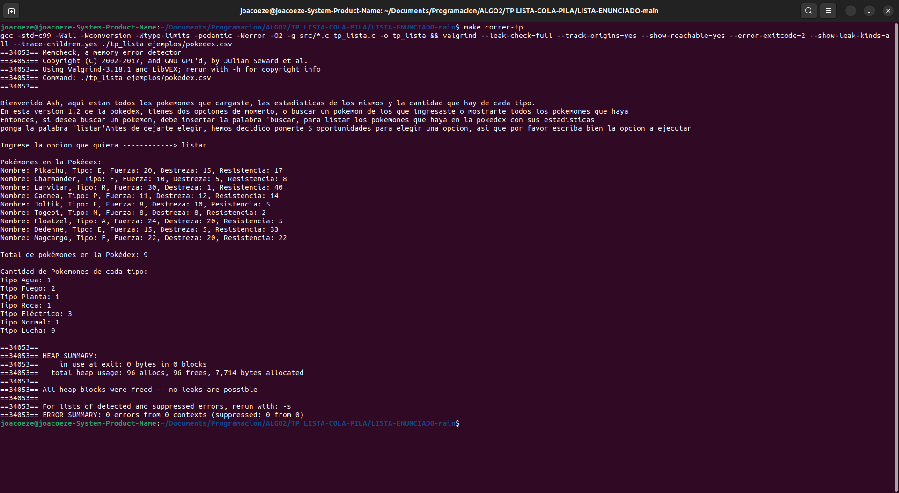
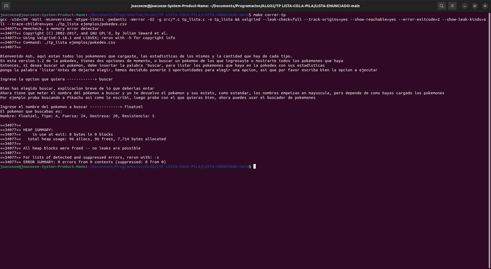
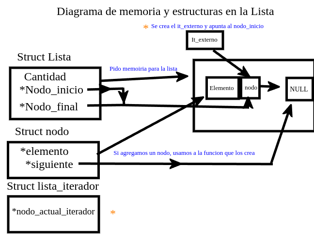
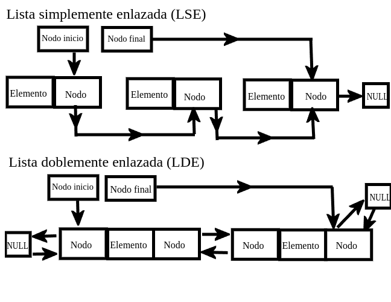
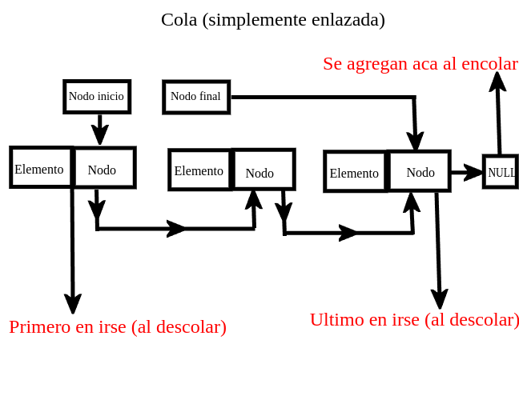
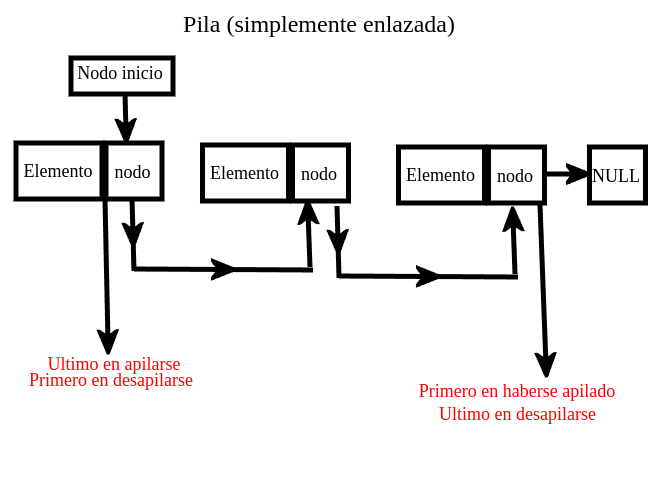

<div align="right">

</div>

# TDA LISTA


## Alumno: Joaquin Ezequiel Mendez Archerrizo - 111767 - jmendeza@fi.uba.ar.

- Para compilar:

```bash
make pruebas_alumno
make tp-lista
```

- Para ejecutar:

```bash
./pruebas_alumno 
./tp_lista ejemplos/pokedex.csv
```

- Para ejecutar con valgrind:
```bash
make valgrind-alumno
make valgrind-tp-lista
```

- Para compilación y ejeccución con valgrind (version rapida):
```bash
make correr-pruebas
make correr-tp
```

---

##  Funcionamiento
El TP consta en hacer algo similar a lo que se hizo para el TP1, pero aca usamos listas simplemente enlazadas, en vez de usar vectores dinamicos. Lo que se pide hacer, es basicamente, leer un archivo csv, linea por linea, separar los elementos separados por el ";" o "," (depende del separador que le pasemos), irlo casteando/parseando esos datos e irlos guardando en una LSE (lista simeplemente enlazada). Y debemos darle la opcion al usuario de listar los pokemones que se leyeron de ese .csv (netamente lo hecho en el tp1) o darle la opcion de buscar X pokemon y que aparezca por pantalla el nombre, el tipo y las estadisticas, si se lo encuentra claro. Y se imprimiria estas dos opciones:

<div align="center">

</div>


<div align="center">

</div>

La idea es ir escribiendo sobre la implementacion de la lista (no tendria mucha gracia explicar que hace pila y cola porque son casos muy similares a la lista y en la parte teorica se habla mas sobre sus funcionalidades y complejidades), algunos problemas presentados, sobre los campos elegids para las estructuras usadas, y un caso particular del main, que creo necesario explicar.

Para empezar, podemos empezar en los campos del TDA lista, en nuestro caso tenemos dos ya definidos y uno que es "auxiliar".  
```c
typedef struct nodo {
	void *elemento;
	struct nodo *siguiente;
} Nodo;

struct lista {
	Nodo *nodo_inicio;
	Nodo *nodo_final;
	size_t cantidad;
};

typedef struct lista_iterador {
	Nodo *nodo_actual_iterador;
} lista_iterador;
```

<div align="center">

</div>

Vamos por el mas "elemental" que es el de nodo, en nodo vamos a guardar un void* a un elemento ya que ahi almacenariamos el elemento que hay en ese nodo; sea un struct, un numero, etc. Y luego tenemos otro que es otro struct nodo* al siguiente. Este fue una de esas cosas que no las tenes muy claro al empezar, mas que nada porque no estas acostumbrado a tener un struct del mismo tipo dentro del mismo struct, o sea no es muy comun (al menos en fundamentos) tener un struct nodo y dentor tener otro struct. Pero luego de pensarlo tenes en claro que si creas un nodo, necesitas que tenga un siguiente para que esten elazadaos los elementos y asi formar la lista enlazada, entonces un puntero a siguiente vas a necesitar pero ¿A qué?, termine concluyendo que lo obvio seria tener otro puntero para mantener el enlazamiento entre nodos. De todas formas, no es algo trivial, pero tiene sentido que el campo *siguiente dentro de un nodo, sea otro nodo. 

Luego tenemos el struct lista, este no fue tan dificil porque ya lo tenia anotado de la clase que lo vimos que era lo necesario para este struct; una cantidad, muy util para la funcion de "lista_cantidad_elementos" ya que podriamos devolver el campo en si, y para validaciones en los casos de querer buscar y/o eliminar en una lista que tuviera cantidad 0 (porque el programa pincharia porque no podrias buscar o eliminar en una lista que no tiene nada). Despues tenemos el puntero al nodo inicial y un puntero al nodo final, el puntero inicila, lo usamos mucho para recorrer la lista, o sea lo que hacemos es algo de este estilo en la mayotia de operaciones que tengan que ver con el medio o el final de la lista:
```c
    //por agarrar cualquier funcion
	Nodo *nodo_anterior = lista->nodo_inicio;
	for (size_t i = 0; i < posicion - 1; i++) {
		nodo_anterior = nodo_anterior->siguiente;
	}
	nodo_nuevo->siguiente = nodo_anterior->siguiente;
	nodo_anterior->siguiente = nodo_nuevo;
```
Donde seteamos el nodo que usamos para recorrer, seteandolo o acomodandolo para que apunte al nodo inicila y que recorra hasta X veces. Auqnue tambien lo usamos para agregar o eliminar en la posicioon 0 porque necesitamos reajustar el nodo inicial ya que se ve "perturbado" el nodo inicial. 
POr ultimo tendriamos nodo_final, que es un puntero al ultimo nodo de la lista, al principio dude de que fuera de utilidad, pero lo termina usando en situaciones muy concretas pero que al tener limitaciones de la complejidad computacional, concretamente de la cola en encolar (ya que agregamos al final), para no recorrer toda la lsita, y que caiga en O(n), ese puntero al nodo final, nos salva de eso. 

Algo que no tome en cuenta, algo que me ocurria es que en las pruebas de agregar y eliminar y buscar (las mixtas) ocurria algo "peculiar" y es que al agregar y eliminar hasta que quedara vacia, llegaba un puntto que el nodo final quedaba desajustado entonces valgrind chillaba y el iterador se atontaba y no iteraba correctamente devolviendo cualquier cosa, entonces debiamos recorrer la lista hasta el final y acomodar que el puntero al nodo final, sea realmente el ultimo y setear el siguiente de ese como null para marcar el final de la lista. ¿A qué quiero llegar con esto? es que al tener ese campo, se mas complejo, no tanto para la maquina sino para el programador porque debes ocuparte de un puntero adicional y setear correctamente todo y verificar este tipo de casos bordes.

Por ultimo tenemos el struct iterador_externo, que el unico campo que vi necesario era el de "nodo_actual_iterador" que vendria a ser un I en un for o while, auqnue cabe aclarar que el nombre largo se debe a que queria usar algo como "nodo_actual" pero en algunas funciones ya usaba variables con ese mismo nombre, entonces decidi cambiarlo a ese nombre para evitar confusiones.

Ahora pasando a la implementacion de la lista, la idea que a las funciones que sean mas compljeas darles mas explicacion y al resto explicarlas pero sin tanto detalle, por ejemplo las funciones de buscar,eliminar,agregar las de iterador externo voy a explicar mas pero las de inicializar, destruir, etc no tanto.

Las funciones de lista_crear, se encargaria de pedir memoria para el struct lista, e inicializar los nodos, la de crear_nuevo_nodo, reservariamos memoria para el struct de Nodo, e inicializamos los campos del nodo, pasandole la cosa y el siguiente como NULL. Y para destruir, lo queh ahcemos es recorrer la lista, y mientras no lleguemos al final, vamos liberando los nodos 1 a 1, concretamnete lo que hariamos es lo siguiente:

```c
	while (nodo_actual != NULL) {
		Nodo *nodo_siguiente = nodo_actual->siguiente;
		free(nodo_actual);
		nodo_actual = nodo_siguiente;
	}
```

Donde mew guardo el siguiente del nodo_acual (o nodo I si lo queres ver asi) libero el nodo actual, y seteo al nodo actual como el nodo siguiente que seria el siguiente de nodo actual (asi el while avanzaria ya que vendria a ser el equivalente a hacer i++).Y luego liberamos lo pedido para la lista, la diferencia entre destruiy y destruir todo, es que antes de liberar el nodo, le aplicamos una funcion que libera lo pedido para el elemento del nodo.

Ahora pasamos a los pesos pesados y empezamos con lista_agregar_elemento,la idea de esta funcion es crear y agregar un nodo en la posicion que te pasan, y reacomodar los punteros a los nodos del struct lsita, asi que opte por dividirlo en dos casos. EL primero es que llame a agregar en la posicion 0, que llamo a mi funcion agregar_al_inicio que es esto basicamente:
```c
void agregar_al_inicio(Lista *lista, Nodo *nodo_nuevo)
{
	nodo_nuevo->siguiente = lista->nodo_inicio;
	lista->nodo_inicio = nodo_nuevo;
}
```
Donde el siguiente del nodo_nuevo (que seria el que creamos al llamar a la fucnion de agregar en posicion) vendria ser igual al nodo inicial y seteamos el puntero al nodo inicial como el nuevo nodo.

El otro caso, seria agregar en culaquier otra posicion,que hacemos esto:
```c
void agregar_en_posicion_intermedia(Lista *lista, size_t posicion, Nodo *nodo_nuevo)
{
	Nodo *nodo_anterior = lista->nodo_inicio;
	for (size_t i = 0; i < posicion - 1; i++) {
		nodo_anterior = nodo_anterior->siguiente;
	}
	nodo_nuevo->siguiente = nodo_anterior->siguiente;
	nodo_anterior->siguiente = nodo_nuevo;
}
```
donde recorremos la lista hasta llegar una pocion previa a la pedida, seteamos al siguiente de ese nuevo nodo como el siguiente del nodo anterior que seria ponerl el nodo en la posicion deseada y al siguiente de esa posicn previa, metemos el nuevo nodo. 
Y al final de la funcion aumentamos el campo cantidad, y se devuelve true.

Luego tenemos lista_agregar_al_final, que aca lo pense como dos casos aparte, el caso donde la cantidad es 0 (o sea agregamos cuando no hay nada en la lista) y si queres agregar al final cuando haya al menos un elemento. LA logica inicial seria identica a agregar_en_posicion (creamos un nodo y vemos en que caso estamos parados), caso donde la cantidad es 0, llamamos a inicializar_lista_con_nodo, caso de que no sea 0 la cantidad llamamos a agregar_nodo_al_final.

```c
void inicializar_lista_con_nodo(Lista *lista, Nodo *nodo_nuevo)
{
	lista->nodo_inicio = nodo_nuevo;
	lista->nodo_final = nodo_nuevo;
	nodo_nuevo->siguiente = NULL;
}

void agregar_nodo_al_final(Lista *lista, Nodo *nodo_nuevo)
{
	nodo_nuevo->siguiente = NULL;
	lista->nodo_final->siguiente = nodo_nuevo;
	lista->nodo_final = nodo_nuevo;
}
```
Entonces, la funcion de inicializar_lista_con_nodo (estamos abiertos a sugerencias sobre cambiar el nombre) se encargaria de que el nodo inicial y el final apunten al nuevo nodo y que el siguiente de ese nuevo nodo apunte a NULL (asi de nuevo marcamos el fin de la lista y podemos liberar lo pedido).
Y la funcion de agregar_nodo_al_final, seteamos al siguiente del nuevo nodo como NULL (misma razon de antes), el siguiente de ese puntero final ya no seria NULL sino el nuevo nodo y terminamos reajustando el puntero al nodo final para que apunte al nuevo nodo.
Entonces, si salio todo bien, se ejecuta alguno de los dos caminos, aumentamos el campo cantidad y devolvemos treu.

Ahora bien la funcion que, para mi, fue la mas caotica y dificil de programar (mas que unas pocas pruebas de xanubot no pasaron por esta funcion). 

```c
bool lista_quitar_elemento(Lista *lista, size_t posicion, void **elemento_quitado)
{
	if (lista == NULL || posicion >= lista->cantidad || lista->cantidad == 0) {
		return false;
	}
	Nodo *nodo_aux;
	if (posicion == 0) {
		nodo_aux = lista->nodo_inicio;
		lista->nodo_inicio = nodo_aux->siguiente;
	} else {
		nodo_aux = lista_quitar_nodo_en_posicion(lista, posicion);
		if (nodo_aux == NULL) {
			return false;
		}
		if (nodo_aux == lista->nodo_final) {
			acomodar_punteros_eliminar_al_final(lista);
		}
	}
	setear_elemento_quitado(elemento_quitado, nodo_aux);
	liberar_nodo_y_decrementar_cantidad(lista, nodo_aux);
	return true;
}
```

Entonces, primero validamos que lista no sea NULL, luego si la posicion es mayor o igual que la cantidad, esto se va a entender mejor cuando hablemos de lista_quitar_nodo_en_posicion, y por ultimo si la cantidad es 0, retornamos false, porque no podemos quitar un elemento de una lista vacia o si lo que me pasan como posicion a eliminar excede la cantidad que hay de elementos en la lista.
entonces, nos creamos un nodo_auxiliar para poder eliminar el nodo. Y aca difurcamos caminos, caso A, es que quiero eliminar el primero nodo de la lista (vital para mantener una complejidad O(1) en las funciones de desapilar y descolar que se explica mejor en la parte teorica), y caso B donde elimino en cualquier otra posicion. Originalmente tambien habia un caso C donde queria eliminar la posciion -1 que seria el final, pero como eran muy parecidos la forma en al que recorriamos la lista, con dejarlo en un caso unificado y modificando la condicion inicial de "posicion >= lista->cantidad" logre hacer que funcione. 
Entonces Si entramos en el caso A, basicamente seteamos al nodo auxiliar como con el valor del nodo inicial de la lista, y le decimos al nodo inicial de la lista que apunte al siguiente del nodo auuxiliar (que vendria a ser el segundo nodo en la lista que pasaria a ser el primero cuando liberemos ese nodo auxiliar). Si caemos en el caso B, el nodo auxiliar toma el valor del nodo que retorne "lista_quitar_nodo_en_posicion" , que hace esto :

```c
Nodo *lista_quitar_nodo_en_posicion(Lista *lista, size_t posicion)
{
	Nodo *nodo_anterior = lista->nodo_inicio;
	for (size_t i = 1; i < posicion; i++) {
		nodo_anterior = nodo_anterior->siguiente;
	}
	Nodo *nodo_aux = nodo_anterior->siguiente;
	nodo_anterior->siguiente = nodo_aux->siguiente;
	return nodo_aux;
}
```
Lo que hacemos, como en las funciones de agregar, es ir recorriendo la lista, pero la ddiferencia radical es que empezamos en 1 en vez de 0, y vamos hasta la posicion y no posicion -1, capaz hubiese sido mas provechoso haber seguido una enfoque mas similar a agregar_en_posicion ya que empeaba en 0 e iba hasta posicion -1, mas que nada para mantener un cierto "estandar", pero funciona bien de todas formas. Entonces, una vez que llegamos a la poscion previa a la que queremos borrar, seteamos al nodo auxiliar como el siguiente al nodo que usamos para recorrer la lsita, el siguiente del nodo que usamos para recorrer la lsita lo seteamos con el valor del siguiente del nodo auxiliar, y retornamos el nodo auxiliar. Luego viene la parte que mas me costo corregir (porque fallaba en las pruebas mixtas de agregar, eliminar e iterar) y es que en teoria, el puntero al final quedaba desacomodado si eliminaba el ultimo nodo de la lista (y te dabas cuenta porque por ejemplo quedaban 3 elementos y solo iterbaa uno pero lo leia bien ese elemento). Entones lo que pense y termine porgramando fue esto:

```c
void acomodar_punteros_eliminar_al_final(Lista *lista)
{
	Nodo *nodo_anterior = lista->nodo_inicio;
	while (nodo_anterior->siguiente != NULL) {
		nodo_anterior = nodo_anterior->siguiente;
	}
	lista->nodo_final = nodo_anterior;
	lista->nodo_final->siguiente = NULL;
}
```
Lo que hacemos es recorrer la lista hasta que lleguemos a que el siguiente del nodo que usmoa para recorrer la lista de NULL, seteamos al nodo final como el nodo que usamos para iterar, y el siguiente del nodo final sea NULL. ¿Es lo mas eficiente? probablemente no, pero no se me ocurrio una forma mejor de poder arreglar el desacomodo que tiene el puntero al nodo final y si que tenga perdida de memoria. 

Luego de pasar por caso A o B, llamamos a setear_elemento_quitado y a liberar_nodo_y_decrementar_cantidad, que lo que hace la primer es que si el elemento quitado no es NULL, el elemento quitado tome el valor del elemento que tiene el nodo aux, antes de destruirlo, asi podemos retornar el valor eliminado. Y la segunda funcion, libera el nodo auxiliar y disminuyo el campo cantidad.

Despues tenemos la funcion de buscar que de nuevo tenemos un caso A y un caso B, caso A es que el elemento buscado este en el inicio, o sea el en el nodo inicial, ¿Como sabemos que justo ocurre esto? porque el comparador entre lso dos elementos dio 0. Luego tenemos el caso B  que seria que ele elemento esta en cualquier ora posicion que no sea la primera, donde lo que hariamos es lo siguiente:

```c
	bool encontre_elemento = false;
	Nodo *nodo_actual = lista->nodo_inicio;
	Nodo *elemento_buscado;
	while (nodo_actual != NULL && !encontre_elemento) {
		if (comparador(buscado, nodo_actual->elemento) == 0) {
			elemento_buscado = nodo_actual;
			encontre_elemento = true;
		}
		nodo_actual = nodo_actual->siguiente;
	}
	if (encontre_elemento) {
		return elemento_buscado->elemento;
	}
	return NULL;
```
Vamos recorriendo la lista hasta que el nodo que usamos para iterar (nodo_actual) sea distinto de NULL, es decir no llego al final de la lista o se encuentre el elemento entonces la variable encontre_elemento sea true etonces corta el while, esto mas que andapara evitar el return/break dentro del while. Y tenemos una variable de tipo nodo que vendria a ser donde guardariamos el eleemnto buscado, esto lo hago porque auqnue encontre_elemento se vuelva true, ejecuta la siguiente linea,
nodo_actual = nodo_actual->siguiente; y ahi corta el while, entonces me devolvia el elemento que estaba en la siguiente posicion a la que deberia devolverme. Entonces a cada nodo que usamos para iterar, vemos si la funcion comparador devuelve 0, si es asi, nos guardamos el nodo que usamos para iterar (nodo en i llamese) en la variable del elemento_buscado. 
Luego, si la variable de encontre_elemento devolvio true, devolvemos el elemento del nodo elemento_buscado, en caso contrario de no encontrarlo devuelve NULL.

Despues tenemos lista_obtener_elemento:

```c
Nodo *obtener_el_nodo_en_posicion(Lista *lista, size_t posicion)
{
	Nodo *nodo_actual = lista->nodo_inicio;
	for (size_t i = 0; i < posicion; i++) {
		nodo_actual = nodo_actual->siguiente;
	}
	return nodo_actual;
}

bool lista_obtener_elemento(Lista *lista, size_t posicion, void **elemento_encontrado)
{
	if (lista == NULL || posicion >= lista->cantidad || lista->cantidad == 0) {
		return false;
	}
	Nodo *nodo_actual = obtener_el_nodo_en_posicion(lista, posicion);
	if (elemento_encontrado != NULL) {
		*elemento_encontrado = nodo_actual->elemento;
	}
	return true;
}
```
Verificamos que la lista no sea NULL, que la posicion no sea mayor o igual a la cantidad y que la cantidad no sea 0, sino devolvemos false. Despues en el nodo_actual, llamamos a obtener_el_nodo_en_posicion, donde recorremos la lista hasta llegar al nodo en la posicion y retornamos ese nodo, y si el elemento_encontrado es distinto de NULL, el elemento_encontrado obteien el elemento del nodo que obtubimos antes y retornamos true, porque lo encontramos.

Por ultimo tenemos las funciones de iterador extreno, en crear, basicamente pedimos memoria para el struct de iterador_externo y seteamos el campo del nodo_actual_iterador que debe apuntar al nodo inicial de la lista, asi puede recorrer la lista correctamente si apunta al inicio de la misma.

Tenemos lista_iterador_hay_siguiente, que devuelve tru en caso de que el ityerador externo y que el nodo_actual_iterador no sean NULL (el segundo tendria mas sentido porque quiere decir que el meintras no llegue al final de la lista hay siguiente).

Luego tenemos lista_iterador_avanzar:
```c
void lista_iterador_avanzar(Lista_iterador *iterador_externo)
{
	if (iterador_externo != NULL &&
	    iterador_externo->nodo_actual_iterador != NULL) {
		iterador_externo->nodo_actual_iterador =
			iterador_externo->nodo_actual_iterador->siguiente;
	}
}
```

Que basicamente, si hay siguiente, es decir que iterador_externo y nodo_actual_iterador sean distintos de NULL, que el nodo_actual_iterador avance al siguiente nodo.

Luego tenemos la funcion de lista_iterador_obtener_elemento_actual,

```c
void *lista_iterador_obtener_elemento_actual(Lista_iterador *iterador_externo)
{
	if (iterador_externo != NULL &&
	    iterador_externo->nodo_actual_iterador != NULL) {
		return iterador_externo->nodo_actual_iterador->elemento;
	}
	return NULL;
}
```
Que si el nodo_actual_iterador no es NULL (no llego al final) y que el iterador_externo no es NULL, devolvemos el elemento que tiene el nodo_actual_iterador, si llegamos al final y queremos devolver el elemento o si no hay elementos, no entra al fin y devuleve NULL.

Y para destruir al iterador, lo unico que hacemos es liberar el espacio pedido para el struct del iterador_exerno.

Por ultimo toca la parte del main, es mas que anda aclarar algo que puede parecer raro a primera vista. Primero que todo, el scanf, yo habia hecho una mini intro para un tp de algo1 que era muy similar aca entonces lo readapte para usarlo en el main, pero me tiraba error al compilar porque no estaba tomando el valor de retorno del scanf, entonces para que no se queje verificaria que scanf devolvio 1, no es nada grave, pero es raro (al menos para mi). Algo similar me ocurrio al intentar meter la funcion de 
```c
    system("clear");
```
Que lo queria usar para limpiar la pantalla cuando pasaras de una seccion a otra. Mas que anda porque mi main te muetratodos los pokemones como en el tp1, si pones 2 te lista y para buscar debes poner el numero 1 y te abre un mini manual de como usar el buscador.


Cabe destacar, que tuve un "dilema" entre las entradas, originalmente, tenia la opcion de que el usuario escriba la operacion a realizar (listar o buscar), pero el xanubot tiraba 1 y 2 para probar esos dos entradas, entonces se quedaba en Time out, entonces le meti un contador de errores donde si llegaba a 5 errores, saliera de while, pero no me gustaba mucho que el usuario quede limitado a 5 errores.Asi que lo cambie a que procese enteros asi si recibia 1 o 2 haga la operacion en cuestion, pero si ponia un string o un char, al scanf no ser capaz de tratar string o chars si espera un int, se quedaba en un bucle infinito. Entonces se me ocurrio la idea de combinar ambas cosas, podes meter listar, o buscar o el numero 1 y 2 para que haga la operacion, asi elimino los problemas de ambas alternativas y quedo satisfecho con lo que queria (que era poder meterle la palabra y que el xanu no se queje). 

## Respuestas a las preguntas teóricas
1)  ¿Qué es una lista/pila/cola? Explicar con diagramas.

Una lista, es una secuencia en la cual guardamos datos del mismo tipo con un cierto orden(como un array) PERO a diferencia del array, este puede tener varias implementaciones, como las listas simplemente enlazadas, doblemente enlazadas y las circulares doblemente enlazadas. Además, no permite como en los arreglos decir "mostrarme el elemento en la posición 5" sino que acá deberíamos recorrer la lista hasta llegar al elemento 5. 

Entonces, la diferencia radical es como se manejan las listas a diferencia de los arrays, estos últimos pueden ser estáticos o dinámicos, pero las listas, como vimos, no manejas así la memoria. En general, vamos reservando espacio para un nodo que contiene un elemento y un puntero al siguiente (o anterior en el caso de las doblemente enlazadas) nodo, lo cual elimina la desventaja de los arreglos dinamicos,no necesitan de memoria contigua, sino que, al trabajar con nodos, estos "saltan" en cuanto al espacio necesario sin que estén, necesariamente, pegados en las direcciones de memoria. Por ejemplo, el primer nodo está en la dirección 00 y el siguiente nodo puede estar en la 04 y el siguiente en al 07 y así, en los vectores dinámicos, deberíamos tener el primer elemento en la posición 00, la siguiente en 01 y así. 
Además, tenemos ciertas operaciones, algunas iguales a las que haríamos en un vector dinámico, pero tiene ventajas en cuanto a la complejidad computacional. Por ejemplo, en las listas tenemos crear, agregar/insertar, destruir, eliminar en X posición y ver X elemento. A diferencia del vector dinámico, que la mayoría de estas operaciones son O(n) (insertar, eliminar y buscar X posición), en las listas se puede reducir el impacto en cuanto complejidad, por ejemplo, insertar al inicio en un vector dinámico si está lleno este debe hacer realloc y pedir más espacio contemplando esa inserción en la primera posición (y mover todo una posición más adelante) en una lista enlazada es O(1) xq solo debemos reajustar el puntero al nodo inicial y como se relaciona el nodo agregado con el que le sigue. O si tenemos una lista doblemente enlazada, la eliminación al final sería O(1). Aunque en general tienden a ser similares en cuanto complejidad computacional, aunque las listas enlazadas terminarían ganando en casos muy puntuales y siempre relacionados con el inicio o el fin de la lista.

Para expandir más, hablemos un poco sobre los enlazados dobles. Como vimos los enlazados simples sirven para eliminaciones o inserciones al inicio, pero los doblemente enlazados, son extremadamente útiles para eliminaciones al final o si queremos acceder a un elemento previo al último nodo o queremos recorrer la lista al revés de la convencional. De hecho también es muy útil si deseamos mantener un cierto orden, un ejemplo (mas allá de los que vimos en clase como el de adelantar o ir para atrás en Netflix o YouTube), algo que me ocurrió en mi tp, concretamente en la implementación de eliminar en la pila, y es que yo la pensaba como un array donde ibas apilando de izquierda a derecha y claro, ¿Como hacías para que desapilar sea O(1)?, costo entender que no debíamos apilar así sino en el orden invertido, así al desapilar eliminas al primero nodo y así sucesivamente, si hubiéramos tenido una lista doblemente enlazada, es probable que pudiera apilar como lo hacía originalmente, y para desapilar, seria guárdate el ultimo nodo en un nodo auxiliar, moverte al nodo anterior al último nodo y ahí eliminas, y ahí mantener un cierto orden. 

<div align="center">

</div>

Ahora pasando a la pila y la cola, estos son casos particulares de la lista ya que netamente son lo mismo pero cada uno sigue un "principio" o una restricción a diferencia de la lista. Vamos primero a la cola, esta tiene la característica FIFO, o sea si voy agregando elementos en la cola, el primero que debería eliminar o "irse" es el que primero metí, y luego se iría el segundo y así hasta que se quede vacía y para agregar, se van poniendo al final, como la cola del supermercado. En la lista no había estas restricciones, pero como hicimos en la implementación de la pila y la cola , se pueden readaptar las funciones de la lista para la pila y la cola, por ejemplo, en la cola podes apilar, llamando a una función de lista que agregue al final, y para eliminar, podes tener una función que elimine el primer elemento así respetarías la restricción de FIFO. 

<div align="center">

</div>

Para Pila, la restricción seria LIFO, que quiere decir que el ultimo que agregue es el primero en irse, como una pila de hojas, no sacas del final directamente, sino que apilas y cuando desapilas sacas el papel de más arriba y así con los que siguen. Aunque a diferencia de la cola, capaz acá si importa como lo veas, porque acá  importaría el orden si quieres que tus funciones primitivas sean O(1), como me paso a mí, es más conveniente ir apilando de forma tal que el último elemento que agregaste sea el primero así al eliminarlo, esa operación es O(1). 

<div align="center">

</div>

2) Explica y analiza las diferencias de complejidad entre las implementaciones de lista simplemente enlazada, doblemente enlazada y vector dinámico para las operaciones:
Insertar/obtener/eliminar al inicio
Insertar/obtener/eliminar al final
Insertar/obtener/eliminar al medio

Vamos con las operaciones al inicio, las LSE (lista simplemente enlazada), insertar al inicio tienen una complejidad computacional de O(1), más que nada porque al nodo nuevo/ nodo a agregar, té creas un nodo nuevo, haces que el nodo siguiente a ese apunte a lo que apuntaba el inicio de la lista , llámese nodo_inicio o el nombre que tenga, y luego el nodo inicio apunta al nodo que vamos a agregar. Para obtener elemento al inicio, seria O(1) más que nada porque no es un problema de tamaño variable, es decir, no necesitamos recorrer toda la lista con N elementos, solo devolver el primer elemento. Y para eliminar es más de lo mismo, al eliminar el primero, es O(1) porque si quieres eliminar el primero, es guardarse en un nodo auxiliar, lo que apuntaba al inicio de la lista (un nodo básicamente),y que ese inicio ahora apunte al siguiente del nodo auxiliar, y después liberas el nodo Aux, todas operaciones que no dependen de recorrer una lista, o sea son problemas que no dependen de un problema de tamaño N, sino que son instrucciones básicas. 
Para las LDE (doblemente enlazada) el proceso seria el mismo, para agrégale el paso que al reajustar el puntero a siguiente debemos ajustar el puntero a anterior. Para obtener al inicio es lo mismo que en las LSE y para eliminar es la misma idea solo que deberíamos ajustar el puntero "anterior" del nodo.  
Y para los vectores dinámicos la cosa es distinta, insertar al inicio es O(n) porque debe mover todos los espacios anteriores a ese una posición después. Para obtener al inicio es O(1) porque simplemente podes acceder al índice que quieras haciendo vector[1], y para elimina al inicio también seria O(n) porque debe mover todos los elementos una posición para la izquierda. (aunque también podríamos mover ese elemento al final, restar el tope y mover el resto a la izquierda).

Ahora vamos con las operaciones del medio. Para las LSE y LDE son O(n) más que anda porque ambas DEBEN recorrer la lista hasta que lleguen a la posición a insertar, y después agregan como mencionamos arriba (lo de crear un nodo y sestear los nodos siguiente y anterior) pero para encontrar donde deben si o si recorrer la lista. Lo mismo ocurre para eliminar y obtener elemento, ambos también deben recorrer la lista para obtener la posición del elemento a obtener o eliminar, por lo que termina cayendo en un problema de tamaño variable porque la lista puede tener 1,5,80 o 1000 nodos con sus elementos. Buscar recorre y te devuelve el elemento en esa posición , y eliminar, te guardas el nodo en un nodo Aux, haces que el siguiente al nodo previo al eliminar apunte al siguiente del nodo a eliminar y luego haces free del auxiliar.
Para los vectores dinámicos, la cosa no es tan distinta, salvo que acá trackeas la posición a agregar, y noves todos los elementos previos una posición más adelante, por lo que vuelve a caer en una operación de O(n) porque debemos recorrer el vector intercambiando las operaciones, y eso termina siendo un problema de tamaño N ya que el vector puede tener 1, 100 o 1000 elementos. Lo mismo pasaría con eliminar, es mover ese elemento al final y ahí restar el tope. Y devolver en el medio, por suerte, es O(1) porque podemos hacer vector[i] donde i es el elemento que buscamos.

Vamos con las últimas operaciones relacionadas con el final. Para LSE, insertar al final tiene una complejidad computacional de O(1) ya que lo único que tenemos que hacer es que al siguiente del puntero que apunta al final (o sea al último nodo) apunte al nuevo nodo, que el elemento final de la lista (puntero al "nodo_final") ahora apunte al último nodo y que el siguiente de ese nuevo nodo sea NULL ( en las LDE deberíamos sestear el campo anterior al anterior nodo). Aunque claro esto ocurre si y solo si tenemos un puntero al último nodo, sino deberíamos recorrer toda la lista hasta el final. Para buscar, pasa lo mismo si tenemos un puntero al último nodo es fácil decir que devuelva el elemento de ese nodo siempre que tengamos ese puntero al final sino seria O(n). Pero en nuestro caso tenemos un puntero al final así que podemos decir que es O(1). Para terminar, tenemos la eliminación al final, acá la cosa bifurca, ya que, en las LSE, van a ser O(n) porque por más que tengamos el puntero al final, ya no vamos a safar porque no podemos eliminarlo así porque necesitamos que el siguiente del último nodo sea NULL para poder liberar todos los nodos sin problema, por lo que debemos recorrer toda la lista hasta la anteúltima posición y podemos guardarnos el nodo siguiente (el ultimo) en un nodo auxiliar y ahí operar tranquilamente. Una opción "viable" seria tener un puntero al anteúltimo, pero esto es un parche porque tendríamos el mismo problema si quieres eliminar varias veces , solo serviría si es una sola vez. 
Pero para las LDE la cosa cambia radicalmente, el problema que teníamos antes es que debemos estar en el nodo anterior al último, y ¿qué ventaja nos dan las LDE? que podemos movernos adelante y atrás, por lo que podes ir al último nodo, moverte una posición atrás y operar para eliminar (guardar el siguiente en un nodo auxiliar, el siguiente del anteúltimo seria NULL y el puntero al final apunta al anteúltimo), por lo que ahora al no depender de que tan larga sea la lista, o sea un problema de tamaño N, esta operación seria O(1).

Por ultimo tenemos las operaciones en el final de los vectores dinámicos, agregar al final a priori podría ser O(1) porque es agregar un elemento en el final, PERO (siempre hay uno), el peor caso sería que mi vector está lleno y debería agrandar mi capacidad y esa operación de mover todo a un bloque más grande es O(n) porque depende del tamaño del vector previo. Para buscar, es O(1) porque podemos hacer vector[i] y accedes a esa posición. Y para eliminar, diría que depende del caso, si hacemos realloc cada vez que agregamos y eliminamos, ahí seria O(n) por las razones iguales a porque es O(n) agregar al final. Pero si no tomamos esa estrategia, seria O(1), ya que se trata de restarle uno al tope/cantidad y ya estaría eliminado del vector. 
 
3) Explica la complejidad de las operaciones implementadas en tu trabajo para la pila y la cola.

Bueno, capaz convenia más solo de lista, pero bueno es lo que toca, vamos a ir haciendo X función de pila y cola y después pasamos a la siguiente función.
Empecemos por lo fácil, cola/pila crear, serian O(1) ya que solo son instrucciones, no tenemos un problema de tamaño variable, el peor de los casos seria que asignamos memoria para la cola, y luego para pedir memoria para el strictu lista, falle y tengamos que liberar la memoria de cola/pila.

Pasando a destruir pila/cola:
```c
void liberar_nodos_en_cola(Lista *lista)
{
    Nodo *nodo_actual = lista->nodo_inicio;
    while (nodo_actual != NULL) {
        Nodo *nodo_siguiente = nodo_actual->siguiente;
        free(nodo_actual);
        nodo_actual = nodo_siguiente;
    }
}

void cola_destruir(Cola *cola)
{
    if (cola != NULL) {
        liberar_nodos_en_cola(cola->lista);
        free(cola->lista);
        free(cola);
    }
}
```
tenemos que para destruir todos los nodos, debemos recorrer la pila/cola hasta llegar a que el nodo_actual sea NULL, o sea llegar al final, por lo que al vernos obligados a recorrer la pila/cola esto termina siendo un problema de tamaño N, por lo que esta función (que usa a liberar_nodos) es O(n).

Para destruir_todo, seguimos la misma lógica que antes, salvo que esta sería un poco más compleja que destruir pila/cola, debido a que también debemos ir recorriendo la lista e ir liberando los nodos uno a uno, pero tema bien vas liberando (antes que a los nodos porque si no perdemos la referencia al elemento dentro del nodo) los elementos del nodo, por lo que al tener que recorrer la pila/cola para ir liberando los elementos y después los nodos, hace que esta función, sea O(n).

Luego tenemos cola/pila cantidad:
```c
size_t cola_cantidad(Cola *cola)
{
    if (cola == NULL) {
        return 0;
    }
    return lista_cantidad_elementos(cola->lista);
}

size_t pila_cantidad(Pila *pila)
{
    if (pila == NULL) {
        return 0;
    }
    return pila->lista->cantidad;
}
```

Es claro que es O(1) ambas son O(1) porque lo único que hacen (además de validar que los punteros no sean NULL) es retornar la cantidad de elementos, me pareció interesante poner ambas versiones ya que una es la versión más clara (la de la pila) y la otra es "reutilizando" la función de cantidad de la lista.

Bueno, sigue cola frente:
void *cola_frente(Cola *cola)

```c
void *cola_frente(Cola *cola)
{
    if (cola == NULL || cola->lista->nodo_inicio == NULL ||
        cola->lista->cantidad == 0) {
        return NULL;
    }
    return cola->lista->nodo_inicio->elemento;
}
```
que lo único que hace es retornar el elemento al que apunta el inicio de la lista (o el primer nodo de la lista) por lo que es O(1).
Y después tenemos el de pila_tope:
```c
void *pila_tope(Pila *pila)
{
    if (pila == NULL || pila->lista->cantidad == 0 ||
        pila->lista->nodo_inicio == NULL) {
        return NULL;
    }
    return pila->lista->nodo_inicio->elemento;
}
```
Que sigue la misma lógica de cola_frente (de hecho son casi que un calco) pero esta devuelve el último elemento en apilarse, que sería donde apunta el nodo_inicio, así que sería O(1) también.

Ahora vamos con cola_encolar y cola_descolar:
```c
void agregar_nodo_al_final(Lista *lista, Nodo *nodo_nuevo)
{
    if (lista->nodo_final != NULL) {
        lista->nodo_final->siguiente = nodo_nuevo;
        lista->nodo_final = nodo_nuevo;
        nodo_nuevo->siguiente = NULL;
    }
}

bool lista_agregar_al_final(Lista *lista, void *cosa)
{
    if (lista == NULL || cosa == NULL) {
        return false;
    }
    Nodo *nodo_nuevo = crear_nuevo_nodo(cosa);
    if (nodo_nuevo == NULL) {
        return false;
    }
    if (lista->cantidad == 0) {
        inicializar_lista_con_nodo(lista, nodo_nuevo);
    } else {
        agregar_nodo_al_final(lista, nodo_nuevo);
    }
    (lista->cantidad)++;
    return true;
}

bool cola_encolar(Cola *cola, void *cosa)
{
    if (cola == NULL || cosa == NULL || cola->lista == NULL) {
        return false;
    }
    return lista_agregar_al_final(cola->lista, cosa);
}

void *cola_desencolar(Cola *cola)
{
    if (cola == NULL || cola->lista == NULL || cola->lista->cantidad == 0) {
        return NULL;
    }
    void *elemento_quitado = NULL;
    if (lista_quitar_elemento(cola->lista, 0, &elemento_quitado)) {
        return elemento_quitado;
    }
    return NULL;
}
```

Para encolar no hay ningún drama ya que llamamos a lista_agregar_al_final que es O(1) porque no tenemos que recorrer la lista gracias al puntero que apunta al último nodo, y como tenemos agregar al final de la cola, por las restricciones FIFO, es correcto este uso, por lo que es de tipo O(1) encolar.
La cosa es más "interesante" en decolar, como dijimos antes la cola tiene la restricción FIFO, o sea que el primero en salir es el primero que llego, o sea que debemos eliminar el primer elemento de la cola. PERO (en serio siempre hay uno), hay un pequeño problema con a la función de lista_quitar_elemento, veamos primero la función:

```c
Nodo *lista_quitar_nodo_en_posicion(Lista *lista, size_t posicion)
{
    Nodo *nodo_anterior = lista->nodo_inicio;
    for (size_t i = 1; i < posicion; i++) {
        nodo_anterior = nodo_anterior->siguiente;
    }
    Nodo *nodo_aux = nodo_anterior->siguiente;
    nodo_anterior->siguiente = nodo_aux->siguiente;
    return nodo_aux;
}

bool lista_quitar_elemento(Lista *lista, size_t posicion,
               void **elemento_quitado)
{
    if (lista == NULL || posicion >= lista->cantidad ||
        lista->cantidad ==
            0)
    {
        return false;
    }
    Nodo *nodo_aux;
    if (posicion == 0) {
        nodo_aux = lista->nodo_inicio;
        lista->nodo_inicio = nodo_aux->siguiente;
    } else {
        nodo_aux = lista_quitar_nodo_en_posicion(lista, posicion);
    }
    setear_elemento_quitado(elemento_quitado, nodo_aux);
    liberar_nodo_y_decrementar_cantidad(lista, nodo_aux);
    return true;
}
```
Antes de que sales diciendo que es O(n) y que no es O(1) y que la consigna dice que sea O(1), déjame explicarlo, es cierto que el peor caso de eliminar seria que estuviera en el medio o el final porque debe recorrer la lista hasta llegar a esa posicion, entonces caeríamos en O(n) porque no sabemos qué tan grande o pequeña es la lista. Pero ¿Y si te digiera que en descolar no nos interesa las demás posiciones sino EXCLUSIVAMENTE la primera? ya no sería O(n) porque nunca caería en el caso donde queremos eliminar una posicion diferente a la primera, entonces el pero caso (y el único acá) es que queramos eliminar la posicion 0, y solo por eso sería O(1), aunque si sogueras con dudas, capaz hubiera sido mejor una función el yen .h que fuera eliminar inicio y ya no tendrías este pequeño problema. 

Ahora vamos rapidamente con Pila_apilar y Pila_desapilar:
```c
bool pila_apilar(Pila *pila, void *cosa)
{
    if (pila == NULL || cosa == NULL || pila->lista == NULL) {
        return false;
    }
    return lista_agregar_elemento(pila->lista, 0, cosa);
}

void *pila_desapilar(Pila *pila)
{
    if (pila == NULL || pila->lista == NULL || pila->lista->cantidad == 0) {
        return NULL;
    }
    void *elemento_quitado = NULL;
    if (lista_quitar_elemento(pila->lista, 0, &elemento_quitado)) {
        return elemento_quitado;
    }
    return NULL;
}
```

Para apilar, pasa algo muy similar que para cola_descolar, tenemos que siempre vamos a ir apilando en la posición 0, por lo que esa operación es O(1) y nunca caeríamos en querer apilar en otra posicion, por lo que por poco es O(1) (siguiendo el mismo razonamiento de antes). Y ocurre exactamente lo mismo que antes pero para desapilar, así que como ya lo explique, saltemos con que sería O(1) por muy poco.

Para finalizar, tenemos pila/cola_esta_vacia:
```c
bool pila_esta_vacía(Pila *pila)
{
    if (pila == NULL) {
        return NULL;
    }
    return pila->lista->cantidad == 0;
}
```
Que son O(1) por el hecho de que no dependen de un tamaño variable solo retornan true si la cantidad es 0 o false en caso contrario por lo que no son un problema de tamaño variable por lo que sería valido decir que es O(1) porque solo son verificaciones e instrucciones básicas.