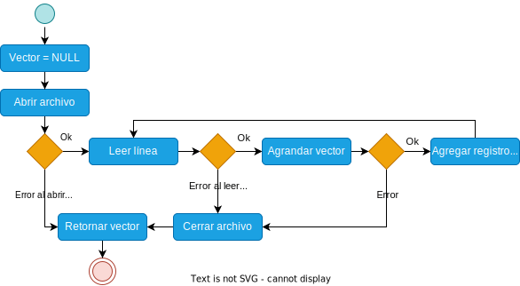

<div align="right">

</div>

# TDA LISTA


## Alumno: Joaquin Ezequiel Mendez Archerrizo - 111767 - jmendeza@fi.uba.ar.

- Para compilar:

```bash
make pruebas_alumno
make tp-lista
```

- Para ejecutar:

```bash
./pruebas_alumno 
./tp_lista ejemplos/pokedex.csv
```

- Para ejecutar con valgrind:
```bash
make valgrind-alumno
make valgrind-tp-lista
```

- Para compilacion y ejeccucion con valgrind:
```bash
make correr-pruebas
make correr-tp
```

---

##  Funcionamiento

Explicación de cómo funcionan las estructuras desarrolladas en el TP y el funcionamiento general del mismo.

Aclarar en esta parte todas las decisiones que se tomaron al realizar el TP, cosas que no se aclaren en el enunciado, fragmentos de código que necesiten explicación extra, etc.

Incluír **EN TODOS LOS TPS** los diagramas relevantes al problema (mayormente diagramas de memoria para explicar las estructuras, pero se pueden utilizar otros diagramas si es necesario).

### Por ejemplo:

El programa funciona abriendo el archivo pasado como parámetro y leyendolo línea por línea. Por cada línea crea un registro e intenta agregarlo al vector. La función de lectura intenta leer todo el archivo o hasta encontrar el primer error. Devuelve un vector con todos los registros creados.

<div align="center">

</div>

En el archivo `sarasa.c` la función `funcion1` utiliza `realloc` para agrandar la zona de memoria utilizada para conquistar el mundo. El resultado de `realloc` lo guardo en una variable auxiliar para no perder el puntero original en caso de error:

```c
int *vector = realloc(vector_original, (n+1)*sizeof(int));

if(vector == NULL)
    return -1;
vector_original = vector;
```


<div align="center">

</div>

---

## Respuestas a las preguntas teóricas
1) ¿Qué es una lista/pila/cola? Explicar con diagramas.

Una lista, es una secuancia en la cual guardamos datos del mismo tipo con un cierto orden(como un array) PERO a diferencia del array, este puede tener varias implementaciones, como las listas simplemente enlazadas, doblemente enlazadas y las circulares doblemente enlazadas. Ademas no permite como en los arreglos decir "mostrame el elemento en la posicon 5" sino que aca deberiamos recorrer la lista hasta llegar al elemento 5. 

Entonces, la diferecnai radical es como se manejan las listas a diferencia de los arrays, estos ultimos pueden ser estaticos o dinamicos, pero las listas, como vimos, no manejas asi la memoria. En general, vamos reservando espacio para un nodo que contiene un elemento y un puntero al siguiente (o anterior en el caso de las doblemente enlazadas) nodo, lo cual elimina la desventaja de los arreglos dinamicos,no necesitan de memoria contigua, sino que al trabajar con nodos, estos "saltan" en cuanto al espacio necesario sin que esten, necesariamente, pegados en las direcciones de memoria. Por ejemplo el primer nodo esta en la direccion 00 y el siguiente nodo puede estar en la 04 y el siguiente en al 07 y asi, en los vectores dinamicos, deberiamos tener el primer elemento en la posicion 00, la siguiente en 01 y asi. 
Ademas tenemos ciertas operaciones, algunas iguales a las que hariamos en un vector dinamico, pero tiene  ventajas en cuanto a la complejidad computacional. Por ejemplo en las listas tenemos crear, agregar/insertar, destruir, eliminar en X poscion y ver X elemento. A diferencia del vector dinamico, que la mayotia de estas operaciones son O(n) (insertar, eliminar y buscar X posicion), en las listas se puede reducir el impacto en cuanto complejidad, por ejemplo, insertar al inicio en ujn vectr dinamico si esta lleno este debe hacer realloc y pedir mas espacio contemplando esa inserccion en la pirmera posicion (y mover todo una posicion mas adelante) en una lista enlazada es O(1) xq solo debemos reajustar el puntero al nodo inicial y como se relaciona el nodo agregado con el que le sigue. O si tenemos una lista doblemente enlazada, la eliminacion al final seria O(1). Aunque en general tienden a ser similares en cuanto complejidad computacional, auqnue las listas enlazadas terminarian ganando en casos muy puntuales y siempre relacionados con el inicio o el fin de la lista.

Para expandir mas, hablemos un poco sobre los enlzados dobles. Como vimos los enlazados simples sirven para eliminaciones o insercciones al inicio, pero los doblemente enlazados, son extremadamente utiles para eliminaciones al final o si queremos acceder a un elemento previo al ultimo nodo o queremos recorrer la lista al revez de la convencional. De hecho tambien es muy util si deseamos mantener un cierto orden, un ejemplo (mas alla de los que vimos en clase como el de adelantar o ir para atras en Netflix o Youtube), algo que me ocurrio en mi tp, concretamente en la implementacion de eliminar en la pila, y es que yo la pensaba como un array donde ibas apilando de izquierda a derecha y claro, ¿Como hacias para que desapilar sea O(1)?, costo entender que no debiamos apilar asi sino en el orden invertido, asi al desapilar eliminas al primero nodo y asi sucesibamente, si hubieramos tenido una lista doblemente enlazada, es probable que pudiera apilar como lo hacia originalmente, y para desapilar, seria guradarte el ultimo nodo en un nodo auxiliar, moverte al nodo anterior al ultimo nodo y ahi eliminas, y ahi mantenes un cierto orden. 

(meter diagrama de lista)

Ahora pasando a la pila y la cola, estos son casos particulares de la lista ya que netamente son lo mismo pero cada uno sigue un "principio" o una restriccion a diferencia de la lista. Vamos primero a la cola, esta tiene la caracteristica FIFO, o sea si voy agregando elementos en la cola, el primero que deberia eliminar o "irse" es el que primero meti, y luego se iria el segundo y asi hatsa que se quede vacia y para agregar, se van poniendo al final, como la cola del supermercado. En la lista no habia estas restricciones pero como hicimos en la implementacion de la pila y la cola , se pueden readaptar las funciones de la lista para la pila y la cola, por ejemplo, en la cola podes apilar, llamand a una funcion de lista que agregue al final, y para eliminar, podes tener una funcion que elimine el priemr elemento asi respetarias la restriccion de FIFO. 

(meter diagrama de cola)

Para Pila, la restriccion seria LIFO, que quiere decir que el ultimo que agregue es el primero en irse, como una pila de hojas, no sacas del final directamnete sino que apilas y cuando desapilas sacas el paple de mas arriba y asi con los que siguen. Aunque a difrecnia de la cola, capaz aca si importa como lo veas, porque aca medio que importaria el orden si queres que tus funciones primitivas sean O(1), como me paso a mi, es mas conveniente ir apilando de forma tal que el ultimo elemento que agregaste sea el primero asi al eliminarlo, esa operacion es O(1). 

(meter diagrama de pila)

2) Explica y analiza las diferencias de complejidad entre las implementaciones de lista simplemente enlazada, doblemente enlazada y vector dinámico para las operaciones:
Insertar/obtener/eliminar al inicio
Insertar/obtener/eliminar al final
Insertar/obtener/eliminar al medio

Vamos con las operaciones al inicio, las LSE (lista simplemente enlazada), insertar al inciio tienen una complejidad computacional de O(1), mas que nada porque al nodo nuevo/ nodo a agregar,te creras un nodo nuevo, haces que el nodo siguiente a ese apunte a lo que apuntaba el inicio de la lista , llamese nodo_inicio o el nombre que tenga, y luego el nodo inicio apunta al nodo que vamos a agregar. Para obtener elemento al incio, seria O(1) mas que nada porque no es un problema de tamaño variable, es decir, no necesitamos recorrer toda la lista con N elementos, solo devolves el primer elemento. Y para eliminar es mas de lo mismo, al eliminar el primero, es O(1) porque si queres eliminar el primero, es guardarse en un nodo auxiliar, lo que apuntaba al inicio de la lista (un nodo basicamente),y que ese inicio ahora apunte al siguientedel nodo auxiliar, y depsues liberas el nodo aux, todas operaciones que no dependen de rwecorrer una lista, o sea son problemas que no dependen de un porblema de tamaño N sino que son instrucciones basicas. 
Para las LDE (doblemente enlazada) el proceso seria el mismo, para agregale el paso que al reajustar el puntero a siguiente debemos ajustar el puntero a anterior. Para obtener al inicio es lo mismo que en las LSE y para eliminar es la misma idea solo que deberiamos ajustar el puntero "anterior" del nodo.  
Y para los vectores dinamicos la cosa es distinta, insertar al inicio es O(n) porque debe mover todos los espacios anteriores a ese una posicion depsues. PAra obteer al inicio es O(1) porque simplemente podes acceder al indice que queiras haciendo vector[1], y para elimina al inicio tambien seroa O(n) porque debe mover todos los elementos ua posicion para la izquierda. (auqneu tambien podriamos mover ese elemento al final, restar el tope y mover el resto a la izquierda).

Ahora vamos con las operaciones del medio. Para las LSE y LDE son O(n) mas que anda porque ambas DEBEN recorrer la lista hasta que lleguen a la posicion a insertar, y depsues agregan como mencionamos arriba (lo de crear un nodo y setear los nodos siguiente y anterior) pero para encontrar donde deben si o si recorrer la lista. Lo mismo ocurre para eliminar y obtener eleemnto, ambos tambien deben recorrer la lista para obtener la posicion dle elemento a obtener o eliminar, por lo que termina cayendo en un problema de tamaño variable porque la lista puede tener 1,5,80 o 1000 nodos con sus elementos. Buscar recorre y te devuelve el elemento en esa posicion , y eliminar, te guardas el nodo en un nodo aux, haces que el siguiente al nodo previo al eliminar apunte al siguiente del nodo a eliminar y luego haces free del auxiliar.
Para los vectores dinamicos, la cosa no es tan distinta, salvo que aca trackeas la posicion a agregar, y moves todos los elementos previos una posicion mas adelante, por lo que vuelve a caer en una operacion de O(n) porque debemos recorrer el vector intercambiando las operaciones, y eso termina siendo un problema de tamaño N ya que el vector puede tener 1, 100 o 1000 elementos.Lo mismo pasaria con eliminar, es mover ese elemento al final y ahi restar el tope. Y devolver en el medio, por suerte, es O(1) porque podemos hacer vector[i] donde i es el elemento que buscamos.

Vamos con las ultimas operaciones relacionadas con el final. Para LSE, insertar al final tiene una complejidad computacional de O(1) ya que lo unico que tenemos que hacer es que al siguiente del puntero que apunta al final (o sea al ultimo nodo) apunte al nuevo nodo, que el elemento final de la lista (puntero al "nodo_final") ahora apunte al ultimo nodo y que el siguiente de ese nuevo nodo sea NULL ( en las LDE deberiamos setear el campo anterior al anterior nodo). AUnque claro esto ocurre si y solo si tenemos un puntero al ultimo nodo, sino deberiamos recorrer toda la lista hasta el final. Para buscar, pasa lo mismo si tenemos un puntero al ultimo nodo es facil decir que devuelva el elemento de ese nodo siempre que tengamos ese puntero al final sino seria O(n). Pero en nuestro caso tenemos un puntero al final asi que podemos decir que es O(1). Para terminar tenemos la eliminacion al final, aca la cosa difurca, ya que en las LSE, van a ser O(n) porque por mas que tengamos el puntero al final, ya no vamos a safar porque no podmeos eliminarlo asi porque necesitamos que el siguiente del ultimo nodo sea NULL para poder liberar todos los nodos sin problema, por lo que debemos recorrer toda la lista hasta la anteultima posicion y podemos guardarnos el nodo siguiente (el ultimo) en un nodo auxiliar y ahi operar tranquilamente. Una opcion "viable" seria tener un puntero al anteultimo pero esto es un parche porque tendriamos el mismo problema si queres eliminar varias veces , solo seriviria si es una sola vez. 
Pero para las LDE la cosa cambia radicalmente, el rpobelma que teniamos antes es que debemos estar en el nodo anterior al ultimo, y ¿que ventaja nos dan las LDE? que podemos movernos adelante y atras, por lo que podes ir al ultimo nodo, moverte una posicion atras y operar para eliminar (guardar el siguiente en un nodo auxiliar, el siguiente del anteultimo seria NULL y el puntero al final apunta al anteultimo), por lo que ahora al no depender de que tan larga sea la lista, o sea un rpoblema de tamaño N, esta operacion seria O(1).

Por ultimo tenemos las operaciones en el final de los vectores dinamicos, agregar al final a priori podria ser O(1) porque es agregar un elmento en el final, PERO (siempre hay uno), el peor caso seria que mi vector esta lleno y deberia agrandar mi capacidad y esa operacion de mover todo a un bloque mas grande es O(n) porque depende de el tamaño del vector previo. Para buscar, es O(1) porque podemos hacer vector[i] y accedes a esa pocision. Y para eliminar, diria que depende del caso, si hacemos realloc cada vez que agregamos y eliminamos, ahi sieria O(n) por las razones iguales a porque es O(n) agregar al final. Pero si no tomamos esa estrategia, seria O(1), ya que se trata de restarle uno al tope/cantidad y ya estaria eliminado del vector. 
 
3) Explica la complejidad de las operaciones implementadas en tu trabajo para la pila y la cola.

Bueno, capaz convenia mas solo de lista, pero bueno es lo que toca, vamos a ir hacinedo X funcion de pila y cola y depsues pasamos a la siguiente funcion.
Empezemos por lo facil, cola/pila_crear, serian O(1) ya que solo son instrucciones, no tenemos un probelam de tamaño variable, el peor de los casos seira que asignamos memoriapara la cola, y luego para pedir memoria para el struct lista, falle y tengamos que liberar la memoria de cola/pila.

Pasando a destruir_pila/cola:
```c
void liberar_nodos_en_cola(Lista *lista)
{
	Nodo *nodo_actual = lista->nodo_inicio;
	while (nodo_actual != NULL) {
		Nodo *nodo_siguiente = nodo_actual->siguiente;
		free(nodo_actual);
		nodo_actual = nodo_siguiente;
	}
}

void cola_destruir(Cola *cola)
{
	if (cola != NULL) {
		liberar_nodos_en_cola(cola->lista);
		free(cola->lista);
		free(cola);
	}
}
```
tenemos que para destruir todos los nodos, debemos recorrer la pila/cola hasta llegar a que el nodo_actual sea NULL, o sea llegar al final, por lo que al vernos obligados a recorrer la pila/cola esto termina siendo unproblema de tamaño N, porlo que esta funcion (que usa a liberar_nodos) es O(n).

Para destruir_todo, seguismo la mism logica que antes, salvo que esta seria un poco mas compleja que destruir_pila/cola, debido a que tambien debemos ir recorriendo la lista e ir liberando los nodos uno a uno, pero temabien vas liberando (antes que a los nodos porque sino perdemos la referencia al elemento dentro del nodo) los elementos del nodo, por lo que al tener que recorrer la pila/cola para ir liberando los elementos y depsues los nodos, hace que esta funcion, sea O(n).

Luego tenemos cola/pila_cantidad:
```c
size_t cola_cantidad(Cola *cola)
{
	if (cola == NULL) {
		return 0;
	}
	return lista_cantidad_elementos(cola->lista);
}

size_t pila_cantidad(Pila *pila)
{
	if (pila == NULL) {
		return 0;
	}
	return pila->lista->cantidad;
}
```

Es claro que es O(1) ambas son O(1) porque lo unico que hacen (ademas de validar que los punteros no sean NULL) es retornar la cantidad de elementos, me parecio interesante poner ambas versiones ya que una es la version mas clara (la de la pila) y la otra es "reutilizando" la funcio de cantidad de la lista.

Bueno, sigue cola_frente:
void *cola_frente(Cola *cola)

```c
void *cola_frente(Cola *cola)
{
	if (cola == NULL || cola->lista->nodo_inicio == NULL ||
	    cola->lista->cantidad == 0) {
		return NULL;
	}
	return cola->lista->nodo_inicio->elemento;
}
```
que lo unico que hace es retornar el elemento al que apunta el inicio de la lista (o el primer nodo de la lista) por lo que es O(1).
Y depsues tenemos el de pila_tope:
```c
void *pila_tope(Pila *pila)
{
	if (pila == NULL || pila->lista->cantidad == 0 ||
	    pila->lista->nodo_inicio == NULL) {
		return NULL;
	}
	return pila->lista->nodo_inicio->elemento;
}
```
Que sigue la misma logica de cola_frente (de hecho son casi que un calco) pero esta devuelve el ultimo elemento en apilarse, que seria donde apunta el nodo_inicio, asi que seria O(1) tambien.

Ahora vamos con cola_encolar y cola_descolar:
```c
void agregar_nodo_al_final(Lista *lista, Nodo *nodo_nuevo)
{
	if (lista->nodo_final != NULL) {
		lista->nodo_final->siguiente = nodo_nuevo;
		lista->nodo_final = nodo_nuevo;
		nodo_nuevo->siguiente = NULL;
	}
}

bool lista_agregar_al_final(Lista *lista, void *cosa)
{
	if (lista == NULL || cosa == NULL) {
		return false;
	}
	Nodo *nodo_nuevo = crear_nuevo_nodo(cosa);
	if (nodo_nuevo == NULL) {
		return false;
	}
	if (lista->cantidad == 0) {
		inicializar_lista_con_nodo(lista, nodo_nuevo);
	} else {
		agregar_nodo_al_final(lista, nodo_nuevo);
	}
	(lista->cantidad)++;
	return true;
}

bool cola_encolar(Cola *cola, void *cosa)
{
	if (cola == NULL || cosa == NULL || cola->lista == NULL) {
		return false;
	}
	return lista_agregar_al_final(cola->lista, cosa);
}

void *cola_desencolar(Cola *cola)
{
	if (cola == NULL || cola->lista == NULL || cola->lista->cantidad == 0) {
		return NULL;
	}
	void *elemento_quitado = NULL;
	if (lista_quitar_elemento(cola->lista, 0, &elemento_quitado)) {
		return elemento_quitado;
	}
	return NULL;
}
```

Para encolar no hay ningun drama ya que llamamos a lista_agregar_al_final que es O(1) porque no tenemos que recorrer la lsita gracias al puntero que apunta al ultimo nodo, y como tenemos agregar al final de la cola, por las restrcciones FIFO, es correcto este uso, por lo que es de tipo O(1) encolar.
La cosa es mas "interesante" en decolar, como dijimos antes la cola tiene la restriccion FIFO, o sea que el primero en salir es el rpimero que llego, o sea que debemos eliminar el primer elemento de la cola. PERO (en serio siempre hay uno), hay un pequeño problema con al funcion de lista_quitar_elemento, veamos primero la funcion:

```c
Nodo *lista_quitar_nodo_en_posicion(Lista *lista, size_t posicion)
{
	Nodo *nodo_anterior = lista->nodo_inicio;
	for (size_t i = 1; i < posicion; i++) {
		nodo_anterior = nodo_anterior->siguiente;
	}
	Nodo *nodo_aux = nodo_anterior->siguiente;
	nodo_anterior->siguiente = nodo_aux->siguiente;
	return nodo_aux;
}

bool lista_quitar_elemento(Lista *lista, size_t posicion,
			   void **elemento_quitado)
{
	if (lista == NULL || posicion >= lista->cantidad ||
	    lista->cantidad ==
		    0)
	{
		return false;
	}
	Nodo *nodo_aux;
	if (posicion == 0) {
		nodo_aux = lista->nodo_inicio;
		lista->nodo_inicio = nodo_aux->siguiente;
	} else {
		nodo_aux = lista_quitar_nodo_en_posicion(lista, posicion);
	}
	setear_elemento_quitado(elemento_quitado, nodo_aux);
	liberar_nodo_y_decrementar_cantidad(lista, nodo_aux);
	return true;
}
```
Antes de que sales diciendo que es O(n) y que no es O(1) y que la consigna dice que sea O(1), dejame explicarlo, es cierto que el peor caso de eliminar seria que estuviera en el medio o el final porque debe recorrer la lista hasta llegar a esa posicion, entonces caeriamos en O(n) porque no sabemos que tan grande o pequeña es la lista. Pero ¿Y si te dijiera que en descolar no nos interesa las demas posiciones sino EXCLUSIVAMENTE la primera? ya no seria O(n) porque nunca caeria en el caso donde queremos eliminar una posicion diferente a la primera, entonces el pero caso (y el unico aca) es que querramos eliminar la posicion 0, y solo por eso seria O(1), auqnue si sigueras con dudas, capaz hubiera sido mejor una funcion el en .h que fuera eliminar_inicio y ya no tendrias este pequeño problema. 

Ahora vamos rapidamente con Pila_apilar y Pila_desapilar:
```c
bool pila_apilar(Pila *pila, void *cosa)
{
	if (pila == NULL || cosa == NULL || pila->lista == NULL) {
		return false;
	}
	return lista_agregar_elemento(pila->lista, 0, cosa);
}

void *pila_desapilar(Pila *pila)
{
	if (pila == NULL || pila->lista == NULL || pila->lista->cantidad == 0) {
		return NULL;
	}
	void *elemento_quitado = NULL;
	if (lista_quitar_elemento(pila->lista, 0, &elemento_quitado)) {
		return elemento_quitado;
	}
	return NULL;
}
```

Para apilar, pasa algo muy similar que para cola_descolar, tenemos que siempre vamos a ir apilando en la posicon 0, por lo que esa operacion es O(1) y nunca caeriamos en querer apilar en otra posicion, por lo que por poco es O(1) (siguiendo el mismo razonamiento de antes). Y ocurre exactamente lo mismo que antes pero para desapilar, asi que como ya lo explique, saltemos con que seria O(1) por muy poco.

Para finalizar, tenemos pila/cola_esta_vacia:
```c
bool pila_esta_vacía(Pila *pila)
{
	if (pila == NULL) {
		return NULL;
	}
	return pila->lista->cantidad == 0;
}
```
Que son O(1) por el hecho de que no dependen de un tamaño variable solo retornan true si la cantidad es 0 o false en caso contrario por lo que no son un probela de tamaño variable por lo que seria valido decir que es O(1) porque solo son verificaciones e instrucciones basicas.