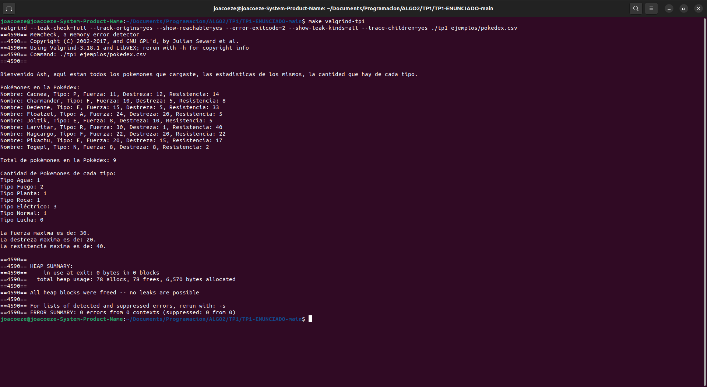
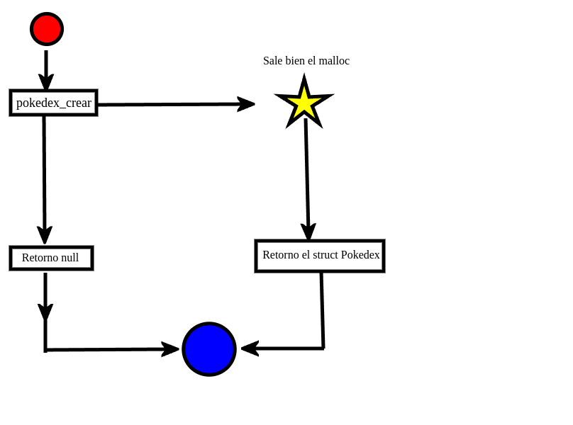

<div align="right">

</div>

# TP1


## Alumno: Joaquin Ezequiel Mendez Archerrizo - 111767 - jmendeza@fi.uba.ar.

- Para compilar:

```bash
make ejemplo
make pruebas_alumno
make tp1
```

- Para ejecutar:

```bash
./ejemplo
./pruebas_alumno
./tp1 ejemplos/pokedex.csv
```

- Para ejecutar con valgrind:
```bash
make valgrind-ejemplo
make valgrind-alumno
make valgrind-tp1 ( o probar esto: valgrind --leak-check=full --track-origins=yes --show-reachable=yes --error-exitcode=2 --show-leak-kinds=all --trace-children=yes ./tp1 ejemplos/pokedex.csv )
```

---

##  Funcionamiento General
El TP consta de dos archivos .h ,pokedex.h y csv.h, y un main donde se controla el flujo del programa. La idea general es que las funciones que hay en csv.h, recibir un archivo csv, donde se espera algo como: Nombre Pokémon; Tipo; Fuerza; Destreza; Resistencia; y un separado (como el ";"), e irlo leyendo línea a línea y casteando/parseando cada elemento que haya en la línea, por ejemplo, el primer elemento se castea a un string, el segundo a una letra, y los demás a enteros. 

Una vez procesada la línea, con las funciones de pokedex.h se van procesando esos datos, y se van colocando los pokemones que haya en el archivo que le pasamos, siempre que sean validos (más adelante explicare que significa), a la pokedex. Una vez llegado al final del archivo, imprimimos lo que procesamos, como que se metan lo pasado al archivo, pero ordenando, alfabéticamente ascendente, a los pokemones, se muestran cuantos pokemones hay en al pokedex, cuantos hay de cada tipo y las estadísticas más altas que se encontraron, quedando algo de este estilo:

<div align="center">

</div>

## Funcionamiento Mas al detalle:

Para hacerlo más ordenado, voy a ir contando que hacen los .c porque decidí hacer X cosa, y porque decidí poner Y campos en los structs, lo más detallado posible y al final de la explicación dejo una diagramita. Empecemos por el de la pokedex.

#### Pokedex.c

Vamos por lo primero, ¿Qué campos elegí para el struct de pokedex? ¿Por qué? El más "obvio" seria el puntero a Pokémon, pensé en poner un puntero a Pokémon porque así podíamos tener de alguna forma sin tener que recurrir a pasarle siempre el struct pokemones, además yo lo pensé como que pokedex es un array gigante donde cada Pokémon "ocupa" una casilla y adentro de esa casilla están todos los datos del Pokémon (nombre, tipo, etc.). 
Por último, tenemos los campos "capacidad" y "cantidad", estos sirven principalmente para manejar, al agregar un Pokémon, el espacio que hay en la pokedex; volviendo a lo que pensé que era la pokedex que es un array, con capacidad decís básicamente hasta cuanto espacio Tenes para meter pokemones y al igualarlo o superarlo pedís más espacio para meter más pokemones, y con cantidad vas midiendo en tiempo de ejecución, cuantos pokemones hay y vas verificando que la capacidad nunca sea menor o igual a la cantidad de pokemones que hay. Una observación que podrías hacerme es, ¿Por qué usas dos campos si podrías hacerlo con uno? si bien podríamos sacar capacidad y dejar cantidad que sería lo más lógico, el costo a pagar, al menos desde mi poca experiencia, es que vivirías haciendo realloc o tendrías que hacer un mecanismo tal que, si por ejemplo cantidad es múltiplo de 5 por ejemplo, hagas realloc del puntero viejo y pidas 5 espacios más. Pero preferí agregar ese campo más que nada por comodidad, y no abusar del realloc ya que es una operación bastante costosa

```c
struct pokedex {
	struct pokemon *pokemones;
	size_t capacidad;
	size_t cantidad;
};
```


Luego tenemos la función de "pokedex_crear", no hay mucho que decir acá, inicializamos los campos que mencionamos antes, y hacemos malloc del tamaño que tenga el struct pokedex, más que nada para poder hacer dinámica el proceso de agregar pokemones.
<div align="center">

</div>

Después tenemos "pokedex_agregar_pokemon", acá hay cosas que no decía el enunciado, pero prefería agregar yo, que tiene que ver con "estándares" que debería tener el archivo, por ejemplo, estas 2 funciones:

```c
//ya no esta esta en pokedex.c
bool es_pokemon_repetido(struct pokedex *pokedex, struct pokemon pokemon)
{
	bool esta_repetido = false;
	for (size_t i = 0; i < pokedex->cantidad; i++) {
		if (strcmp(pokedex->pokemones[i].nombre, pokemon.nombre) == 0) {
			if (pokedex->pokemones[i].fuerza == pokemon.fuerza &&
			    pokedex->pokemones[i].destreza ==
				    pokemon.destreza &&
			    pokedex->pokemones[i].resistencia ==
				    pokemon.resistencia) {
				esta_repetido = true;
			}
		}
	}
	return esta_repetido;
}
//estas si
bool es_tipo_esperado(struct pokemon pokemon)
{
	return (pokemon.tipo == TIPO_AGUA || pokemon.tipo == TIPO_FUEGO ||
		pokemon.tipo == TIPO_ELECTRICO || pokemon.tipo == TIPO_LUCHA ||
		pokemon.tipo == TIPO_NORMAL || pokemon.tipo == TIPO_PLANTA ||
		pokemon.tipo == TIPO_ROCA);
}

bool es_entrada_adecuada(struct pokemon pokemon)
{
	return (strcmp(pokemon.nombre, "") != 0 && es_tipo_esperado(pokemon) &&
		pokemon.fuerza >= 0 && pokemon.destreza >= 0 &&
		pokemon.resistencia >= 0);
}
```

Estas dos funciones, sirven mas que nada para validar que las stats y los tipos sean validos. Antes tambien validaba con es_pokemon_repetido que el pokemon no se repitiera en la pokedex, o sea no podia haber un pokemon con el mismo nombre y mismas stats, pero como no pasaban las ultimas pruebas, tuve que sacarlo. 

Pero volviendo a lo que propiamente se pidió de la función de agregar, básicamente pedimos memoria para guardar el nombre del Pokémon + 1 para ponerle el 0 al final del string, lo vemos en esta función:
```c
bool asignar_memoria_pokemon(struct pokedex *pokedex, struct pokemon pokemon)
{
	pokedex->pokemones[pokedex->cantidad].nombre =
		malloc(strlen(pokemon.nombre) + 1);
	if (pokedex->pokemones[pokedex->cantidad].nombre == NULL) {
		return false;
	}
	return true;
}

bool redimensionar_pokedex(struct pokedex *pokedex)
{
	size_t nueva_capacidad_pokedex =
		(pokedex->capacidad == 0) ?
			CAPACIDAD_INICIAL :
			pokedex->capacidad * FACTOR_DE_CRECIMIENTO;
	struct pokemon *pokemones_redimensionados =
		realloc(pokedex->pokemones,
			nueva_capacidad_pokedex * sizeof(struct pokemon));
	if (pokemones_redimensionados == NULL) {
		return false;
	}
	pokedex->pokemones = pokemones_redimensionados;
	pokedex->capacidad = nueva_capacidad_pokedex;
	return true;
}
```
Y luego entran los campos de capacidad y cantidad, al principio seteamos ambos a 0 porque la pokedex empieza vacía por lo que de entrada terminaríamos pidiendo espacio para 10 pokemones, con la operación del realloc, aunque nos guardamos el resultado del realloc en pokemon_redimensionados por si llegara a fallar no perder el puntero original. En caso de que la cantidad fuera mayor o igual pedimos la capacidad actual multiplicada por 2. Aunque podría ser ineficiente si tuviéramos 11 pokemones por ejemplo hay que quedan ahí 9 espacios sin usar, pero eso supongo que lo veremos más adelante (o no) temas de eficiencia y optimización, pero supongo que para empezar está bien.

Entonces al llegar a la función pokedex_agregar_pokemon, validamos que el puntero pokedex no sea null, verificamos que la cantidad no supere o iguale a la capacidad, en caso de serlo llamamos a redimensionar y si este devolvió false porque fallo, devolvemos false en la función. Después verificamos que la entrada sea válida para agregar y si seteamos correctamente los atributos pasados (nombre, tipo, etc.) devolvemos true.

<div align="center">

</div>


Luego tenemos la función de pokedex_cantidad_pokemones, que lo único que hace es validar que el puntero pokedex, no sea null y devuelve lo que haya en el campo cantidad en la pokedex. 


Luego tenemos la función de pokedex_buscar_pokemon, las únicas dos cosas interesantes serian, la condición para que retorno null, ya que validamos que pokedex y nombre no sean null y después si la cantidad es menor o igual a 0 o si el nombre del Pokémon a buscar es 0, retorna null, esas dos últimas son más que nada para que no tire segmentation porque se rompía obviamente si buscaba un nombre vacío, o si no había nada en la pokedex. Lo otro interesante es que buscamos el Pokémon por búsqueda binaria. Honestamente, elegí búsqueda binaria porque en el discord preguntaron y alguien dijo que había hecho búsqueda binaria, entonces recordé que al llamar a esta función ya ordena la pokedex por orden alfabético y lo cambie a búsqueda binara ya que es más eficiente y no era una búsqueda lineal (que es como originalmente lo pensé).Ademas dentro del while vamos verificando que lo que haya en el centro no sea NULL y si el centro es mayor o igual a la cantidad devuelve null tambien. 

```c
const struct pokemon *pokedex_buscar_pokemon(struct pokedex *pokedex,
					     const char *nombre)
{
	if (pokedex == NULL || nombre == NULL || (pokedex->cantidad <= 0) ||
	    (strcmp(nombre, "") == 0)) {
		return NULL;
	}
	int se_encontro_pokemon = false;
	size_t pos_pokemon_buscado = 0;
	size_t inicio = 0;
	size_t fin = pokedex->cantidad - 1;
	while (inicio <= fin && !se_encontro_pokemon) {
		size_t centro = calcular_centro(inicio, fin);
		if (centro >= pokedex->cantidad ||
		    pokedex->pokemones[centro].nombre == NULL) {
			return NULL;
		}
		int resultado_entr_strs = comparar_strs(
			pokedex->pokemones[centro].nombre, nombre);
		if (resultado_entr_strs == 0) {
			se_encontro_pokemon = true;
			pos_pokemon_buscado = centro;
		} else if (resultado_entr_strs < 0) {
			inicio = centro + 1;
		} else {
			fin = centro - 1;
		}
	}
	if (se_encontro_pokemon) {
		return &pokedex->pokemones[pos_pokemon_buscado];
	}
	return NULL;
}
```

Por ultimo tenemos la función de iterar, primero que todo debemos ir ordenando a medida que ordenamos, por lo que si la cantidad de pokemones es mayor a 1 (porque no voy a ordenar 1 elemento porque ya lo estaría) y lo vamos ordenando con el método de ordenamiento por burbujeo, porque es el único que me acuerdo siempre, y la verdad entre selección, inserción y burbujeo, es mejor burbujeo solo porque es el más usado para incitantes, (total creo que son todos O(n^n)). Y luego iteramos hasta que lleguemos a la cantidad de pokemones o hasta que el puntero a funciones devuelva false, y devolvemos la cantidad de iteraciones hechas.
```c
void ordenar_pokemones(struct pokedex *pokedex)
{
	for (size_t i = 0; i < pokedex->cantidad - 1; i++) {
		for (size_t j = 0; j < pokedex->cantidad - i - 1; j++) {
			if (strcmp(pokedex->pokemones[j].nombre,
				   pokedex->pokemones[j + 1].nombre) > 0) {
				intercambiar_pokemones(
					&pokedex->pokemones[j],
					&pokedex->pokemones[j + 1]);
			}
		}
	}
}

size_t pokedex_iterar_pokemones(struct pokedex *pokedex,
				bool (*funcion)(struct pokemon *, void *),
				void *ctx)
{
	if (pokedex == NULL) {
		return 0;
	}
	if (pokedex->cantidad > 1) {
		ordenar_pokemones(pokedex);
	}
	size_t cant_iterada = 0;
	size_t i = 0;
	bool finalizar_iteracion = false;
	while (i < pokedex->cantidad && !finalizar_iteracion) {
		bool continuar_iteracion = funcion(&pokedex->pokemones[i], ctx);
		if (!continuar_iteracion) {
			finalizar_iteracion = true;
		}
		cant_iterada++;
		i++;
	}
	return cant_iterada;
}
```
Capaz algo que te llame la atención es la variable finalizar iteración, y que está dentro del while, es más que nada para no meter un return dentro del while, sino que cortarlo de forma menos artificial.

Por ultimo tenemos la función de destruir_pokedex, no hay mucho misterio en esta función, solo liberamos lo pedido en memoria para los nombres de los pokemones que fuimos agregando, del puntero a pokemones, y del struct pokedex.  


#### Csv.c
Vamos a omitir la explicación de la primera parte ya que es parte del tp0, y ya había hecho una explicación del mismo.

Vamos por partes, en el siguiente struct vemos 4 campos, uno sirve para guardar el nombre del archivo, otro para guardar el separador que le vamos a usar para hacer el Split, y los otros dos restantes son los equivalentes a partes y strign del tp0. 

```c
struct archivo_csv {
	FILE *nombre_archivo;
	size_t columnas;
	char **string;
	char separador;
};
```

Es verdad que string y columnas podrían estar de más, pero como tuve problemas al intentar importar lo usado para el tp0, no funcionaba y decidí traer todo e irlo modificando según lo que tenía, y por eso están los campos string (para ir copiando el nuevo string separado por el delimitador) y columnas que vendría a ser el equivalente a partes porque ya sabes que, si te pasan 5 como columnas, vas a tener 5 espacios en string para almacenar las palabras. Pero si no hubiera tenido problemas con la importación de lo hecho en el tp0, con el nombre del archivo (porque necesitas cerrarlo y no tenes "nombre archivo" en cerrar archivo) y el separador, porque en leer_linea no tenes el separador como tenías en abrir, por lo que es obligatorio tenerlo en un campo para pasárselo a dividir string.

En abrir_archivo, no hay nada interesante mas allá de inicializar los campos del struct, el fopen del archivo en lectura, pedir memoria para el struct archivo_csv y verificar que el puntero al nombre del archivo no sea NULL ni que el malloc falle, aunque en caso de que el archivo fuera null, libero lo pedido para el struct 

Lo más interesante está en leer_linea_csv, donde tenemos un contador de líneas casteadas a modo de que, si la funcion no es null (en i), y si el contexto es distinto de null, aumenta el contador de lineas casteadas, si la funcion es distinat de null pero el contexto lo es, ahi no aumenta. Antes tenia un error bastante groso que era que si alguna de ambas era null, cortaba la iteracion y seguia con la sigiente linea, sin tomar en cuneta de que si atras de ese null habia un contexto o una funcion valida, no la leeria. 
En caso de que el fgets devolviera null (que sería cuando se llegó al final del archivo o la línea o algo salió mal) devuelve el contador de líneas casteadas. Luego llamamos a dividir string, en caso de que algo haya salido mal, devolvemos 0, sino divide el string y sigue ejecutándose la función.
```c
size_t leer_linea_csv(struct archivo_csv *archivo, size_t columnas,
		      bool (*funciones[])(const char *, void *), void *ctx[])
{
    // lo mas relevante
while (i < archivo->columnas) {
		if (funciones[i] != NULL) {
			if (funciones[i](archivo->string[i],
					 ctx ? ctx[i] : NULL)) {
				contador_lineas_casteadas++;
			}
		}
		i++;
	}
	liberar_substr_al_procesar_linea(archivo);
	return contador_lineas_casteadas;
}
```

Por último, llamamos a liberar_substr_al_procesar_linea, que una vez procesados los strings divididos por el separador, liberamos esa memoria pedida, que sería la cantidad exacta de "partes" o columnas que el pasamos. En resumen, si le pasan 5 como la cantidad de columnas a leer, nosotros en las funciones del tp0 pedimos espacio para 5 strings separados por el delimitador, y acá liberamos esos espacios pedidos. 
```c
void liberar_substr_al_procesar_linea(struct archivo_csv *archivo)
{
	for (size_t i = 0; i < archivo->columnas; i++) {
		free(archivo->string[i]);
	}
}
```

Por último, tenemos cerrar archivo que libera lo pedido para el campo string, el struct y cierra el archivo. 

## Respuestas a las preguntas teóricas
1) Explicar con diagramas cómo quedan dispuestas las estructuras y elementos en memoria.

Bien, para responder esto, hagamos primero el diagrama de como quedaría el uso de memoria y los campos de pokedex.c con el siguiente diagrama que hice: 
<div align="center">

</div>

Si lo sé, no es el mejor diagrama, pero para algo le puse numeritos así te voy contando lo que no se puede poner en el diagrama. 
Para arrancar, en el paso 1 vamos y pedimos memoria según el tamaño que tenga el struct puede (el rectángulo grande) y sesteamos cantidad y capacidad a 0 y el puntero al struct Pokémon a NULL. Capaz lo más conveniente hubiera sido haber hecho un rectángulo que incluya al puntero al struct Pokémon en la puede, pero siento que así se entendía un poco mejor. Para el paso 2, técnicamente debería estar vacío el rectángulo porque la capacidad es 0, entonces la nueva capacidad seria de 10 y si llegáramos a completarla (paso 8) hacemos la capacidad actual por 2. 

Después, en el paso 3, hacemos realloc con un puntero auxiliar llamado pokemones_redimensionados, con el fin de que, si llega a fallar el realloc, no perdamos el puntero original, pasando al paso 4 donde vamos a ir llenando el rectángulo grande con los cuadraditos pequeños que representan cada Pokémon (por eso p0, p1, etc.). Donde hacemos realloc con la capacidad nueva (10 en el caso inicial) * el tamaño del struct Pokémon. Una vez que el realloc hay sido exitoso, pasamos al paso 5 que saetearíamos a *pompones como pokemones_redimensioandos, ahora si con los 10 espacios para los pokemones. 

Después tenemos el paso 6 que sirve más que nada para ir agregando pokemones a la pokedex, podemos ver que de P0, sale una "flecha" a otro vector, ese vector es el campo "nombre" que es un char*, entonces para almacenar el nombre de del Pokémon, vamos a hace un malloc con el tamaño del nombre del mismo Pokémon + 1 para agregarle el '\0' al final de la palabra para decir que es un string. Además, dentro de cada celda de pokemones, estarían los otros campos de Pokémon como el tipo y las estadísticas. 
Para el paso 7, es básicamente ir copiando el nombre en el espacio que pedimos para guardar el nombre, luego el tipo, luego las estadísticas y le decimos que aumente la cantidad a la pokedex.

Para el paso 8 es este caso donde la capacidad fuera igual o menor a la cantidad de pokemones, llamemos a redimensionar que básicamente tiene que agrandar la cantidad de "cuadraditos" que hay dentro de pokedex, y trasladar los 10 pokemones de antes a ese nuevo arreglo de 20 pokemones, y el proceso se repetiría así hasta que no haya más pokemones. 

Por último, una vez operado con las funciones que hayamos querido usar y haber agregado los pokemones necesarios, llamaríamos a destruir pokedex, que libera en este orden: primero los cuadraditos del nombre del Pokémon, luego los bloquecitos que están dentro de pokedex, o sea los pokemones en sí, y luego liberamos el rectángulo que es el espacio pedido para la pokedex. Siempre deberíamos mantener este orden, porque, recuerdos de fundamentos, si liberamos pokedex, quedarían "atrapados" los bloques de los pokemones y los bloques pedidos para guardar los nombres de los pokemones. 


Ahora vamos con csv, que es un poco mas corto,porque la mayoria de elemntos en memoria son mas del tp0, asi que vamos con el diagrama:

<div align="center">

</div>

Como podemos ver, la mayoría del uso de la memoria dinámica es mas parte del tp0, de todas formas, explico que haríamos. En el paso 1, tenemos que hacemos un malloc pidiendo espacio de memoria según el tamaño del struct de archivo_csv, después, en el paso 2, al campo **string le pedimos con realloc espacios para ir almacenando las strigns que vayamos sacándole el separador, y depende de la cantidad de columnas a leer, si son 5 como en el ejemplo que puse, pediría para 5 strings. 
Luego en el paso 3, vamos a procesar la string en cuestión, vamos a ir pidiendo con malloc, memoria del tamaño suficiente como para almacenar el string sin contar el separador, + 1 espacio para el 0 del final del string. Y para el paso 4 es justamente pedir este espacio e ir copiando el string en cuestión incluyendo el 0 del final. Por ultimo en el último paso, quedaría liberar lo pedido, yendo sede el espacio pedido para la substring (o el string sin el delimitador), luego el espacio pedido para las partes del string completo (o sea según la cantidad de columnas que quiera leer) y luego liberar el espacio pedido para el struct archivo_csv.

Gran parte de este procedimiento lo hacemos en un bucle hasta que se llegue al final del archivo, salvo que cada vez que terminamos de leer y procesar la línea, liberamos lo pedido para los substring, pero el espacio pedido con realloc para ir guardando cada string sin el delimitador, volveríamos a pedir con realloc otro espacio idéntico, porque se supone que siempre se lee N cantidad de columnas hasta llegar al final del archivo, por lo que liberarlo sería inútil en esta instancia, por eso después vemos que libero el espacio pedido con realloc y el struct los liberamos en cerrar archivo porque sería lo más conveniente porque solo lo Tenes que hacer una vez.

2) Explicar la complejidad computacional de cada una de las funciones que se piden implementar.

Bueno, empecemos por pokedex.c. La primera función que teníamos era la de "pokedex_crear", es de las familias o(1) ya que no hay fors ni whiles, ni es recursivo, ni hay dos fors, etc. Y tiene 5 instrucciones, 3 son de stear los campos, 1 de retornar y 1 del malloc. O sea, seria O(1) + 5 instrucciones. 

Para la función pokedex_agregar_pokemon, vamos a desglosar rápidamente, la complejidad de las funciones auxiliares que tiene. 

La función de es_pokemon_repetido, es de la familia O(n) aunque si desglosamos más diría que sería O(n*m) donde N es la cantidad de pokemones (del for) y M seria la longitud del strign buscado con el strcmp, pero nos alcanza con decir que es o(n), y tiene unas 4 o 6 instrucciones. O sea, O(n*m) + 4/6, donde en el peor de los casos, n (cantidad de pokemones) es 100 por dar un numero y m fuera el pokemon "pichachu", claro esto puede variar y por eso digo que depende de la cantidad de pokemones y de la longitud del pokemon a agregar. 
Luego tenemos asignar_memoria_pokemon, tengo mis dudas porque técnicamente todas las funciones son o(1), el problema lo tendríamos en la cantidad de asignación porque depende de la longitud del string que es algo que no "controlamos" o podemos anticipar, por lo que por eso podría llegar a ser O(n), por el strlen, aunque yo me inclinaría más por el lado que es O(1) porque lo que variaría en el peor de los casos, es lo que pedimos de memoria, tiene 3 instrucciones en el caso que malloc falle (tendríamos el malloc, la condición del if y el return). O sea que sería O(1)+3.
Luego tenemos setear_atributos_pokemon, que es de tipo O(n) donde n es tamaño del nombre del Pokémon a copiar, y tiene 6 instrucciones (que son los seteos, el aumento en la cantidad y el strcpy).Y supongamos que debemos copiar el nombre del pokemon "Fletchinder" y depsues quiero agregar a "Joltik" varia siempre el largo del nombre.

setear_nuevo_pokemon depende de las funciones "asignar_memoria_pokemon" y "setear_atributos_pokemon", en caso de que análisis sea correcto, esta seria O(1) + O(n) pero "prevalece" o(n) antes que o(1), así que sería del tipo o(n) + 3 instrucciones.
es_tipo_esperado y es_entrada_adecuada son de la familia O(1), donde la primera tendría una instrucción compleja (o 2 que serían el validar y el retornar) y la segunda también tendrá 1 instrucción compleja. Mas que anda porque son validaciones que no dependen de algo que varia (como un for, strcpy,longitud de un string,etc), 
Por último, tenemos redimensionar_pokedex, que es de tipo o(n)+6 instrucciones aprox, donde N depende de la cantidad a asignar y a mover los elementos del antiguo puntero al nuevo. Porque recordemos que realloc, asigna mas memoria (o menos, no es este el caso) y debe copiar/mover todos los elementos del antiguo puntero al nuevo con mayor capacidad, y no es lo mismo tener que mover 1 elemento a pasar 100, por eso es O(n).

Una vez analizadas estas funciones auxiliares, podemos definir que complejidad computacional tiene pokedex_agregar_pokemon. Por lo que para mí tendría esta forma, O(n*m) + 5 instrucciones(en el caso donde tenga que redimensionar, entra en ese if, llama a redimensionar, luego entra en el if donde es un Pokémon no repetido, llama a setear al Pokémon, y retorna true ), donde N es la cantidad de pokemones y M la longitud del nombre del Pokémon a agregar, Por lo que sería de las familias O(n).

Por suerte, pokedex_cantidad_pokemones, es o(1)+2 instrucciones, en el caso de que el puntero sea null, es O(1) porque solo tiene seteos, validaciones y un retorno, y no depende de algo que varie porque es solo retornar al cantidad de pokemones. 

Para pokedex_buscar_pokemon, tenemos que analizar rápidamente las dos funciones que la acompañan; comparar_strs, seria o(n*m)+1 donde N seria la longitud del primer string y M la longitud de la segunda, y tiene 1 instrucción compleja (o dos si contamos el strcmp y el return del valor). Después tenemos calcular centro, que es O(1)+1 instrucción simple (o 2/3 si contamos el return el cálculo y el seteo de centro). Ya con esto, y viendo el código, podemos ver que tenemos una búsqueda binaria, que tiene una complejidad computacional de O(log(n)), porque va reduciendo aún más el problema hasta llegar a algo absurdamente fácil de resolver (que es si ese elemento es el buscado o no) pero vimos que comparar strigns es O(n*m), así que podríamos decir que sería algo como O(h*m*log(n))  donde m y h son la longitud de los dos nombres a comparar ( o sea el nombre del pokemon a buscar y el nombre del pokemon actual) y n es la cantidad de pokemones que haya en la pokedex. Pero supongo que alcanza con decir que es de la familia O(log(n))+11 a 14 instrucciones instrucciones aprox. Aunque podriamos encapzularla en las familias de O(log(N))

Para pokedex_iterar_pokemones, de nuevo tenemos que considerar a las dos funciones que la acompañan. La de intercambiar_pokemones, es O(1)+3 instrucciones, y la de ordenar_pokemones, es O(n^2), porque tiene dos fors, que dependen de la cantidad de pokemones, y como son dos, se terminarían multiplicando y por eso es n*n (cosa que pasa con la inserción y selección como métodos de sort).Y además tenemos el strcmp que depende de la longitud de las dos strigns que le pasemos, por lo que esta función seria O(n^n *m*h) donde n es la cantidad de pokemones, h y  la longitud de los dos strigns pasados a strcmp. Pero supongo que alcanza con decir que es de las familias O(n^2)+2 instrucciones simples (el if y el llamado al swap/intercambiar). 
Una vez analizado estas dos funciones, podemos ver que la función de iterar_pokemones, sería una combinación de las dos funciones, quedando algo de este estilo O(n^2*m*h) + O(n) +8/9 instrucciones, capaz está mal planteado, o erróneo, así que vamos a desglosar de donde sale esto. La parte de O(n^2*m*h), viene por la parte del ordenamiento, ya lo vimos, y la segunda parte viene del while que usamos para ir iterando, o sea dependemos de la cantidad cantidad de pokemones, capaz solo nos interesa saber que sería algo como O(n^2)+ 8/9 instrucciones ya que el "que manda" o el que tiene mayor peso es el n^2, por lo que podriamos decir que es de las familias de O(n^2).

Por último, tenemos la función de pokedex_destruir, que es de las familias de O(n) ,por el for, donde n es la cantidad de pokemones, y tiene 3 instrucciones simples. 

Ahora vamos con CSV.C, como no se si debería incluir el análisis de la complejidad computacional de la parte del tp0, voy a incluirla en el siguiente párrafo y lo más resumidamente posible, si no es de relevancia, saltéate al siguiente párrafo del que sigue.

calcular_longitud_subpalabra, O(n) + 4 instrucciones, donde n es la cantidad de letras que hay antes de llegar a un separador u el final de un strign.escribir_subcadena, O(n) + 3 instrucciones donde n es la longitud del substring calculado previamente. liberar_memoria_en_substr, o(1) + 3 instrucciones. escribir_palabras, O(n*m) + 8/9 instrucciones, con n dependiendo de las partes/columnas y m la longitud de las subcadenas. dividir_string, O(n*m) + 4 instrucciones, con n = a la cantidad de columnas/partes, y m la longitud de las substrings. liberar_todo es O(1)+3 instrucciones.

Bien, una vez sacadas esas complejidades computacionales, vamos a lo que nos compete, inicializar_campos y es_archivo_valido son O(1) porque no dependen de un problema de tamaño variable (que lo resolveriamos con un for/while) con 3 y 2 instrucciones respectivamente. abrir_archivo_csv, por otro lado, también es O(1)+ 4 instrucciones en el caso donde devolviera null es archivo valido, ya que tendría la validación de la función, el free y el return, más el malloc inicial. 

Después en leer_linea_csv, es O(n*m) +11/12 instrucciones aprox, donde n vendría a ser la cantidad de columnas que queremos leer por linea (usados para el while) y m vendría a ser la longitud del substring a dividir, para las instrucciones, tenemos 5 seteo iniciales, llamar a dividir string,1 de la validación dentro del while, suponiendo que entra en los dos if,  que serían 2 instrucciones, 1 al aumentar i, y las ultimas 2, llamar a liberar_substr_al_procesar_linea y el return del contador. Entonces podemos simplificar y decir que es de las familias O(n) + 12 instrucciones.

Por ultimo tenemos cerrar archivo que al no depende de un problema de tamaño variable, seria O(1)+2 instrucciones, validar y llamar a liberar_todo, porque es un problema que no depende de un N variable, solo depende de la cantidad de instrucciones.