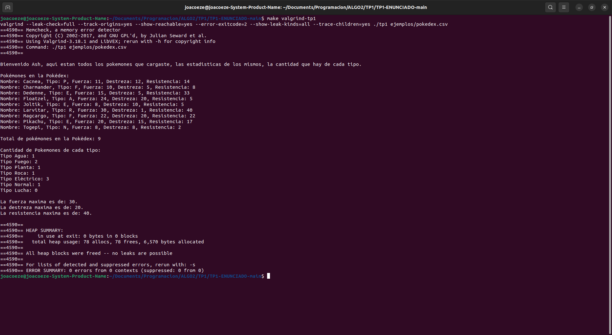

<div align="right">

</div>

# TP1


## Alumno: Joaquin Ezequiel Mendez Archerrizo - 111767 - jmendeza@fi.uba.ar.

- Para compilar:

```bash
make ejemplo
make pruebas_alumno
make tp1
```

- Para ejecutar:

```bash
./ejemplo
./pruebas_alumno
./tp1 ejemplos/pokedex.csv
```

- Para ejecutar con valgrind:
```bash
make valgrind-ejemplo
make valgrind-alumno
valgrind-tp1 ( o probar esto: valgrind --leak-check=full --track-origins=yes --show-reachable=yes --error-exitcode=2 --show-leak-kinds=all --trace-children=yes ./tp1 ejemplos/pokedex.csv )
```

---

##  Funcionamiento General
El TP consta de dos archivos .h ,pokedex.h y csv.h, y un main donde se controla el flujo del programa. La idea general es que las funciones que hay en csv.h, recibir un archivo csv, donde se espera algo como: Nombre Pokémon; Tipo; Fuerza; Destreza; Resistencia; y un separado (como el ";"), e irlo leyendo línea a línea y casteando/parseando cada elemento que haya en la línea, por ejemplo, el primer elemento se castea a un string, el segundo a una letra, y los demás a enteros. 

Una vez procesada la línea, con las funciones de pokedex.h se van procesando esos datos, y se van colocando los pokemones que haya en el archivo que le pasamos, siempre que sean validos (más adelante explicare que significa), a la pokedex. Una vez llegado al final del archivo, imprimimos lo que procesamos, como que se metan lo pasado al archivo, pero ordenando, alfabéticamente ascendente, a los pokemones, se muestran cuantos pokemones hay en al pokedex, cuantos hay de cada tipo y las estadísticas más altas que se encontraron, quedando algo de este estilo:

<div align="center">

</div>

## Funcionamiento Mas al detalle:

Para hacerlo más ordenado, voy a ir contando que hacen los .c porque decidí hacer X cosa, y porque decidí poner Y campos en los structs, lo más detallado posible y al final de la explicación dejo una diagramita. Empecemos por el de la pokedex.

#### Pokedex.c

Vamos por lo primero, ¿Qué campos elegí para el struct de pokedex? ¿Por qué? El más "obvio" seria el puntero a Pokémon, pensé en poner un puntero a Pokémon porque así podíamos tener de alguna forma sin tener que recurrir a pasarle siempre el struct pokemones, además yo lo pensé como que pokedex es un array gigante donde cada Pokémon "ocupa" una casilla y adentro de esa casilla están todos los datos del Pokémon (nombre, tipo, etc.). 
Por último, tenemos los campos "capacidad" y "cantidad", estos sirven principalmente para manejar, al agregar un Pokémon, el espacio que hay en la pokedex; volviendo a lo que pensé que era la pokedex que es un array, con capacidad decís básicamente hasta cuanto espacio Tenes para meter pokemones y al igualarlo o superarlo pedís más espacio para meter más pokemones, y con cantidad vas midiendo en tiempo de ejecución, cuantos pokemones hay y vas verificando que la capacidad nunca sea menor o igual a la cantidad de pokemones que hay. Una observación que podrías hacerme es, ¿Por qué usas dos campos si podrías hacerlo con uno? si bien podríamos sacar capacidad y dejar cantidad que sería lo más lógico, el costo a pagar, al menos desde mi poca experiencia, es que vivirías haciendo realloc o tendrías que hacer un mecanismo tal que, si por ejemplo cantidad es múltiplo de 5 por ejemplo, hagas realloc del puntero viejo y pidas 5 espacios más. Pero preferí agregar ese campo más que nada por comodidad, y no abusar del realloc ya que es una operación bastante costosa

```c
struct pokedex {
	struct pokemon *pokemones;
	size_t capacidad;
	size_t cantidad;
};
```


Luego tenemos la función de "pokedex_crear", no hay mucho que decir acá, inicializamos los campos que mencionamos antes, y hacemos malloc del tamaño que tenga el struct pokedex, más que nada para poder hacer dinámica el proceso de agregar pokemones.

Después tenemos "pokedex_agregar_pokemon", acá hay cosas que no decía el enunciado, pero prefería agregar yo, que tiene que ver con "estándares" que debería tener el archivo, por ejemplo, estas 3 funciones:

```c
bool es_pokemon_repetido(struct pokedex *pokedex, struct pokemon pokemon)
{
	bool esta_repetido = false;
	for (size_t i = 0; i < pokedex->cantidad; i++) {
		if (strcmp(pokedex->pokemones[i].nombre, pokemon.nombre) == 0) {
			if (pokedex->pokemones[i].fuerza == pokemon.fuerza &&
			    pokedex->pokemones[i].destreza ==
				    pokemon.destreza &&
			    pokedex->pokemones[i].resistencia ==
				    pokemon.resistencia) {
				esta_repetido = true;
			}
		}
	}
	return esta_repetido;
}

bool es_tipo_esperado(struct pokemon pokemon)
{
	return (pokemon.tipo == TIPO_AGUA || pokemon.tipo == TIPO_FUEGO ||
		pokemon.tipo == TIPO_ELECTRICO || pokemon.tipo == TIPO_LUCHA ||
		pokemon.tipo == TIPO_NORMAL || pokemon.tipo == TIPO_PLANTA ||
		pokemon.tipo == TIPO_ROCA);
}

bool es_entrada_adecuada(struct pokemon pokemon)
{
	return (strcmp(pokemon.nombre, "") != 0 && es_tipo_esperado(pokemon) &&
		pokemon.fuerza >= 0 && pokemon.destreza >= 0 &&
		pokemon.resistencia >= 0);
}
```

Donde validamos cosas como que el nombre del Pokémon y las estadísticas no esté en la pokedex, porque no queremos que se agreguen pokemones repetidos. Técnicamente la pokedex sirve para registrar un Pokémon atrapado, y no permite volver a meter un Pokémon que ya estaba registrado, pero metí esto más que nada para hacer una validación de entrada, y no lo especifica el enunciado por lo que puede estar mal agregarlo si no lo piden. Después el resto son cosas como validar que el tipo de Pokémon sea válido y que las stats sean mayores o iguales a 0. 

Pero volviendo a lo que propiamente se pidió de la función de agregar, básicamente pedimos memoria para guardar el nombre del Pokémon + 1 para ponerle el 0 al final del string, lo vemos en esta función:
```c
bool asignar_memoria_pokemon(struct pokedex *pokedex, struct pokemon pokemon)
{
	pokedex->pokemones[pokedex->cantidad].nombre =
		malloc(strlen(pokemon.nombre) + 1);
	if (pokedex->pokemones[pokedex->cantidad].nombre == NULL) {
		return false;
	}
	return true;
}

bool redimensionar_pokedex(struct pokedex *pokedex)
{
	size_t nueva_capacidad_pokedex =
		(pokedex->capacidad == 0) ?
			CAPACIDAD_INICIAL :
			pokedex->capacidad * FACTOR_DE_CRECIMIENTO;
	struct pokemon *pokemones_redimensionados =
		realloc(pokedex->pokemones,
			nueva_capacidad_pokedex * sizeof(struct pokemon));
	if (pokemones_redimensionados == NULL) {
		return false;
	}
	pokedex->pokemones = pokemones_redimensionados;
	pokedex->capacidad = nueva_capacidad_pokedex;
	return true;
}
```
Y luego entran los campos de capacidad y cantidad, al principio seteamos ambos a 0 porque la pokedex empieza vacía por lo que de entrada terminaríamos pidiendo espacio para 10 pokemones, con la operación del realloc, aunque nos guardamos el resultado del realloc en pokemon_redimensionados por si llegara a fallar no perder el puntero original. En caso de que la cantidad fuera mayor o igual pedimos la capacidad actual multiplicada por 2. Aunque podría ser ineficiente si tuviéramos 11 pokemones por ejemplo hay que quedan ahí 9 espacios sin usar, pero eso supongo que lo veremos más adelante (o no) temas de eficiencia y optimización, pero supongo que para empezar está bien.

Entonces al llegar a la función pokedex_agregar_pokemon, validamos que el puntero pokedex no sea null, verificamos que la cantidad no supere o iguale a la capacidad, en caso de serlo llamamos a redimensionar y si este devolvió false porque fallo, devolvemos false en la función. Después verificamos que la entrada sea válida para agregar y si seteamos correctamente los atributos pasados (nombre, tipo, etc.) devolvemos true.


Luego tenemos la función de pokedex_cantidad_pokemones, que lo único que hace es validar que el puntero pokedex, no sea null y devuelve lo que haya en el campo cantidad en la pokedex. 


Luego tenemos la función de pokedex_buscar_pokemon, las únicas dos cosas interesantes serian, la condición para que retorno null, ya que validamos que pokedex y nombre no sean null y después si la cantidad es menor o igual a 0 o si el nombre del Pokémon a buscar es 0, retorna null, esas dos últimas son más que nada para que no tire segmentation porque se rompía obviamente si buscaba un nombre vacío, o si no había nada en la pokedex. Lo otro interesante es que buscamos el Pokémon por búsqueda binaria. Honestamente, elegí búsqueda binaria porque en el discord preguntaron y alguien dijo que había hecho búsqueda binaria, entonces recordé que al llamar a esta función ya ordena la pokedex por orden alfabético y lo cambie a búsqueda binara ya que es más eficiente y no era una búsqueda lineal (que es como originalmente lo pensé).


Por ultimo tenemos la función de iterar, primero que todo debemos ir ordenando a medida que ordenamos, por lo que si la cantidad de pokemones es mayor a 1 (porque no voy a ordenar 1 elemento porque ya lo estaría) y lo vamos ordenando con el método de ordenamiento por burbujeo, porque es el único que me acuerdo siempre, y la verdad entre selección, inserción y burbujeo, es mejor burbujeo solo porque es el más usado para incitantes, (total creo que son todos O(n^n)). Y luego iteramos hasta que lleguemos a la cantidad de pokemones o hasta que el puntero a funciones devuelva false, y devolvemos la cantidad de iteraciones hechas.
```c
void ordenar_pokemones(struct pokedex *pokedex)
{
	for (size_t i = 0; i < pokedex->cantidad - 1; i++) {
		for (size_t j = 0; j < pokedex->cantidad - i - 1; j++) {
			if (strcmp(pokedex->pokemones[j].nombre,
				   pokedex->pokemones[j + 1].nombre) > 0) {
				intercambiar_pokemones(
					&pokedex->pokemones[j],
					&pokedex->pokemones[j + 1]);
			}
		}
	}
}

size_t pokedex_iterar_pokemones(struct pokedex *pokedex,
				bool (*funcion)(struct pokemon *, void *),
				void *ctx)
{
	if (pokedex == NULL) {
		return 0;
	}
	if (pokedex->cantidad > 1) {
		ordenar_pokemones(pokedex);
	}
	size_t cant_iterada = 0;
	size_t i = 0;
	bool finalizar_iteracion = false;
	while (i < pokedex->cantidad && !finalizar_iteracion) {
		bool continuar_iteracion = funcion(&pokedex->pokemones[i], ctx);
		if (!continuar_iteracion) {
			finalizar_iteracion = true;
		}
		cant_iterada++;
		i++;
	}
	return cant_iterada;
}
```
Capaz algo que te llame la atención es la variable finalizar iteración, y que está dentro del while, es más que nada para no meter un return dentro del while, sino que cortarlo de forma menos artificial.

Por ultimo tenemos la función de destruir_pokedex, no hay mucho misterio en esta función, solo liberamos lo pedido en memoria para los nombres de los pokemones que fuimos agregando, del puntero a pokemones, y del struct pokedex.  

(meter diagrama de pokedex)
<div align="center">

</div>

#### Csv.c
Vamos a omitir la explicación de la primera parte ya que es parte del tp0, y ya había hecho una explicación del mismo.

Vamos por partes, en el siguiente struct vemos 4 campos, uno sirve para guardar el nombre del archivo, otro para guardar el separador que le vamos a usar para hacer el Split, y los otros dos restantes son los equivalentes a partes y strign del tp0. 

```c
struct archivo_csv {
	FILE *nombre_archivo;
	size_t columnas;
	char **string;
	char separador;
};
```

Es verdad que string y columnas podrían estar de más, pero como tuve problemas al intentar importar lo usado para el tp0, no funcionaba y decidí traer todo e irlo modificando según lo que tenía, y por eso están los campos string (para ir copiando el nuevo string separado por el delimitador) y columnas que vendría a ser el equivalente a partes porque ya sabes que, si te pasan 5 como columnas, vas a tener 5 espacios en string para almacenar las palabras. Pero si no hubiera tenido problemas con la importación de lo hecho en el tp0, con el nombre del archivo (porque necesitas cerrarlo y no tenes "nombre archivo" en cerrar archivo) y el separador, porque en leer_linea no tenes el separador como tenías en abrir, por lo que es obligatorio tenerlo en un campo para pasárselo a dividir string.

En abrir_archivo, no hay nada interesante mas allá de inicializar los campos del struct, el fopen del archivo en lectura, pedir memoria para el struct archivo_csv y verificar que el puntero al nombre del archivo no sea NULL ni que el malloc falle, aunque en caso de que el archivo fuera null, libero lo pedido para el struct 

Lo más interesante está en leer_linea_csv, donde tenemos un contador de líneas casteadas a modo de que, si salió bien el casteo, aumenta ese contador, además de que en caso de que el fgets devolviera null (que sería cuando se llegó al final del archivo o la línea o algo salió mal) devuelve el contador de líneas casteadas. Luego llamamos a dividir string, en caso de que algo haya salido mal, devolvemos 0, sino me dividí el string y sigue ejecutándose la función. Por ultimo debemos recorrer el puntero a funciones, en caso de que alguna función fuera null, cortaría la ejecución porque la variable es_funcion_invalida hace que sea true, entonces corta el while, libera y retorna el contador de líneas. Si eso no ocurre, o sea que la función es válida, le pasamos el n elemento que tengamos guardado de string (o sea un string separado por el delimitador) y el n elemento del arreglo de ctx y aumentamos el contador de líneas. 

```c
size_t leer_linea_csv(struct archivo_csv *archivo, size_t columnas,
		      bool (*funciones[])(const char *, void *), void *ctx[])
{
    // lo mas relevante
	while (!es_funcion_invalida && i < archivo->columnas) {
		if (funciones[i] == NULL){
			es_funcion_invalida = true;
		}		
		else if (funciones[i](archivo->string[i], ctx[i])) {
			contador_lineas_casteadas++;
		}		
		i++;
	}
	liberar_substr_al_procesar_linea(archivo);
	return contador_lineas_casteadas;
}
```

Por último, llamamos a liberar_substr_al_procesar_linea, que una vez procesados los strings divididos por el separador, liberamos esa memoria pedida, que sería la cantidad exacta de "partes" o columnas que el pasamos. En resumen, si le pasan 5 como la cantidad de columnas a leer, nosotros en las funciones del tp0 pedimos espacio para 5 strings separados por el delimitador, y acá liberamos esos espacios pedidos. 
```c
void liberar_substr_al_procesar_linea(struct archivo_csv *archivo)
{
	for (size_t i = 0; i < archivo->columnas; i++) {
		free(archivo->string[i]);
	}
}
```

Por último, tenemos cerrar archivo que libera lo pedido para el campo string, el struct y cierra el archivo. 
<div align="center">

</div>


<div align="center">

</div>

---

## Respuestas a las preguntas teóricas
1) Explicar con diagramas cómo quedan dispuestas las estructuras y elementos en memoria.


2) Explicar la complejidad computacional de cada una de las funciones que se piden implementar.
Bueno, empecemos por pokedex.c. La primera fucnion que teneiamos era la de "pokedex_crear", es de las familias o(1) ya que no hay fors ni whiles, ni es recursivo, ni hay dos fors, etc. Y tiene 4 instrucciones, 3 son de stear los campos y 1 de retornar (ver si el de retornar cuenta y lo del if)
